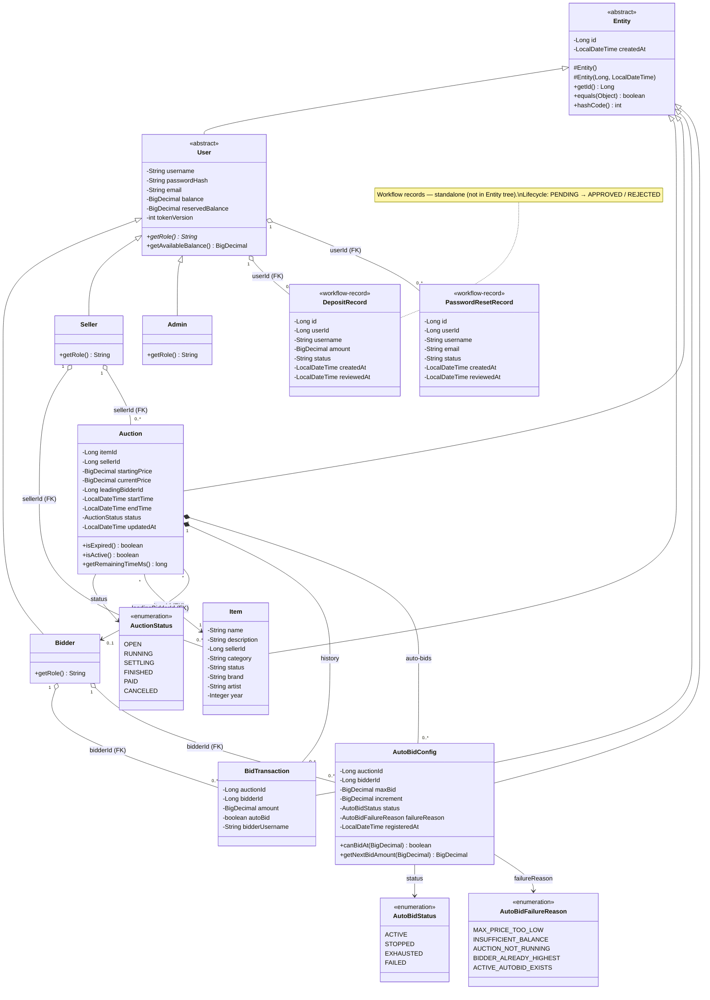
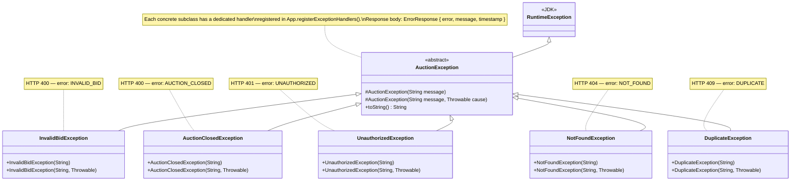
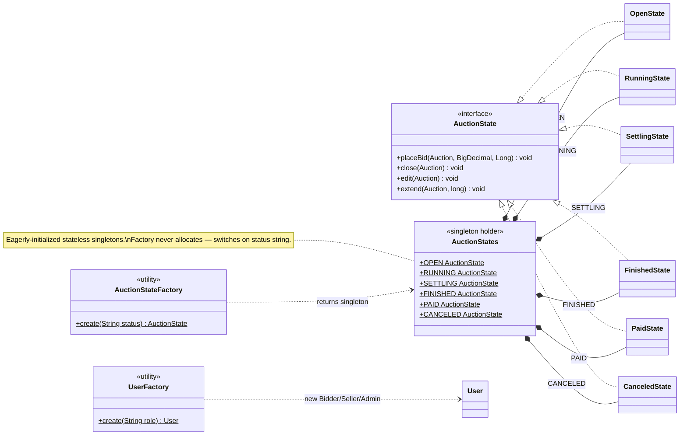
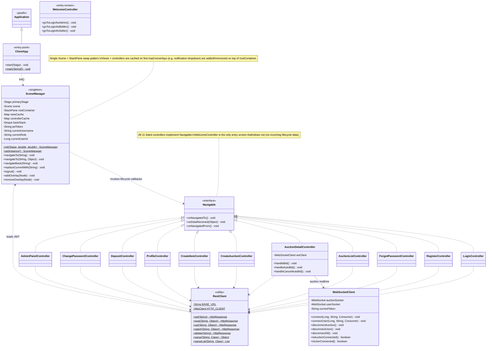
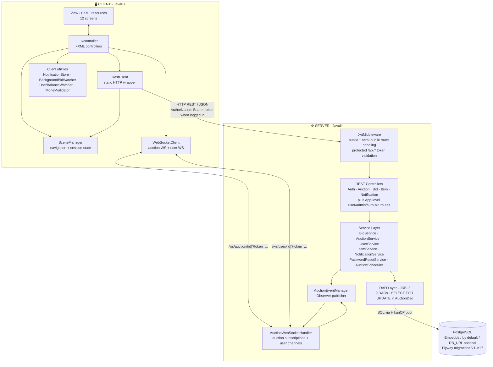

<div align="center">


# Online Auction System

*A real-time desktop auction platform - JavaFX client • Javalin server • PostgreSQL • WebSocket*

[](https://github.com/kieran-labs/oop-course-project-uet/actions/workflows/ci.yml)
[](https://adoptium.net/)
[](https://javalin.io)
[](https://www.postgresql.org/)
[](https://gradle.org/)
[](LICENSE)

**[⬇️ Download JARs](https://github.com/kieran-labs/oop-course-project-uet/releases/tag/v1.0.0)** • **[CI pipeline](https://github.com/kieran-labs/oop-course-project-uet/actions)** • **[License](LICENSE)**

</div>

---

## 🧩 Overview

A full-stack **desktop auction platform** built with Java 21. A **JavaFX client** communicates with a **Javalin HTTP/WebSocket server** backed by a PostgreSQL database (embedded, zero-install). Multiple clients can bid simultaneously with real-time price updates pushed over WebSocket - no polling, no stale data.

**What makes this project non-trivial:**

- **Concurrent bid safety** via database-level `SELECT FOR UPDATE` inside a JDBI transaction - prevents lost updates and double-winners under simultaneous bids
- **Anti-sniping protection**: bids in the final 30 seconds automatically extend the deadline by 60 seconds
- **Auto-bidding engine** using a `PriorityQueue` with FIFO tie-breaking, capable of chaining multiple auto-bids in a single transaction
- A complete **6-state auction lifecycle** enforced by the State pattern - illegal operations throw typed exceptions, not silent failures
- **12 JavaFX screens** with a clean blue theme (`#1565C0` primary, `#EFF6FF` background) and a live `AreaChart` fed directly from WebSocket events

The project covers **3 user roles** (Admin, Seller, Bidder), **3 item categories** (Electronics, Art, Vehicle) stored in a flattened `Item` model, and a complete lifecycle from item creation through payment and password management — **99 production Java files**, **28 test classes**, and **17 Flyway migrations**.

**Environment:** Java 21+ • Windows / macOS / Linux • No external services required

---

## 🖼️ Screenshots

| Login | Auction List |
|:---:|:---:|
|  |  |

| Live Bid Detail *(with real-time chart + countdown)* | Admin Dashboard |
|:---:|:---:|
|  |  |

---

## ✅ Completed Features

### Required

- [x] Registration / login with role-based access control (Bidder · Seller · Admin)
- [x] Create / edit / delete items - 3 categories (Electronics, Art, Vehicle)
- [x] Create and manage auction sessions; lifecycle `OPEN → RUNNING → SETTLING → FINISHED / PAID / CANCELED`
- [x] Manual bidding - BIDDER-only, validates integer VND `amount > currentPrice`, stored atomically
- [x] Automatic session expiry (`AuctionScheduler`)
- [x] Winner determination and settlement; successful payment transitions auction to `PAID`, otherwise finalizes as `FINISHED`
- [x] Error handling & exceptions - 5 custom exception types, HTTP status mapping
- [x] JavaFX GUI - 12 screens, Lexend font, blue theme
- [x] Concurrent bidding safety - `SELECT FOR UPDATE` inside JDBI transaction
- [x] Real-time updates - WebSocket push, Observer pattern, no polling
- [x] Clean Client–Server architecture (Javalin ↔ JavaFX)
- [x] MVC on client side (FXML + ui/controller) and server side (Controller → Service → DAO)
- [x] Gradle build tool, Google Java Style, Conventional Commits
- [x] Unit Tests - JUnit 5 + Mockito, integration tests against real PostgreSQL
- [x] CI/CD - GitHub Actions: `spotlessCheck` → `clean test check jacocoTestReport`

### Advanced

- [x] **Auto-Bidding** - configurable `maxBid` + `increment`, `PriorityQueue` ordered by `registeredAt` (FIFO)
- [x] **Anti-sniping** - bid in final 30s → extend by 60s → broadcast `TIME_EXTENDED`
- [x] **Live Bid History Chart** - JavaFX `AreaChart` updated in real time from WebSocket events, no manual refresh needed


## 🧬 Class Diagrams

### 1. Domain Model



---

### 2. Exception Hierarchy



---

### 3. Design Patterns

#### 3a. State + Factory — Auction lifecycle resolution



#### 3b. Strategy + Observer — Bid execution & real-time publish

```mermaid
classDiagram
    direction LR

    class BidService {
        <<orchestrator>>
        +placeBid(Long, Long, BigDecimal, boolean) BidTransaction
        +createAutoBid(Long, Long, BigDecimal, BigDecimal) AutoBidConfig
        +getBidHistory(Long) List
    }

    class AutoBidStrategy {
        <<strategy>>
        +MAX_AUTO_BIDS_PER_TRIGGER int$
        -autoBidConfigDao AutoBidConfigDao
        -userDao UserDao
        +executeAll(Long, BigDecimal, Long, AutoBidExecutor) void
        +executeAllInTransaction(Handle, Long, BigDecimal, Long, InTransactionBidExecutor) void
    }

    class AutoBidExecutor {
        <<functional interface>>
        +execute(...) BidTransaction
    }
    class InTransactionBidExecutor {
        <<functional interface>>
        +execute(Handle, ...) BidTransaction
    }

    class AuctionEventListener {
        <<interface>>
        +onBidUpdate(BidUpdateMessage) void
        +onTimeExtended(BidUpdateMessage) void
        +onAuctionEnd(BidUpdateMessage) void
    }

    class AuctionEventManager {
        <<subject>>
        -listeners ConcurrentHashMap
        +subscribe(Long, AuctionEventListener) void
        +unsubscribe(Long, AuctionEventListener) void
        +notifyBidUpdate(Long, BidUpdateMessage) void
        +notifyTimeExtended(Long, BidUpdateMessage) void
        +notifyAuctionEnd(Long, BidUpdateMessage) void
    }

    class WebSocketObserver {
        <<concrete observer>>
        -handler AuctionWebSocketHandler
        -auctionId Long
        +onBidUpdate(BidUpdateMessage) void
        +onTimeExtended(BidUpdateMessage) void
        +onAuctionEnd(BidUpdateMessage) void
    }

    class AuctionWebSocketHandler {
        +broadcast(Long, BidUpdateMessage) void
    }

    AuctionEventListener <|.. WebSocketObserver
    AuctionEventManager o-- "0..*" AuctionEventListener : per auctionId

    BidService --> AutoBidStrategy : chains auto-bids
    BidService --> AuctionEventManager : publishes events
    AutoBidStrategy ..> InTransactionBidExecutor : callback
    AutoBidStrategy ..> AutoBidExecutor : callback
    WebSocketObserver --> AuctionWebSocketHandler : delegates broadcast

    note for AuctionEventManager "ConcurrentHashMap-backed subscriber registry.\nBidService.placeBid() → notifyBidUpdate() →\neach observer pushes JSON over WebSocket."
    note for AutoBidStrategy "FIFO PriorityQueue sorted by registeredAt.\nChain cap: 100 auto-bids per manual trigger.\nFunctional-interface callback breaks the circular\ndependency with BidService."
```



---

### 4. UI Layer




## 🏗️ Architecture


---

## 🔄 Data Flow - End-to-End

*Scenario: Bidder places a bid of 500,000 VND from the JavaFX client*

```
1. AuctionDetailController (JavaFX)
   └─► POST /api/auctions/{id}/bid  { amount: 500000 }  + Authorization: Bearer <JWT>

2. JwtMiddleware (before-handler on /api/*)
   └─► JwtUtil.verifyToken() → extract { userId, username, role, tokenVersion }
   └─► tokenVersion compared against UserDao to invalidate stale tokens
   └─► inject { userId, username, role } into Javalin context

3. BidController.handleManualBid(ctx)
   └─► role check: reject with UnauthorizedException if role ≠ "BIDDER"
   └─► bidService.placeBid(auctionId, bidderId, amount, isAutoBid=false)

4. BidService.placeBid()
   └─► pre-check: requirePositiveIntegerVnd(amount)            ← outside tx, rejects non-integer or non-positive VND
   └─► jdbi.inTransaction(handle -> {
         auctionDao.findByIdForUpdate(handle, id)                ← SELECT FOR UPDATE (row lock)
         RunningState.placeBid()                                 ← State: validate amount > currentPrice
         userDao.findByIdForUpdate(handle, bidderId)             ← row-lock bidder + check availableBalance ≥ amount
         if (remaining < 30s) extend endTime by 60s              ← Anti-sniping
         release previous leader's reserved balance              ← wallet_transactions: RELEASE
         update current bidder's reserved balance                ← wallet ledger entry
         auctionDao.updateInTransaction(handle, auction)         ← UPDATE price + endTime atomically
         bidTransactionDao.insert(handle, tx)                    ← INSERT bid record + wallet ledger FREEZE
         autoBidStrategy.executeAllInTransaction()                ← FIFO PriorityQueue chains additional auto-bids,
                                                                    each one rerunning the same inner steps inside the
                                                                    same handle (atomic with the manual bid)
       })  // ← single transaction commits here

5. Post-commit dispatch (all events queued during the transaction are now run)
   └─► AuctionEventManager.notifyTimeExtended()  (if anti-snipe triggered)
   └─► AuctionEventManager.notifyBidUpdate()     (one per bid placed in the chain)
   └─► WebSocketObserver → broadcast BidUpdateMessage (JSON) → all connected clients

6. All AuctionDetailControllers (each connected client)
   └─► Platform.runLater():
         update currentPrice label
         append point to AreaChart
         reset countdown timer
```

---

## 🧠 Design Patterns

### 1. Observer - Real-time Push

```
AuctionEventManager (Subject)
  └─► Map<auctionId, List<AuctionEventListener>>

AuctionEventListener (Observer interface)
  ├── onBidUpdate(BidUpdateMessage)      ← currentPrice, leadingBidderId, leadingBidderUsername, autoBid
  ├── onTimeExtended(BidUpdateMessage)   ← endTime (new deadline)
  └── onAuctionEnd(BidUpdateMessage)     ← currentPrice (final), leadingBidderId, leadingBidderUsername

WebSocketObserver (Concrete Observer)
  └─► BidUpdateMessage JSON → broadcast over WebSocket
```

**Trigger:** `BidService.placeBid()` succeeds → `eventManager.notify()` → all open `AuctionDetailController` instances update immediately.

### 2. Factory Method - State/User Creation

```
AuctionStateFactory.create(status)
  ├── "OPEN"     → AuctionStates.OPEN
  ├── "RUNNING"  → AuctionStates.RUNNING
  ├── "SETTLING" → AuctionStates.SETTLING
  ├── "FINISHED" → AuctionStates.FINISHED
  ├── "PAID"     → AuctionStates.PAID
  └── "CANCELED" → AuctionStates.CANCELED

UserFactory.create(role)
  ├── "BIDDER" → new Bidder()
  ├── "SELLER" → new Seller()
  └── "ADMIN"  → new Admin()
```

`Item` is now a flattened model with category-specific fields (`brand`, `artist`, `year`) instead of separate item subclasses.

### 3. Strategy - Auto-Bid Chain Execution

```
AutoBidStrategy
  └── executeAllInTransaction(handle, auctionId, currentPrice, leaderId, executor)

Manual bid validation lives in RunningState.placeBid (State pattern).
AutoBidStrategy owns the chain logic:
  → PriorityQueue<AutoBidConfig> sorted by registeredAt (FIFO fairness)
  → InTransactionBidExecutor callback to avoid circular dependency with BidService
  → EXHAUSTED when nextBid > maxBid · FAILED on insufficient balance
  → max 100 auto-bids per chain (safety limit)
```

### 4. State - Auction Lifecycle

```
AuctionState (interface): placeBid(), close(), edit(), extend()

OpenState     → can edit, cannot bid
RunningState  → can bid + extend, cannot edit
SettlingState → blocks external operations while settlement is being processed
FinishedState → allows close() for PAID transition; rejects bid/edit/extend
PaidState     → throws on all operations (terminal)
CanceledState → throws on all operations (terminal)
```

Transitions are driven by `AuctionScheduler`. Calling `placeBid()` on `FinishedState` or `SettlingState` throws `AuctionClosedException` → HTTP 400 (`AUCTION_CLOSED`). Trying to soft-cancel an already-CANCELED auction throws `IllegalStateException` → HTTP 409 (`INVALID_STATE`).

### 5. DAO - Database Isolation

Each table has exactly one dedicated DAO class using JDBI 3. Several DAOs expose `findByIdForUpdate()` (`AuctionDao`, `ItemDao`, `UserDao`, `DepositRequestDao`, `PasswordResetRequestDao`), all using `SELECT ... FOR UPDATE` for row-level locking. `AuctionDao.findByIdForUpdate()` is the lock that guarantees correctness for concurrent bids inside `BidService`.

---

## 🌳 Class Hierarchy

```
Entity (abstract)           ← id: Long, createdAt: LocalDateTime
│
├── User (abstract)         ← username, email, balance/reservedBalance: BigDecimal, getRole()
│   ├── Bidder              ← getRole() = "BIDDER"
│   ├── Seller              ← getRole() = "SELLER"
│   └── Admin               ← getRole() = "ADMIN"
│
├── Item                    ← flattened item model: name, description, sellerId, category, status
│                              category-specific nullable fields: brand / artist / year
│
├── Auction                 ← startingPrice / currentPrice: BigDecimal (not double)
│                              status: OPEN / RUNNING / SETTLING / FINISHED / PAID / CANCELED
│
├── BidTransaction          ← auctionId, bidderId, amount, autoBid: boolean, bidderUsername
└── AutoBidConfig           ← maxBid, increment, status, failureReason, registeredAt
```

`BigDecimal` is used consistently for all monetary values - no `double` or `float` anywhere.

---

## 📡 API Reference

### REST Endpoints

| Method | Path | Auth | Role | Description |
|---|---|---|---|---|
| `GET` | `/api/health` | Public | - | Server health check |
| `POST` | `/api/auth/register` | Public | - | Register (BIDDER / SELLER) |
| `POST` | `/api/auth/login` | Public | - | Login → JWT token |
| `POST` | `/api/auth/forgot-password` | Public | - | Request admin-reviewed password reset |
| `GET` | `/api/users/me` | Required | Any | Current user profile |
| `PUT` | `/api/users/me/password` | Required | Any | Change password |
| `GET` | `/api/users/me/deposit-requests` | Required | Any | Current user's deposit request history (intended for BIDDER) |
| `POST` | `/api/users/me/deposit` | Required | Any | Submit deposit request — returns `202 Accepted` (intended for BIDDER) |
| `GET` | `/api/items` | Optional | Any | List/search items |
| `GET` | `/api/items/{id}` | Optional | Any | Item detail |
| `POST` | `/api/items` | Required | SELLER | Create item |
| `PUT` | `/api/items/{id}` | Required | SELLER owner | Edit item |
| `DELETE` | `/api/items/{id}` | Required | SELLER owner / ADMIN | Soft-delete item |
| `GET` | `/api/auctions` | Optional | Any | List auctions (`?status=`) |
| `GET` | `/api/auctions/{id}` | Optional | Any | Auction detail (enriched) |
| `POST` | `/api/auctions` | Required | SELLER | Create auction |
| `PUT` | `/api/auctions/{id}` | Required | SELLER owner | Edit auction (OPEN state only) |
| `DELETE` | `/api/auctions/{id}` | Required | SELLER owner / ADMIN | Cancel auction |
| `POST` | `/api/auctions/{id}/bid` | Required | BIDDER only | Place manual bid |
| `GET` | `/api/auctions/{id}/bids` | Optional | Any | Bid history (semi-public, like other `GET /api/auctions/*`) |
| `GET` | `/api/auctions/{id}/auto-bid` | Required | BIDDER | Get current user's auto-bid config |
| `POST` | `/api/auctions/{id}/auto-bid` | Required | BIDDER | Register/update auto-bid |
| `DELETE` | `/api/auctions/{id}/auto-bid` | Required | BIDDER | Stop current user's auto-bid |
| `GET` | `/api/notifications` | Required | Any | Recent notifications for current user |
| `PATCH` | `/api/notifications/{id}/read` | Required | Owner | Mark one notification as read |
| `PATCH` | `/api/notifications/mark-all-read` | Required | Any | Mark current user's notifications as read |
| `GET` | `/api/admin/users` | Required | ADMIN | List users |
| `DELETE` | `/api/admin/users/{id}` | Required | ADMIN | Delete user except self |
| `GET` | `/api/admin/deposit-requests` | Required | ADMIN | List pending deposits |
| `POST` | `/api/admin/deposit-requests/{id}/approve` | Required | ADMIN | Approve deposit |
| `POST` | `/api/admin/deposit-requests/{id}/reject` | Required | ADMIN | Reject deposit |
| `GET` | `/api/admin/password-reset-requests` | Required | ADMIN | List pending reset requests |
| `POST` | `/api/admin/password-reset-requests/{id}/approve` | Required | ADMIN | Generate random 6-character temporary password |
| `POST` | `/api/admin/password-reset-requests/{id}/reject` | Required | ADMIN | Reject reset request |
| `DELETE` | `/api/admin/auctions/{id}` | Required | ADMIN | Hard-delete auction |

All errors return `ErrorResponse { error: String, message: String, timestamp: LocalDateTime }` with the corresponding HTTP status. Error codes: `INVALID_BID` / `AUCTION_CLOSED` / `BAD_REQUEST` → 400, `UNAUTHORIZED` → 401, `NOT_FOUND` → 404, `DUPLICATE` / `INVALID_STATE` → 409, `INTERNAL_ERROR` → 500.

<details>
<summary><b>Key Request / Response Examples</b></summary>

<br>

<details>
<summary><code>POST /api/auth/login</code></summary>

**Request**
```json
{
  "username": "admin",
  "password": "123456"
}
```

**Response `200 OK`**
```json
{
  "token": "eyJhbGciOiJIUzI1NiJ9...",
  "role": "ADMIN",
  "username": "admin",
  "userId": 1
}
```
</details>

<details>
<summary><code>POST /api/auctions/{id}/bid</code></summary>

**Request** *(Authorization: Bearer &lt;token&gt;)*
```json
{
  "amount": 500000
}
```

**Response `201 Created`**
```json
{
  "auctionId": 3,
  "bidderId": 7,
  "amount": 500000,
  "autoBid": false
}
```

**Error `400 Bad Request`** *(bid too low or invalid amount)*
```json
{
  "error": "INVALID_BID",
  "message": "Bid amount must be higher than current price 450000",
  "timestamp": "2026-05-17T10:15:30"
}
```
</details>

<details>
<summary><code>POST /api/auctions/{id}/auto-bid</code></summary>

**Request** *(Authorization: Bearer &lt;token&gt;)*
```json
{
  "maxBid": 2000000,
  "increment": 50000
}
```

**Response `201 Created`**
```json
{
  "auctionId": 3,
  "bidderId": 7,
  "maxBid": 2000000,
  "increment": 50000,
  "status": "ACTIVE"
}
```
</details>

</details>

### WebSocket Protocol

```
Auction channel: /ws/auction/{auctionId}?token=<JWT>
User channel:    /ws/user/{userId}?token=<JWT>
```

All payloads share the envelope `{ type, auctionId, timestamp, ... }`. Below lists the per-type fields that actually get populated.

| Channel | Direction | `type` | Populated fields |
|---|---|---|---|
| Auction | Server → Client | `BID_UPDATE` | `currentPrice`, `leadingBidderId`, `leadingBidderUsername`, `autoBid` |
| Auction | Server → Client | `TIME_EXTENDED` | `endTime` (new deadline after anti-snipe extension) |
| Auction | Server → Client | `AUCTION_ENDED` | `currentPrice` (final price), `leadingBidderId` (winner), `leadingBidderUsername` (winner name; `null` if no bids) |
| User | Server → Client | `BALANCE_UPDATED` | `newBalance`, `balanceDelta`, `approved` (true=approved deposit, false=rejected), `message` (pre-formatted; may be `null`) |
| User | Server → Client | `USER_NOTIFICATION` | `message` (raw notification text) |

---

## Business Rules Snapshot

- Manual bid endpoint `POST /api/auctions/{id}/bid` is **BIDDER-only**. Sellers and admins are rejected by the HTTP authorization layer.
- Sellers create items and auctions, and can only edit/cancel their own auctions according to auction state rules. Admins use admin-only routes for moderation.
- Money inputs use integer VND at service/API boundaries. Negative, zero where positive is required, and decimal amounts such as `1000.50` are rejected.
- Auto-bid is BIDDER-only, scoped to the authenticated bidder, and cannot be stopped for another bidder. Auto-bid uses `maxBid` and `increment` with integer VND validation.
- Wallet balance changes are recorded in `wallet_transactions` for deposit approval, bid freeze/release, cancellation release, winner consume, and seller payout.
- PostgreSQL schema is owned by Flyway migrations under `src/main/resources/db/migration`; CI and local test bootstrap run the full migration set.

---

## 🤔 Technical Decisions

**Javalin over Spring Boot** — Spring Boot adds annotation-based DI and layers of abstraction that make the execution flow harder to trace under concurrency. Javalin keeps routing explicit (`app.post("/path", handler)`), starts in well under a second, and lets the bidding code path be read top-to-bottom without auto-configuration magic.

**Embedded PostgreSQL over H2** - H2 does not support `SELECT FOR UPDATE` the same way PostgreSQL does. Since concurrent bidding is a core requirement, integration tests need to run against the real engine to be meaningful.

**JDBI 3 over Hibernate/JPA** - ORM hides the SQL, making concurrency bugs harder to debug. With JDBI every query is explicit - you can see exactly the order of locks, updates, and inserts within a transaction.

**`SELECT FOR UPDATE` instead of `synchronized`** - `synchronized` only protects within a single JVM instance. `SELECT FOR UPDATE` operates at the database level - the entire validate → update → insert sequence runs inside a single `jdbi.inTransaction()` call, guaranteeing true atomicity.

**Admin-reviewed password reset** - SMTP setup requires external credentials and environment configuration that complicates the evaluator experience. Admin-reviewed reset lets a trusted Admin approve the request and generate a random 6-character temporary password without any external email dependency.

**`BigDecimal` for monetary values** - `double` introduces floating-point errors (`0.1 + 0.2 ≠ 0.3`). Every bid amount, account balance, and starting price uses `BigDecimal`, stored as `NUMERIC` in PostgreSQL.

**`PriorityQueue` ordered by `registeredAt` for auto-bid** - When multiple bidders register auto-bid configs, the one who registered first gets priority. Sorting by `registeredAt: LocalDateTime` gives a deterministic and fair ordering.

---

## ⚠️ Known Limitations

- **Single-server deployment** - `SELECT FOR UPDATE` at the DB layer protects correctness even with multiple server nodes. However, some in-memory state (such as the `AuctionEventManager` listener map) is per-instance - horizontal scaling would require a message broker (e.g. Redis Pub/Sub).

- **No payment gateway** - The `PAID` status exists in the state machine, but actual payment is mocked (balance is debited directly). A production system would need a payment provider integration.

- **Embedded PostgreSQL data directory** - An unclean shutdown may leave `data/postgres/` in a state that requires manual deletion (see Troubleshooting). Production deployments should use a managed PostgreSQL instance.

- **Admin-reviewed password reset instead of email reset** - Approved reset requests generate a random 6-character temporary password. A production system would normally use a one-time token delivered out-of-band, such as email.

---

## 🚀 Getting Started

There are two supported ways to run this project. **Option 1** is the fastest path for evaluators — download two JARs and go. **Option 2** is for reviewers who want to read, modify, or test the source.

### Prerequisites *(shared by both options)*

| Requirement | Version | Notes |
|---|---|---|
| Java (JDK) | **21+** | [Download Adoptium](https://adoptium.net/); verify with `java -version` |
| OS | Windows 10+ / macOS 12+ / Ubuntu 20.04+ | JavaFX requires a desktop display |
| RAM | 512 MB free | Embedded PostgreSQL + JavaFX |
| Display | 1280×720 minimum | Required for JavaFX rendering |
| Port `8080` | Free on `localhost` | Used by the Javalin server |

PostgreSQL itself is **not** required — the server starts an embedded PostgreSQL instance in `data/postgres/` on first run and applies all Flyway migrations (V1–V17) automatically. CI uses an external `postgres:16` service through `DB_URL`, `DB_USER`, and `DB_PASSWORD`, then runs the same migration path.

### Configure `JWT_SECRET` *(shared by both options)*

The server **fails fast** at startup if `JWT_SECRET` is missing, blank, or shorter than 32 bytes when encoded as UTF-8. Set it in every new terminal before launching the server:

```powershell
# Windows PowerShell
$env:JWT_SECRET = "replace-with-a-random-secret-of-at-least-32-bytes"
```

```bash
# macOS / Linux / Git Bash
export JWT_SECRET="replace-with-a-random-secret-of-at-least-32-bytes"
```

Generate a strong value on the fly:

```powershell
# PowerShell
[Convert]::ToBase64String((1..32 | ForEach-Object { Get-Random -Min 0 -Max 256 }))
```
```bash
# Bash
openssl rand -base64 32
```

> The `.env` file at the repo root is **not** auto-loaded by the application — it exists only for IDE / external tooling. The real environment variable above is required.

---

### Option 1 · Run the prebuilt JARs *(evaluators — no Git, no Gradle)*

#### 1.1 — Download both JARs into the same folder

| File | Size | Download |
|---|---|---|
| Server | ~123 MB | [**auction-server-1.0.0.jar**](https://github.com/kieran-labs/oop-course-project-uet/releases/download/v1.0.0/auction-server-1.0.0.jar) |
| Client | ~126 MB | [**auction-client-1.0.0.jar**](https://github.com/kieran-labs/oop-course-project-uet/releases/download/v1.0.0/auction-client-1.0.0.jar) |

Place both files in a writable working directory (e.g. `D:\auction-demo\`). The server will create `data/` and may write `logs/` next to the JARs, so avoid read-only locations such as `Program Files`.

#### 1.2 — Start the server *(Terminal 1)*

```powershell
cd D:\auction-demo
$env:JWT_SECRET = "replace-with-a-random-secret-of-at-least-32-bytes"
java -jar auction-server-1.0.0.jar
```

The server is ready once Javalin logs `Javalin started in <N>ms` and binds to `http://localhost:8080`. The first launch also downloads the PostgreSQL binary into the OS cache (~10–30 seconds); subsequent starts complete in about 5 seconds. Verify readiness from any terminal:

```bash
curl http://localhost:8080/api/health
# → {"status":"ok","pid":...,"port":8080}
```

Stop the server with **Ctrl+C** in Terminal 1 — this triggers a graceful shutdown that releases the embedded PostgreSQL data files cleanly.

#### 1.3 — Launch one or more clients *(Terminal 2, 3, …)*

```bash
java -jar auction-client-1.0.0.jar
```

Each terminal that runs this command opens an independent JavaFX window. Open three or four of them to simulate concurrent bidding. Clients do **not** need `JWT_SECRET` — only the server does.

---

### Option 2 · Build from source *(developers and reviewers)*

#### 2.1 — Clone the repository

```bash
git clone https://github.com/kieran-labs/oop-course-project-uet.git
cd oop-course-project-uet
```

Gradle Wrapper (`gradlew.bat` / `gradlew`) is committed at the repo root, so no separate Gradle installation is required — the wrapper downloads Gradle 8.12.1 on first invocation.

#### 2.2 — Pick a sub-path

Set `JWT_SECRET` as shown in [Configure `JWT_SECRET`](#configure-jwt_secret-shared-by-both-options), then choose:

**2.2 · A — Run directly from source** *(fastest iteration loop for developers)*

```powershell
# Terminal 1 — server
.\gradlew.bat run            # Windows
./gradlew run                # macOS / Linux

# Terminal 2..N — clients
.\gradlew.bat runClient
./gradlew runClient
```

`Ctrl+C` in each terminal stops the corresponding process. Gradle keeps its build cache between runs, so the second invocation typically takes ~5 seconds.

**2.2 · B — Build redistributable fat JARs**

```bash
./gradlew clean buildJars        # macOS / Linux
gradlew.bat clean buildJars      # Windows
```

The task produces two self-contained JARs in `build/libs/`:

- `auction-server-1.0.0.jar` (~123 MB) — entry `com.auction.App`
- `auction-client-1.0.0.jar` (~126 MB) — entry `com.auction.Launcher`

These JARs are identical in shape to the ones released on GitHub and can be copied to any machine with Java 21+. Run them exactly as in Option 1.

#### 2.3 — Gradle commands

| Command | Description |
|---|---|
| `./gradlew run` | Start the Javalin server from source |
| `./gradlew runClient` | Start the JavaFX client from source |
| `./gradlew buildJars` | Produce both fat JARs in `build/libs/` |
| `./gradlew test` | Run the JUnit 5 + Mockito suite (uses embedded PostgreSQL for integration tests) |
| `./gradlew check` | Full quality gate: tests + Checkstyle + SpotBugs + JaCoCo 20 % instruction-coverage verification |
| `./gradlew jacocoTestReport` | HTML coverage report at `build/reports/jacoco/test/html/index.html` |
| `./gradlew spotlessCheck` | Verify Google Java Style (CI gate) |
| `./gradlew spotlessApply` | Auto-format all Java sources |
| `./gradlew spotbugsMain` | Static analysis report at `build/reports/spotbugs/spotbugsMain.html` |
| `./gradlew installGitHooks` | Wire `.githooks/pre-commit` to auto-run `spotlessApply` before each commit |
| `./gradlew clean` | Remove `build/` |

CI executes `./gradlew spotlessCheck`, then `./gradlew clean test check jacocoTestReport --info --stacktrace`.

#### 2.4 — Windows convenience scripts

Three `.bat` files at the repo root wrap the server lifecycle for Windows users who prefer not to keep a terminal open:

```powershell
.\server-start.bat       # builds the JAR if missing, starts the server hidden, waits for /api/health
.\server-status.bat      # prints PID and port reported by /api/health
.\server-stop.bat        # graceful shutdown via POST /internal/shutdown
```

When the server is launched through `server-start.bat`, stdout and stderr are redirected to `logs/server.out.log` and `logs/server.err.log` respectively.

---

### Default accounts

The first run seeds a single admin account via `V2__seed_admin.sql`:

| Role | Username | Password |
|---|---|---|
| Admin | `admin` | `123456` |

Additional Seller and Bidder accounts are created from the **Register** screen in the client.

### Five-minute demo flow

1. Log in as `admin / 123456` and open the **Users** tab.
2. Register one `seller1` (SELLER) and two bidders (`bidder1`, `bidder2`).
3. As each bidder, open **Profile → Deposit** and request 10 000 000 VND.
4. As `admin`, approve both deposit requests. Each bidder receives a real-time `BALANCE_UPDATED` push on `/ws/user/{id}`.
5. As `seller1`, create an item and an auction (`startTime` = now + 1 min, `endTime` = now + 5 min, `startingPrice` = 100 000).
6. After one minute, `AuctionScheduler` transitions the auction `OPEN → RUNNING` automatically.
7. Both bidders open the auction detail screen and place alternating bids. The `AreaChart` updates live over `/ws/auction/{id}`; the countdown resets whenever anti-snipe triggers (a bid in the last 30 s extends the deadline by 60 s).
8. One bidder registers auto-bid (`maxBid` 5 000 000, `increment` 50 000). The next manual bid kicks off the auto-bid chain inside the same transaction.
9. When `endTime` passes, the scheduler advances `RUNNING → SETTLING → PAID` (or `FINISHED` if the leader's balance is insufficient at settlement).

### Comparing the two options

| Concern | Option 1 (prebuilt JARs) | Option 2 (from source) |
|---|---|---|
| Audience | Evaluators, quick demo | Developers, reviewers |
| Requires Git? | No | Yes |
| Requires Gradle? | No (wrapper not used) | Wrapper auto-downloads Gradle 8.12.1 |
| First-run time to a healthy server | ~2 minutes (JAR download dominates) | ~3–5 minutes (clone + Gradle dependency resolution) |
| Subsequent startup | ~5 seconds | ~5 seconds (`gradlew run` warm cache) |
| Can modify the code? | No | Yes |
| Can run tests, coverage, SpotBugs? | No | Yes |
| Disk footprint | ~250 MB (two JARs + `data/`) | ~600 MB+ (sources + `build/` + `.gradle/` + `data/`) |

### Troubleshooting

**`JWT_SECRET is required and must be at least 32 bytes long when encoded as UTF-8.`**
The environment variable is missing or too short in the current shell. Set it as shown in [Configure `JWT_SECRET`](#configure-jwt_secret-shared-by-both-options) and rerun.

**`initdb: directory "data/postgres" exists but is not empty`**
The previous server process was killed before it could release the embedded data directory.

```powershell
rmdir /s /q data\postgres     # Windows
```
```bash
rm -rf data/postgres          # macOS / Linux
```

**`Server is already running at http://localhost:8080`**
Another instance is bound to port 8080. Inspect it with `.\server-status.bat`, then stop it with `.\server-stop.bat` (Windows) or `Ctrl+C` in the terminal that owns the process.

**Client cannot reach the server**
Confirm the server is up with `curl http://localhost:8080/api/health`. If it returns `{"status":"ok",...}` the issue is local firewall or VPN, not the application.

**JavaFX window does not appear on Linux**
Ensure a display server is running. On headless hosts, set `export DISPLAY=:0` or launch through a desktop session — JavaFX cannot render without one.

**Reset all local state**
Stop the server, then delete the generated directories. The next start re-seeds the admin account and re-applies every migration.

```powershell
rmdir /s /q data logs build   # Windows
```
```bash
rm -rf data logs build        # macOS / Linux
```

---

## 👥 Team

| Member | GitHub | Role | Technical Contributions |
|---|---|---|---|
| **Bui Ngoc Phu Hung** | [@HumaNormal](https://github.com/HumaNormal) | Backend Lead | Javalin server setup · REST controllers · WebSocket handler (`AuctionWebSocketHandler`) · JDBI DAOs · Flyway migrations · HikariCP connection pool config |
| **Tran Anh Duc** | [@kieran-lucas](https://github.com/kieran-lucas) | Frontend Lead | 12 JavaFX screen controllers · 12 FXML layout files · `SceneManager` singleton · scene-overlay notification dropdown · blue CSS theme (`#1565C0`) · Lexend font integration |
| **Nguyen Dinh Viet Duc** | [@Black1206-coder](https://github.com/Black1206-coder) | Business Logic | Service-layer classes · 4 design pattern packages (14 files) · `AuctionException` hierarchy (5 custom subclasses) · JWT authentication · BCrypt password hashing |
| **Bui Quang Huy** | [@stillqhuy](https://github.com/stillqhuy) | DevOps & QA | GitHub Actions CI pipeline · JUnit 5 regression suite · Gradle Kotlin DSL config · Checkstyle + Spotless + SpotBugs integration · Git workflow & documentation |

All members jointly own `model/` (14 domain classes), `dto/` (14 transfer objects), and project documentation.

---

<details>
<summary><b>🛠️ Tech Stack & Why We Chose It</b></summary>

<br>

| Layer | Technology | Version | Why |
|---|---|---|---|
| Language | Java | 21 (LTS) | Modern LTS toolchain and JavaFX/Javalin compatibility |
| GUI | JavaFX + FXML | 21 | Native desktop UI; FXML separates View from Controller |
| HTTP + WebSocket | Javalin | 6.4.0 | Explicit routing, no DI overhead; embeds Jetty for both HTTP and WebSocket |
| Database | PostgreSQL | `io.zonky.test:embedded-postgres:2.0.7` locally; `postgres:16` in CI | True `SELECT FOR UPDATE` support; H2 does not handle it correctly |
| Connection Pool | HikariCP | 6.2.1 | Lowest-latency JDBC pool |
| SQL Mapper | JDBI 3 | 3.45.4 | SQL-first - every query is explicit and easy to debug under concurrency |
| JSON | Jackson + JSR310 | 2.18.2 | De-facto standard; JSR310 handles `LocalDateTime` natively |
| Auth | JWT (Auth0) | 4.4.0 | HMAC JWT with per-user tokenVersion check after password changes |
| Password | BCrypt | 0.10.2 | One-way hash with salt, cost factor 12 |
| Testing | JUnit 5 + Mockito | 5.11.4 | Parameterized tests + mock injection |
| Coverage | JaCoCo | - | GitHub Actions artifact + 20% minimum instruction coverage gate in `check` |
| Build | Gradle (Kotlin DSL) | 8.12.1 | Type-safe build scripts |
| Code Style | Checkstyle + Spotless | - | Google Java Style, enforced in CI + pre-commit hook |
| Static Analysis | SpotBugs | 6.0.9 | MAX effort - null dereferences, race conditions |
| CI/CD | GitHub Actions | - | `spotlessCheck` + Gradle verification pipeline |

</details>

<details>
<summary><b>📁 Project Structure</b></summary>

<br>

```
oop-course-project-uet/
│
├── .githooks/
│   └── pre-commit                              ← Runs spotlessApply automatically before every commit
│                                                  Enforces Google Java Style without manual formatting
│
├── .github/
│   └── workflows/
│       └── ci.yml                              ← GitHub Actions pipeline (trigger: push + PR → main)
│                                                  Steps: spotlessCheck → clean test check jacocoTestReport
│                                                  check runs Checkstyle, SpotBugs, and JaCoCo coverage verification
│                                                  Spins up an empty PostgreSQL 16 test database
│                                                  Flyway applies all migrations during test bootstrap
│                                                  Uploads coverage artifact on completion
│
├── assets/
│   ├── app-screenshot.png                      ← Hero screenshot used at the top of README
│   ├── grading-rubric.png                      ← Course rubric reference (kept for evaluators)
│   └── screenshots/
│       ├── admin.png                           ← AdminPanel: user management, deposit approval, password reset review
│       ├── auction-detail.png                  ← Auction detail: WebSocket realtime feed + AreaChart + countdown timer
│       ├── auction-list.png                    ← Auction list with status filter (?status=)
│       └── login.png                           ← Login screen (JWT-based auth entry point)
│
├── config/
│   └── checkstyle/
│       └── checkstyle.xml                      ← Google Java Style ruleset enforced via Checkstyle
│                                                  Runs as gradle checkstyleMain in CI pipeline
│
├── gradle/
│   └── wrapper/
│       ├── gradle-wrapper.jar                  ← Committed intentionally for reproducible builds
│       └── gradle-wrapper.properties           ← Pins Gradle version across all environments
│
├── src/
│   ├── main/
│   │   ├── java/com/auction/
│   │   │   ├── App.java                        ← Server entry point: Javalin setup, route registration,
│   │   │   │                                      WebSocket registration, scheduler startup,
│   │   │   │                                      global exception handlers (AuctionException hierarchy)
│   │   │   ├── ClientApp.java                  ← Client entry point: JavaFX Application, loads welcome.fxml
│   │   │   ├── Launcher.java                   ← Fat JAR wrapper - bypasses JavaFX module path restriction
│   │   │   │                                      Required when packaging with shadow/fat JAR
│   │   │   │
│   │   │   ├── config/
│   │   │   │   ├── DatabaseConfig.java         ← HikariCP connection pool + JDBI instance setup
│   │   │   │   │                                  Reads DB credentials from environment/config
│   │   │   │   └── JwtUtil.java                ← JWT generation & verification (com.auth0:java-jwt)
│   │   │   │                                      Token payload: { userId, username, role, tokenVersion, expiry }
│   │   │   │
│   │   │   ├── controller/                     ← 5 REST controllers + 1 WebSocket handler
│   │   │   │   ├── AuctionController.java      ← REST: GET /api/auctions, GET /api/auctions/{id},
│   │   │   │   │                                  POST /api/auctions, PUT /api/auctions/{id},
│   │   │   │   │                                  DELETE /api/auctions/{id}
│   │   │   │   ├── AuctionWebSocketHandler.java← WebSocket endpoints: /ws/auction/{id}?token=<JWT>
│   │   │   │   │                                  and /ws/user/{id}?token=<JWT>
│   │   │   │   │                                  Registers WebSocketObserver into AuctionEventManager
│   │   │   │   │                                  Auction-channel pushes: BID_UPDATE · TIME_EXTENDED · AUCTION_ENDED
│   │   │   │   │                                  Per-user pushes: BALANCE_UPDATED · USER_NOTIFICATION
│   │   │   │   ├── AuthController.java         ← REST: POST /api/auth/register · /login (public, no JWT)
│   │   │   │   │                                  POST /api/auth/forgot-password (public password reset request)
│   │   │   │   ├── BidController.java          ← REST: POST /api/auctions/{id}/bid (manual, role: BIDDER)
│   │   │   │   │                                  GET  /api/auctions/{id}/bids (bid history)
│   │   │   │   ├── ItemController.java         ← REST: GET /api/items, GET /api/items/{id},
│   │   │   │   │                                  POST /api/items, PUT /api/items/{id},
│   │   │   │   │                                  DELETE /api/items/{id} (SELLER for write ops)
│   │   │   │   └── NotificationController.java ← REST: GET /api/notifications · PATCH /:id/read
│   │   │   │                                      PATCH /api/notifications/mark-all-read
│   │   │   │
│   │   │   ├── dao/                            ← DAO pattern: one class per table, all use JDBI (9 DAOs total)
│   │   │   │   ├── AuctionDao.java             ← ★ Includes SELECT ... FOR UPDATE for DB-level concurrency lock
│   │   │   │   │                                  Maps to: auctions table (status: OPEN/RUNNING/SETTLING/FINISHED/PAID/CANCELED)
│   │   │   │   ├── AutoBidConfigDao.java       ← Maps to: auto_bid_configs (maxBid, increment, registeredAt)
│   │   │   │   │                                  registeredAt used as PriorityQueue sort key
│   │   │   │   ├── BidTransactionDao.java      ← Maps to: bid_transactions (amount, autoBid flag, timestamp)
│   │   │   │   ├── DepositRequestDao.java      ← Maps to: deposit_requests (status: PENDING/APPROVED/REJECTED)
│   │   │   │   ├── ItemDao.java                ← Maps to: items (category-aware: ELECTRONICS/ART/VEHICLE)
│   │   │   │   ├── NotificationDao.java        ← Maps to: notifications (per-user feed, is_read flag, notification_type)
│   │   │   │   ├── PasswordResetRequestDao.java← Maps to: password_reset_requests (Admin-reviewed workflow)
│   │   │   │   ├── UserDao.java                ← Maps to: users (passwordHash via BCrypt, balance as BigDecimal)
│   │   │   │   └── WalletTransactionDao.java   ← Maps to: wallet_transactions (deposit, freeze/release, cancel release, payout)
│   │   │   │
│   │   │   ├── dto/                            ← 14 request/response objects - decouples API contract from domain model
│   │   │   │   ├── AuctionResponse.java        ← Enriched auction view (includes item info + leading bidder username)
│   │   │   │   ├── AutoBidRequest.java         ← { maxBid, increment } for auto-bid registration
│   │   │   │   ├── BidRequest.java             ← { amount } for manual bid placement
│   │   │   │   ├── BidUpdateMessage.java       ← Shared WebSocket envelope for both channels — `type` discriminates
│   │   │   │   │                                  BID_UPDATE / TIME_EXTENDED / AUCTION_ENDED / BALANCE_UPDATED / USER_NOTIFICATION
│   │   │   │   ├── ChangePasswordRequest.java  ← { oldPassword, newPassword }
│   │   │   │   ├── CreateAuctionRequest.java   ← { itemId, startingPrice, startTime, endTime }
│   │   │   │   ├── CreateItemRequest.java      ← { name, description, category, brand/artist/year }
│   │   │   │   ├── DepositRequest.java         ← { amount } - creates a PENDING DepositRecord
│   │   │   │   ├── ErrorResponse.java          ← Standardized error envelope: { error, message, timestamp }
│   │   │   │   ├── PageRequest.java            ← Pagination helper DTO
│   │   │   │   ├── ForgotPasswordRequest.java  ← Triggers Admin-reviewed PasswordResetRecord (PENDING)
│   │   │   │   ├── LoginRequest.java           ← { username, password } → returns JWT token on success
│   │   │   │   ├── RegisterRequest.java        ← { username, email, password, role: BIDDER|SELLER }
│   │   │   │   └── UserResponse.java           ← Safe user view (passwordHash never exposed)
│   │   │   │
│   │   │   ├── exception/                      ← Custom exception hierarchy rooted at AuctionException (abstract)
│   │   │   │   │                                  App.java maps each subclass → HTTP status code
│   │   │   │   ├── AuctionClosedException.java ← Thrown when current state/role forbids the attempted action
│   │   │   │   ├── AuctionException.java       ← Abstract base - all domain exceptions extend this
│   │   │   │   ├── DuplicateException.java     ← 409 Conflict (e.g. duplicate username/email on register)
│   │   │   │   ├── InvalidBidException.java    ← 400 Bad Request (bid amount ≤ current price)
│   │   │   │   ├── NotFoundException.java      ← 404 Not Found (auction/item/user missing from DB)
│   │   │   │   ├── package-info.java           ← Package-level Javadoc descriptor
│   │   │   │   └── UnauthorizedException.java  ← 401 Unauthorized (JWT invalid or insufficient role)
│   │   │   │
│   │   │   ├── middleware/
│   │   │   │   └── JwtMiddleware.java          ← Javalin before-handler applied to all /api/* routes
│   │   │   │                                      Extracts + verifies JWT from Authorization: Bearer <token>
│   │   │   │                                      Injects { userId, username, role } into request context
│   │   │   │
│   │   │   ├── model/                          ← 14 domain classes - pure data, no framework coupling
│   │   │   │   ├── Admin.java                  ← User subclass · getRole() = "ADMIN"
│   │   │   │   ├── Auction.java                ← Core aggregate: price (BigDecimal), status, startTime/endTime
│   │   │   │   ├── AutoBidConfig.java          ← { maxBid, increment, registeredAt } - PriorityQueue sort key
│   │   │   │   ├── Bidder.java                 ← User subclass · getRole() = "BIDDER" · holds balance
│   │   │   │   ├── BidTransaction.java         ← Immutable record: { auctionId, bidderId, amount, autoBid }
│   │   │   │   ├── DepositRecord.java          ← { userId, amount, status, reviewedAt }
│   │   │   │   ├── Entity.java                 ← Abstract root: { id: Long, createdAt: LocalDateTime }
│   │   │   │   ├── Item.java                   ← Flattened model: name, description, sellerId, category, status, brand/artist/year
│   │   │   │   ├── PasswordResetRecord.java    ← { userId, status, reviewedAt } - Admin-reviewed reset flow
│   │   │   │   ├── Seller.java                 ← User subclass · getRole() = "SELLER"
│   │   │   │   ├── User.java                   ← Abstract: { username, passwordHash, email, balance: BigDecimal }
│   │   │   │   ├── AutoBidFailureReason.java   ← Reason enum for failed/stopped auto-bid configs
│   │   │   │   ├── AutoBidStatus.java          ← ACTIVE / STOPPED / EXHAUSTED / FAILED
│   │   │   │   └── AuctionStatus.java          ← OPEN / RUNNING / SETTLING / FINISHED / PAID / CANCELED
│   │   │   │
│   │   │   ├── pattern/
│   │   │   │   ├── factory/
│   │   │   │   │   ├── AuctionStateFactory.java← Factory for state singletons by auction status
│   │   │   │   │   └── UserFactory.java        ← Factory for User subclasses by role string
│   │   │   │   │
│   │   │   │   ├── observer/
│   │   │   │   │   ├── AuctionEventListener.java  ← Observer interface: onBidUpdate · onTimeExtended · onAuctionEnd
│   │   │   │   │   ├── AuctionEventManager.java   ← Subject (server-side): maintains listener registry per auction
│   │   │   │   │   │                                 BidService calls notify(BID_UPDATE) after successful placeBid()
│   │   │   │   │   └── WebSocketObserver.java     ← Concrete Observer: serializes BidUpdateMessage → JSON,
│   │   │   │   │                                     pushes to all connected WebSocket clients for that auction
│   │   │   │   │
│   │   │   │   ├── state/
│   │   │   │   │   ├── AuctionState.java       ← State interface: placeBid() · close() · edit() · extend()
│   │   │   │   │   ├── CanceledState.java      ← Terminal state - throws on all operations
│   │   │   │   │   ├── FinishedState.java      ← Allows close() for PAID transition; rejects bid/edit/extend
│   │   │   │   │   ├── OpenState.java          ← Allows edit; rejects bids (auction not yet started)
│   │   │   │   │   ├── PaidState.java          ← Terminal state - throws on all operations
│   │   │   │   │   ├── RunningState.java       ← Allows bid + time extension (anti-sniping); rejects edit
│   │   │   │   │   └── SettlingState.java      ← Locks external operations during settlement
│   │   │   │   │
│   │   │   │   └── strategy/
│   │   │   │       └── AutoBidStrategy.java    ← Iterates PriorityQueue of AutoBidConfigs (sorted by registeredAt)
│   │   │   │                                      Chains auto-bids until all participants' maxBids are exceeded
│   │   │   │
│   │   │   ├── service/                        ← 7 service classes
│   │   │   │   ├── AuctionScheduler.java       ← ScheduledExecutorService: polls DB to auto-transition states
│   │   │   │   │                                  OPEN → RUNNING at startTime · RUNNING → SETTLING → FINISHED/PAID at endTime
│   │   │   │   ├── AuctionService.java         ← CRUD orchestration for auctions (create, edit, delete, list, get)
│   │   │   │   ├── BidService.java             ← ★ Core bidding engine — concurrency via DB-level locking:
│   │   │   │   │                                  jdbi.inTransaction() + AuctionDao.findByIdForUpdate() (SELECT FOR UPDATE)
│   │   │   │   │                                  validates state via RunningState.placeBid (State pattern)
│   │   │   │   │                                  Anti-sniping: if remaining < 30s → extend endTime +60s + notifyTimeExtended
│   │   │   │   │                                  Post-bid: chains AutoBidStrategy.executeAllInTransaction inside same tx
│   │   │   │   ├── ItemService.java            ← Creates flattened Item objects; maps category detail into brand/artist/year
│   │   │   │   ├── NotificationService.java    ← Wraps NotificationDao: list recent, mark one read, mark all read
│   │   │   │   ├── PasswordResetService.java   ← Creates PasswordResetRecord(PENDING)
│   │   │   │   │                                  Admin approves → generates random 6-character temporary password
│   │   │   │   └── UserService.java            ← Registration (BCrypt hash), login (BCrypt verify), balance management
│   │   │   │
│   │   │   ├── ui/
│   │   │   │   ├── controller/                 ← 12 JavaFX controllers (MVC: C layer - each paired with an FXML view)
│   │   │   │   │   ├── AdminPanelController.java      ← Manages users, approves/rejects deposits & password resets
│   │   │   │   │   ├── AuctionDetailController.java   ← ★ Connects to WebSocket, renders JavaFX AreaChart (bid history),
│   │   │   │   │   │                                     runs countdown timer, handles manual & auto-bid forms
│   │   │   │   │   ├── AuctionListController.java     ← Fetches auction list via REST; supports status filter
│   │   │   │   │   ├── ChangePasswordController.java  ← PUT /api/users/me/password flow
│   │   │   │   │   ├── CreateAuctionController.java   ← POST /api/auctions (role: SELLER)
│   │   │   │   │   ├── CreateItemController.java      ← POST /api/items (role: SELLER); form adapts to category
│   │   │   │   │   ├── DepositController.java         ← POST /api/users/me/deposit - submits PENDING deposit request
│   │   │   │   │   ├── ForgotPasswordController.java  ← Submits forgot-password request into Admin review queue
│   │   │   │   │   ├── LoginController.java           ← POST /api/auth/login → stores JWT in memory for session
│   │   │   │   │   ├── ProfileController.java         ← Displays user info + current balance
│   │   │   │   │   ├── RegisterController.java        ← POST /api/auth/register (role: BIDDER | SELLER)
│   │   │   │   │   └── WelcomeController.java         ← App landing screen; routes to login or register
│   │   │   │   │
│   │   │   │   └── util/
│   │   │   │       ├── Navigable.java          ← Interface: allows controllers to receive data on navigation
│   │   │   │       └── SceneManager.java       ← Singleton: manages all JavaFX scene/stage transitions
│   │   │   │                                      Central router - all screen switches go through here
│   │   │   │
│   │   │   └── util/                           ← client-side utility classes
│   │   │       ├── BackgroundBidWatcher.java   ← Background watcher for bid updates
│   │   │       ├── MoneyValidator.java         ← Integer VND validation helpers
│   │   │       ├── NotificationFormat.java     ← Consistent Vietnamese notification label formatting
│   │   │       ├── NotificationItem.java       ← Client-side notification item model
│   │   │       ├── NotificationStore.java      ← In-memory store for push notifications received via WebSocket
│   │   │       ├── RestClient.java             ← HTTP client wrapper: auto-injects Authorization: Bearer <JWT>
│   │   │       ├── UserBalanceWatcher.java     ← User WebSocket + offline notification loader
│   │   │       └── WebSocketClient.java        ← Auction/user WS lifecycle; wraps UI updates in Platform.runLater()
│   │   │
│   │   └── resources/
│   │       ├── logback.xml                     ← SLF4J/Logback configuration (log levels + appenders)
│   │       │
│   │       ├── css/
│   │       │   └── style.css                   ← Global JavaFX stylesheet - blue theme: #1565C0 · #EFF6FF
│   │       │
│   │       ├── db/
│   │       │   └── migration/                  ← Versioned SQL migrations (Flyway-style, applied in order)
│   │       │       ├── V1__initial_schema.sql  ← Creates core tables: users, items, auctions, bid_transactions, auto_bid_configs
│   │       │       ├── V2__seed_admin.sql      ← Seeds default admin account
│   │       │       ├── V3__add_balance.sql                       ← Adds users.balance for wallet accounting
│   │       │       ├── V4__deposit_requests.sql                  ← Admin-reviewed deposit workflow table
│   │       │       ├── V5__password_reset_requests.sql           ← Admin-reviewed password reset workflow table
│   │       │       ├── V6__notifications.sql                     ← Per-user notification feed table
│   │       │       ├── V7..V11                                   ← Repair/relax auto_bid_configs columns (increment_amount, registered_at)
│   │       │       ├── V8__add_seller_id_to_auctions.sql         ← Denormalize seller_id onto auctions for cheap auth checks
│   │       │       ├── V9__add_settling_status.sql               ← Allows SETTLING as an intermediate status
│   │       │       ├── V12__add_reserved_balance.sql             ← Tracks money held by leading bids (users.reserved_balance)
│   │       │       ├── V13__unique_pending_password_reset.sql    ← One pending reset per user (DB-level invariant)
│   │       │       ├── V14__add_item_status.sql                  ← Item lifecycle: AVAILABLE/IN_AUCTION/SOLD/REMOVED
│   │       │       ├── V15__add_auto_bid_status.sql              ← Adds AutoBidStatus + failure_reason columns
│   │       │       ├── V16__add_user_token_version.sql           ← users.token_version for invalidating JWTs after password change
│   │       │       └── V17__wallet_transactions.sql              ← Wallet ledger for balance/reserved-balance movements
│   │       │
│   │       ├── fonts/                          ← Lexend typeface bundled at 9 weights (Black → Thin)
│   │       │   ├── Lexend-Black.ttf
│   │       │   ├── Lexend-Bold.ttf
│   │       │   ├── Lexend-ExtraBold.ttf
│   │       │   ├── Lexend-ExtraLight.ttf
│   │       │   ├── Lexend-Light.ttf
│   │       │   ├── Lexend-Medium.ttf
│   │       │   ├── Lexend-Regular.ttf
│   │       │   ├── Lexend-SemiBold.ttf
│   │       │   └── Lexend-Thin.ttf
│   │       │
│   │       ├── icons/                          ← 6 PNG icons used across JavaFX screens
│   │       │   ├── auction.png
│   │       │   ├── auctionpic.png
│   │       │   ├── businessman.png
│   │       │   ├── computer.png
│   │       │   ├── seller.png
│   │       │   └── settings.png
│   │       │
│   │       └── ui/
│   │           └── fxml/                       ← 12 FXML screens (MVC: V layer - designed in SceneBuilder)
│   │               ├── admin-panel.fxml        ← Bound to AdminPanelController
│   │               ├── auction-detail.fxml     ← Bound to AuctionDetailController (AreaChart + WebSocket display)
│   │               ├── auction-list.fxml       ← Bound to AuctionListController
│   │               ├── change-password.fxml    ← Bound to ChangePasswordController
│   │               ├── create-auction.fxml     ← Bound to CreateAuctionController
│   │               ├── create-item.fxml        ← Bound to CreateItemController (dynamic category fields)
│   │               ├── deposit.fxml            ← Bound to DepositController
│   │               ├── forgot-password.fxml    ← Bound to ForgotPasswordController
│   │               ├── login.fxml              ← Bound to LoginController
│   │               ├── profile.fxml            ← Bound to ProfileController
│   │               ├── register.fxml           ← Bound to RegisterController
│   │               └── welcome.fxml            ← Bound to WelcomeController (app entry screen)
│
└── test/
    └── java/com/auction/                       ← 28 test classes; mix of unit (Mockito) and integration (real PostgreSQL)
        ├── SetupTest.java                              ← Bootstraps embedded PostgreSQL + JDBI for integration tests
        ├── HttpAuthorizationIntegrationTest.java       ← End-to-end JWT + role checks across REST routes
        ├── NotificationApiPersistenceTest.java         ← Notification REST endpoints against real DB
        ├── NotificationPersistenceTest.java            ← Notification DAO + service persistence
        │
        ├── config/
        │   ├── DatabaseConfigTest.java                 ← HikariCP pool + JDBI handle smoke test
        │   └── JwtUtilTest.java                        ← Token generation, verification, expiry, tampering
        │
        ├── controller/
        │   ├── AuctionWebSocketHandlerTest.java        ← Auction + user WebSocket subscribe/broadcast paths
        │   └── BidControllerTest.java                  ← BIDDER-only guard + happy path for POST /bid
        │
        ├── middleware/
        │   └── JwtMiddlewareTest.java                  ← Public/semi-public/protected route classification
        │
        ├── dao/
        │   ├── AuctionDaoTest.java                     ← CRUD + SELECT FOR UPDATE locking
        │   ├── AutoBidConfigDaoTest.java               ← Config persistence + registeredAt ordering
        │   ├── BidTransactionDaoTest.java              ← Bid insertion / history retrieval
        │   ├── ItemDaoTest.java                        ← Category-specific field persistence (brand/artist/year)
        │   └── UserDaoTest.java                        ← Registration, BCrypt hash storage, balance updates
        │
        ├── exception/
        │   ├── AuctionClosedExceptionTest.java         ← Verifies message + HTTP mapping
        │   ├── DuplicateExceptionTest.java             ← 409 mapping
        │   ├── InvalidBidExceptionTest.java            ← 400 mapping
        │   ├── NotFoundExceptionTest.java              ← 404 mapping
        │   └── UnauthorizedExceptionTest.java          ← 401 mapping
        │
        ├── model/
        │   └── ModelTest.java                          ← Entity → User/Item subclass dispatch (getRole, getCategory)
        │
        ├── service/
        │   ├── AuctionServiceTest.java                 ← Create/edit/delete + State pattern guards
        │   ├── AuctionServiceCreateIntegrationTest.java← End-to-end auction creation against PostgreSQL
        │   ├── AuctionSchedulerSettlementTest.java     ← OPEN → RUNNING → SETTLING → FINISHED/PAID transitions
        │   ├── AuctionCancellationNotificationIntegrationTest.java ← Cancel auction → observer broadcast
        │   ├── BidServiceTest.java                     ← ★ Bid logic, anti-sniping (30s), auto-bid chain
        │   ├── BidServiceConcurrencyTest.java          ← Parallel bid threads + SELECT FOR UPDATE correctness
        │   ├── WalletLedgerIntegrationTest.java        ← wallet_transactions ledger movements (deposit, freeze, release)
        │   └── UserServiceTest.java                    ← Registration, BCrypt verify, balance mutation
        │
        └── util/                                       ← Empty directory; reserved for future client-side helpers
```

</details>

<details>
<summary><b>📊 Rubric Coverage</b> - for evaluators</summary>

<br>

*Direct mapping from rubric criteria to source files.*

| Rubric item | Points | File / Folder |
|---|---|---|
| Class design, inheritance hierarchy | 0.5 | `model/Entity` → `User` → `Bidder/Seller/Admin` · flattened `Item` with category-specific fields |
| OOP principles | 1.0 | Encapsulation (private + getter/setter) · Inheritance · Polymorphism (`getRole()`) · Abstraction (abstract `User`) · Encapsulated flattened `Item` category fields |
| Design patterns | 1.0 | `pattern/observer/` · `pattern/factory/` (`AuctionStateFactory`, `UserFactory`) · `pattern/strategy/` · `pattern/state/` · `dao/` |
| User & item management | 1.0 | `AuthController` · `ItemController` · `AuctionController` + 12 JavaFX screens |
| Auction functionality | 1.0 | `BidService.placeBid()` · `BidController` · `RunningState` · `AutoBidStrategy` |
| Error handling & exceptions | 1.0 | `exception/AuctionException` (abstract) + 5 custom + handlers in `App.java` |
| Concurrent bidding | 1.0 | `BidService` → `jdbi.inTransaction()` → `AuctionDao.findByIdForUpdate()` (`SELECT FOR UPDATE`) |
| Real-time updates | 0.5 | `AuctionEventManager` · `WebSocketObserver` · `AuctionWebSocketHandler` |
| Client-Server | 0.5 | `App.java` (Javalin) ↔ `ClientApp.java` (JavaFX) via HTTP + WebSocket |
| MVC | 0.5 | `ui/fxml/` (View) + `ui/controller/` (Controller) + `model/` + `dto/` (Model) |
| Build + conventions | 0.5 | `build.gradle.kts` · `checkstyle.xml` · `.editorconfig` · Spotless |
| Unit Tests | 0.5 | `test/` - JUnit 5 + Mockito, integration tests against real PostgreSQL |
| CI/CD | 0.5 | `.github/workflows/ci.yml` - `spotlessCheck` + Gradle verification pipeline |
| Auto-bidding | 0.5 | `AutoBidStrategy` · `AutoBidConfig` · `AutoBidConfigDao` |
| Anti-sniping | 0.5 | `BidService.placeBid()` - `ANTI_SNIPE_THRESHOLD_MS = 30_000` · `EXTENSION = 60s` |
| Bid History Chart | 0.5 | `AuctionDetailController` + `auction-detail.fxml` (JavaFX `AreaChart`) |
| **Total** | **11.0** | |

</details>

---

## 📄 Resources

| Resource | Link |
|---|---|
| Prebuilt JARs (server + client) | [Releases · v1.0.0](https://github.com/kieran-labs/oop-course-project-uet/releases/tag/v1.0.0) |
| CI pipeline (Spotless + tests + JaCoCo + SpotBugs) | [GitHub Actions](https://github.com/kieran-labs/oop-course-project-uet/actions/workflows/ci.yml) |
| Coverage report (HTML) | Uploaded as `coverage-report` artifact on every CI run |
| SpotBugs reports (HTML) | Uploaded as `spotbugs-reports` artifact on every CI run |

---

## 📜 License

Released under the [MIT License](LICENSE) — see the `LICENSE` file at the repository root for the full text.

---

<div align="center">
<sub>Built for Advanced Programming (LTNC) - University of Engineering and Technology, VNU Hanoi</sub>
</div>
