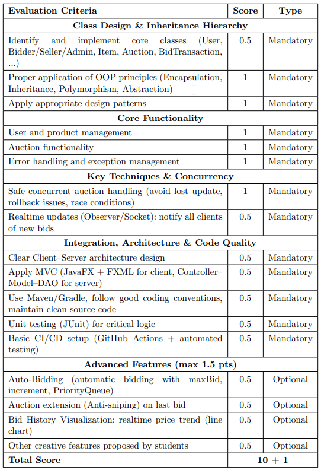
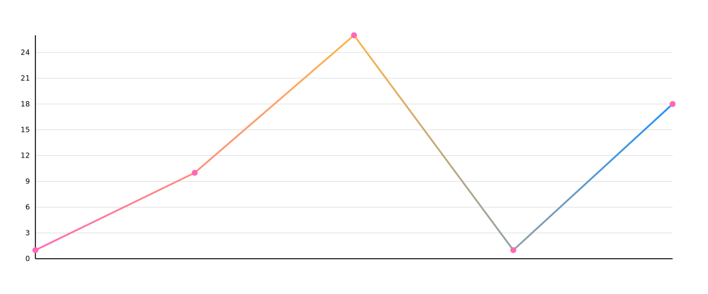

<h1 align="center">Realtime Online Auction System</h1>

  

## Overview

A real-time online auction platform built with Java 21 and a clean Client–Server architecture.
The Javalin server handles all business logic, concurrency control, and database access through JDBI, while the JavaFX client provides a responsive graphical interface for three distinct roles: Bidder, Seller, and Admin.

🔄 Auction Lifecycle

Each auction follows a strict state machine: OPEN → RUNNING → FINISHED → PAID / CANCELED, implemented using the State pattern.
Every state — OpenState, RunningState, FinishedState, PaidState, and CanceledState — defines exactly which actions are allowed. For example, a running auction accepts bids, while a finished auction rejects them immediately. State transitions are triggered automatically by a server-side scheduler, ensuring auctions open and close precisely on time.

⚡ Real-Time Updates

When a bid is placed, all clients currently viewing that auction receive instant updates for the latest price, new leading bidder, and remaining time through a persistent WebSocket connection.
There is no polling and no page refresh. This behavior is powered by the Observer pattern: AuctionEventManager maintains a list of WebSocketObserver instances per session and broadcasts every bid-related event, including BID_UPDATE, TIME_EXTENDED, AUCTION_ENDED, and AUTO_BID_TRIGGERED.

🛡️ Concurrent Safety

The platform is designed to handle multiple simultaneous bids safely at two levels.
At the application level, BidService.placeBid() wraps the entire validate-update-notify flow in a synchronized block on the auction object, preventing interleaved execution on the JVM.
At the database level, each bid runs inside a transaction that uses SELECT ... FOR UPDATE to lock the auction row, preventing stale reads and race conditions before the current update commits.

🤖 Bidding Strategies

The Strategy pattern separates two bidding modes cleanly:

ManualBidStrategy validates the submitted amount against the current price and applies the update.
AutoBidStrategy uses a PriorityQueue<AutoBidConfig> ordered by registration time to automatically outbid competitors in controlled increments, without exceeding the user’s declared maximum.

When multiple auto-bids conflict, the bidder who registered earlier gets priority.

⏱️ Anti-Sniping Protection

Inside placeBid(), a concise time-check detects whether fewer than 30 seconds remain when a valid bid arrives.
If so, the auction end time is extended by 60 seconds, and a TIME_EXTENDED event is broadcast to all connected clients so their countdown timers update instantly.

📈 Live Bid History Chart

The auction detail screen includes a JavaFX LineChart that renders the full price history on load, then appends new points whenever a BID_UPDATE WebSocket message arrives.
Using Platform.runLater(), the chart stays safely on the UI thread, producing a live price curve that grows in real time as the auction unfolds.

🧩 Design & Architecture

The codebase applies OOP principles consistently: a clear inheritance hierarchy (Entity → User / Item → role and category subclasses), encapsulation through private fields and DTOs, and polymorphism via getRole() and getCategory() overrides.
It also uses five core design patterns intentionally: Observer for real-time event dispatch, Factory Method for item creation by category, Strategy for bid execution, State for auction lifecycle control, and DAO for isolating SQL from business logic.

🧪 Tooling & Quality

The project is built with Gradle (Kotlin DSL) and kept consistent with Checkstyle, Spotless, and EditorConfig aligned to Google Java Style.
Testing is done with JUnit 5: unit tests mock the DAO layer using Mockito, while integration tests run against a live PostgreSQL instance. A GitHub Actions pipeline spins up a PostgreSQL 16 service container on every push, then runs formatting checks, convention checks, the full test suite, and a JaCoCo coverage report uploaded as a build artifact.

## Scoring
Below is the grading rubric for this project.

  

## 📈 Commit History (Repo Only)

