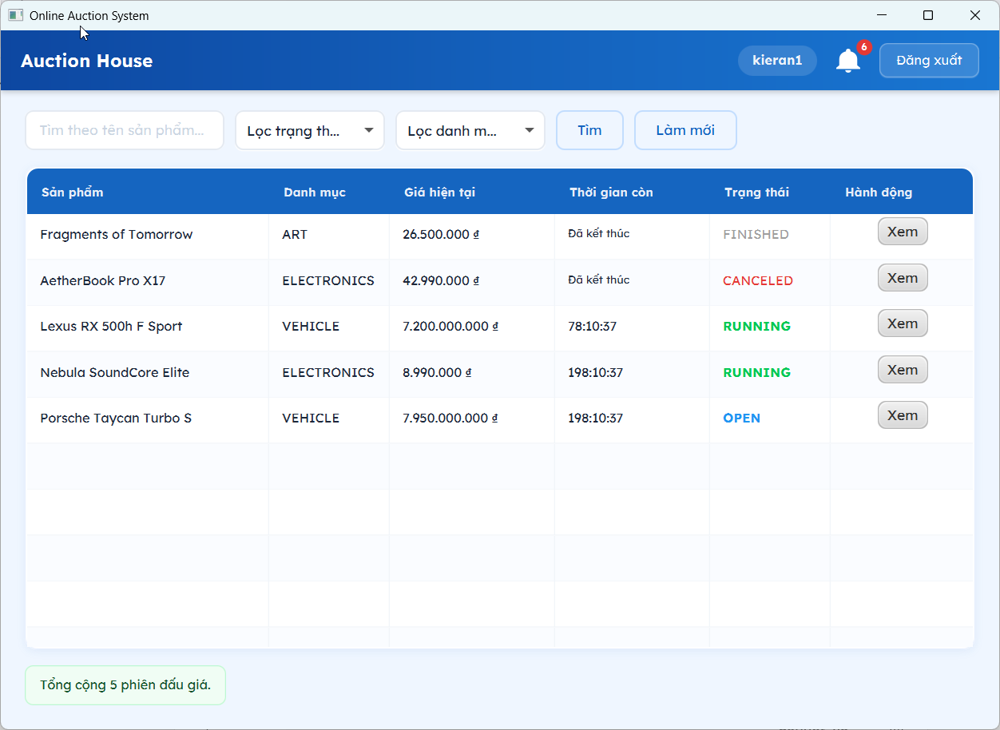
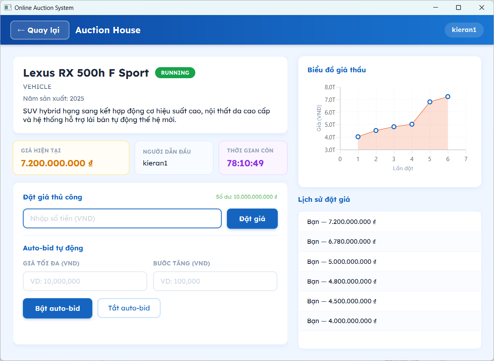
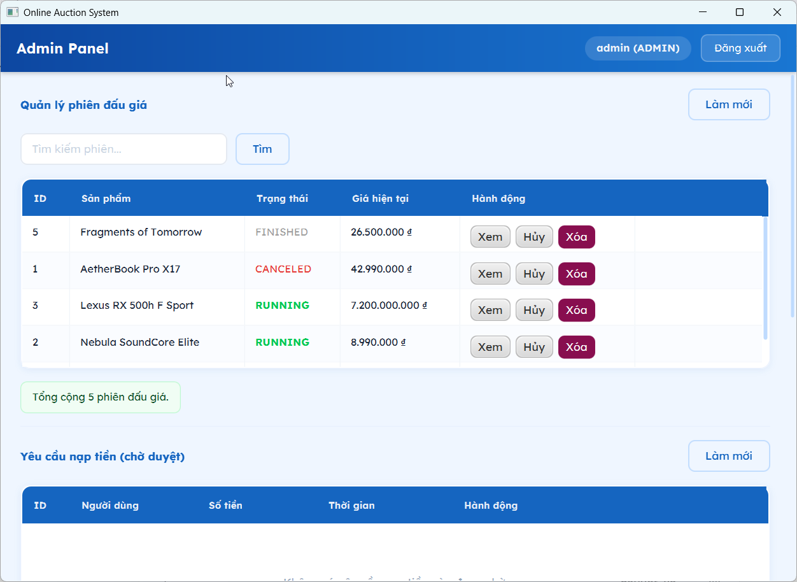
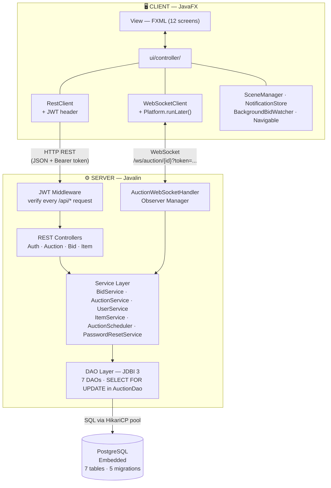

<div align="center">


# Online Auction System

*A real-time desktop auction platform — JavaFX client · Javalin server · PostgreSQL · WebSocket*

[](https://github.com/kieran-labs/oop-course-project-uet/actions/workflows/ci.yml)
[](https://adoptium.net/)
[](https://github.com/kieran-labs/oop-course-project-uet/actions)
[](https://github.com/kieran-labs/oop-course-project-uet/actions)
[](https://javalin.io)
[](https://www.postgresql.org/)
[](LICENSE)

**[📹 Demo Video](#)** · **[📄 PDF Report](#)** · **[⬇️ Download JARs](https://github.com/kieran-labs/oop-course-project-uet/releases/tag/v1.0.0)**

</div>

---

## 🧩 Overview

A full-stack **desktop auction platform** built with Java 21. A **JavaFX client** communicates with a **Javalin HTTP/WebSocket server** backed by a PostgreSQL database (embedded, zero-install). Multiple clients can bid simultaneously with real-time price updates pushed over WebSocket — no polling, no stale data.

**What makes this project non-trivial:**

- **Concurrent bid safety** via database-level `SELECT FOR UPDATE` inside a JDBI transaction — prevents lost updates and double-winners under simultaneous bids
- **Anti-sniping protection**: bids in the final 30 seconds automatically extend the deadline by 60 seconds
- **Auto-bidding engine** using a `PriorityQueue` with FIFO tie-breaking, capable of chaining multiple auto-bids in a single transaction
- A complete **5-state auction lifecycle** enforced by the State pattern — illegal operations throw typed exceptions, not silent failures
- **12 JavaFX screens** with a clean blue theme (`#1565C0` primary, `#EFF6FF` background), fade transitions, and a live `LineChart` fed directly from WebSocket events

The project covers **3 user roles** (Admin, Seller, Bidder), **3 item categories** (Electronics, Art, Vehicle), and a complete lifecycle from item creation through payment and password management — **~99 Java files**, 17 test files, 5 database migrations.

**Environment:** Java 21+ · Windows / macOS / Linux · No external services required

---

## 🖼️ Screenshots

| Login | Auction List |
|:---:|:---:|
|  |  |

| Live Bid Detail *(with real-time chart + countdown)* | Admin Dashboard |
|:---:|:---:|
|  |  |

---

## ✅ Completed Features

### Required

- [x] Registration / login with role-based access control (Bidder · Seller · Admin)
- [x] Create / edit / delete items — 3 categories (Electronics, Art, Vehicle)
- [x] Create and manage auction sessions; lifecycle `OPEN → RUNNING → FINISHED → PAID / CANCELED`
- [x] Manual bidding — validates `amount > currentPrice`, stored atomically
- [x] Automatic session expiry (`AuctionScheduler`)
- [x] Winner determination, transitions auction to `PAID`
- [x] Error handling & exceptions — 5 custom exception types, HTTP status mapping
- [x] JavaFX GUI — 12 screens, Lexend font, blue theme
- [x] Concurrent bidding safety — `SELECT FOR UPDATE` inside JDBI transaction
- [x] Real-time updates — WebSocket push, Observer pattern, no polling
- [x] Clean Client–Server architecture (Javalin ↔ JavaFX)
- [x] MVC on client side (FXML + ui/controller) and server side (Controller → Service → DAO)
- [x] Gradle build tool, Google Java Style, Conventional Commits
- [x] Unit Tests — 17 files, JUnit 5 + Mockito, integration tests against real PostgreSQL
- [x] CI/CD — GitHub Actions: format → lint → test → coverage

### Advanced

- [x] **Auto-Bidding** — configurable `maxBid` + `increment`, `PriorityQueue` ordered by `registeredAt` (FIFO)
- [x] **Anti-sniping** — bid in final 30s → extend by 60s → broadcast `TIME_EXTENDED`
- [x] **Live Bid History Chart** — JavaFX `LineChart` updated in real time from WebSocket events, no manual refresh needed

---

## 🏗️ Architecture



---

## 🔄 Data Flow — End-to-End

*Scenario: Bidder places a bid of 500,000 VND from the JavaFX client*

```
1. AuctionDetailController (JavaFX)
   └─► POST /api/auctions/{id}/bid  { amount: 500000 }  + Authorization: Bearer <JWT>

2. JwtMiddleware
   └─► verifyToken() → extract { userId, username, role }
   └─► BidController.placeBid(ctx)

3. BidService.placeBid()
   └─► validate: amount > 0, sufficient balance
   └─► jdbi.inTransaction(handle -> {
         auctionDao.findByIdForUpdate(handle, id)  ← SELECT FOR UPDATE (row lock)
         RunningState.placeBid()                   ← State: validate amount > currentPrice
         if (remaining < 30s) extend by 60s        ← Anti-sniping
         auctionDao.updateInTransaction(handle)    ← UPDATE price + endTime (atomic)
         bidTransactionDao.insert(handle, tx)      ← INSERT bid record
       })

4. AuctionEventManager
   └─► notifyTimeExtended()  (if anti-snipe triggered)
   └─► notifyBidUpdate()
   └─► WebSocketObserver → broadcast BidUpdateMessage (JSON) → all connected clients

5. All AuctionDetailControllers
   └─► Platform.runLater():
         update currentPrice label
         append point to LineChart
         reset countdown timer

6. BidService (after transaction)
   └─► autoBidStrategy.execute() → trigger auto-bid chain if any configs exist
```

---

## 🧠 Design Patterns

### 1. Observer — Real-time Push

```
AuctionEventManager (Subject)
  └─► Map<auctionId, List<AuctionEventListener>>

AuctionEventListener (Observer interface)
  ├── onBidUpdate(auctionId, price, bidder)
  ├── onTimeExtended(auctionId, newEndTime)
  └── onAuctionEnd(auctionId, winner, finalPrice)

WebSocketObserver (Concrete Observer)
  └─► BidUpdateMessage JSON → broadcast over WebSocket
```

**Trigger:** `BidService.placeBid()` succeeds → `eventManager.notify()` → all open `AuctionDetailController` instances update immediately.

### 2. Factory Method — Item Creation

```
ItemFactory.create(CreateItemRequest, sellerId)
  ├── "ELECTRONICS" → new Electronics(name, desc, brand)
  ├── "ART"         → new Art(name, desc, artist)
  └── "VEHICLE"     → new Vehicle(name, desc, year)
```

`ItemService` calls `ItemFactory` without needing to know which subclass is being instantiated.

### 3. Strategy — Bid Execution

```
BidStrategy (interface)
  └── execute(auction, bidderId, amount, isAutoBid)

ManualBidStrategy   → validate amount > currentPrice → update auction
AutoBidStrategy     → PriorityQueue<AutoBidConfig> sorted by registeredAt
                    → chain auto-bids until maxBid is exceeded
```

### 4. State — Auction Lifecycle

```
AuctionState (interface): placeBid(), close(), edit(), extend()

OpenState     → can edit, cannot bid
RunningState  → can bid + extend, cannot edit
FinishedState → throws on all operations
PaidState     → throws on all operations (terminal)
CanceledState → throws on all operations (terminal)
```

Transitions are driven by `AuctionScheduler`. Calling `placeBid()` on `FinishedState` throws `AuctionClosedException` → HTTP 409.

### 5. DAO — Database Isolation

Each table has exactly one dedicated DAO class using JDBI 3. `AuctionDao` is the only class that exposes `findByIdForUpdate()` — SQL uses `SELECT ... FOR UPDATE` to guarantee row-level locking for concurrent bids.

---

## 🌳 Class Hierarchy

```
Entity (abstract)           ← id: Long, createdAt: LocalDateTime
│
├── User (abstract)         ← username, email, balance: BigDecimal, getRole()
│   ├── Bidder              ← getRole() = "BIDDER"
│   ├── Seller              ← getRole() = "SELLER"
│   └── Admin               ← getRole() = "ADMIN"
│
├── Item (abstract)         ← name, description, sellerId, getCategory()
│   ├── Electronics         ← getCategory() = "ELECTRONICS" · + brand: String
│   ├── Art                 ← getCategory() = "ART"         · + artist: String
│   └── Vehicle             ← getCategory() = "VEHICLE"     · + year: int
│
├── Auction                 ← startingPrice / currentPrice: BigDecimal (not double)
│                              status: OPEN / RUNNING / FINISHED / PAID / CANCELED
│
├── BidTransaction          ← auctionId, bidderId, amount, autoBid: boolean
├── AutoBidConfig           ← maxBid, increment, registeredAt (PriorityQueue sort key)
├── DepositRecord           ← amount, status: PENDING / APPROVED / REJECTED
└── PasswordResetRecord     ← status: PENDING / APPROVED / REJECTED
```

`BigDecimal` is used consistently for all monetary values — no `double` or `float` anywhere.

---

## 📡 API Reference

### REST Endpoints

| Method | Path | Auth | Role | Description |
|---|---|---|---|---|
| `POST` | `/api/auth/register` | ❌ | — | Register (BIDDER / SELLER) |
| `POST` | `/api/auth/login` | ❌ | — | Login → JWT token |
| `POST` | `/api/auth/change-password` | ✅ | Any | Change password |
| `POST` | `/api/auth/forgot-password` | ✅ | Any | Request password reset |
| `GET` | `/api/items` | ✅ | Any | List all items |
| `POST` | `/api/items` | ✅ | SELLER | Create item |
| `GET` | `/api/auctions` | ✅ | Any | List auctions (`?status=`) |
| `GET` | `/api/auctions/{id}` | ✅ | Any | Auction detail (enriched) |
| `POST` | `/api/auctions` | ✅ | SELLER | Create auction |
| `PUT` | `/api/auctions/{id}` | ✅ | SELLER | Edit auction (OPEN state only) |
| `DELETE` | `/api/auctions/{id}` | ✅ | SELLER/ADMIN | Cancel auction |
| `POST` | `/api/auctions/{id}/bid` | ✅ | BIDDER | Place manual bid |
| `POST` | `/api/auctions/{id}/auto-bid` | ✅ | BIDDER | Register auto-bid |
| `POST` | `/api/users/me/deposit` | ✅ | BIDDER | Submit deposit request |
| Admin endpoints | `/api/admin/*` | ✅ | ADMIN | Manage users, deposits, password resets |

All errors return `ErrorResponse { error: String, message: String }` with the corresponding HTTP status (400 / 401 / 404 / 409).

<details>
<summary><b>Key Request / Response Examples</b></summary>

<br>

<details>
<summary><code>POST /api/auth/login</code></summary>

**Request**
```json
{
  "username": "admin",
  "password": "123456"
}
```

**Response `200 OK`**
```json
{
  "token": "eyJhbGciOiJIUzI1NiJ9...",
  "username": "admin",
  "role": "ADMIN"
}
```
</details>

<details>
<summary><code>POST /api/auctions/{id}/bid</code></summary>

**Request** *(Authorization: Bearer &lt;token&gt;)*
```json
{
  "amount": 500000
}
```

**Response `200 OK`**
```json
{
  "auctionId": 3,
  "currentPrice": 500000,
  "leadingBidder": "alice"
}
```

**Error `409 Conflict`** *(bid too low)*
```json
{
  "error": "BID_TOO_LOW",
  "message": "Bid amount must be higher than current price 450000"
}
```
</details>

<details>
<summary><code>POST /api/auctions/{id}/auto-bid</code></summary>

**Request** *(Authorization: Bearer &lt;token&gt;)*
```json
{
  "maxBid": 2000000,
  "increment": 50000
}
```

**Response `200 OK`**
```json
{
  "message": "Auto-bid registered successfully",
  "maxBid": 2000000,
  "increment": 50000
}
```
</details>

</details>

### WebSocket Protocol

```
Endpoint: /ws/auction/{auctionId}?token=<JWT>
```

| Direction | `type` | Payload |
|---|---|---|
| Server → Client | `BID_UPDATE` | `{ currentPrice, leadingBidderUsername, timestamp }` |
| Server → Client | `TIME_EXTENDED` | `{ newEndTime }` |
| Server → Client | `AUCTION_ENDED` | `{ winner, finalPrice }` |
| Server → Client | `AUTO_BID_TRIGGERED` | `{ bidderId, amount }` |

---

## 🤔 Technical Decisions

**Javalin over Spring Boot** — Spring Boot adds startup time, annotation-based DI, and layers of abstraction that make the execution flow harder to trace. Javalin lets you write `app.post("/path", handler)` explicitly; the resulting JAR is also ~50 MB lighter.

**Embedded PostgreSQL over H2** — H2 does not support `SELECT FOR UPDATE` the same way PostgreSQL does. Since concurrent bidding is a core requirement, integration tests need to run against the real engine to be meaningful.

**JDBI 3 over Hibernate/JPA** — ORM hides the SQL, making concurrency bugs harder to debug. With JDBI every query is explicit — you can see exactly the order of locks, updates, and inserts within a transaction.

**`SELECT FOR UPDATE` instead of `synchronized`** — `synchronized` only protects within a single JVM instance. `SELECT FOR UPDATE` operates at the database level — the entire validate → update → insert sequence runs inside a single `jdbi.inTransaction()` call, guaranteeing true atomicity.

**Admin-reviewed password reset** — SMTP setup requires external credentials and environment configuration that complicates the evaluator experience. Admin-reviewed reset achieves the same security goal (a trusted party authorises the reset) without any external dependency.

**`BigDecimal` for monetary values** — `double` introduces floating-point errors (`0.1 + 0.2 ≠ 0.3`). Every bid amount, account balance, and starting price uses `BigDecimal`, stored as `NUMERIC` in PostgreSQL.

**`PriorityQueue` ordered by `registeredAt` for auto-bid** — When multiple bidders register auto-bid configs, the one who registered first gets priority. Sorting by `registeredAt: LocalDateTime` gives a deterministic and fair ordering.

---

## ⚠️ Known Limitations

- **Single-server deployment** — `SELECT FOR UPDATE` at the DB layer protects correctness even with multiple server nodes. However, some in-memory state (such as the `AuctionEventManager` listener map) is per-instance — horizontal scaling would require a message broker (e.g. Redis Pub/Sub).

- **No payment gateway** — The `PAID` status exists in the state machine, but actual payment is mocked (balance is debited directly). A production system would need a payment provider integration.

- **Embedded PostgreSQL data directory** — An unclean shutdown may leave `data/postgres/` in a state that requires manual deletion (see Troubleshooting). Production deployments should use a managed PostgreSQL instance.

- **Basic WebSocket reconnection** — `WebSocketClient` retries on disconnection but does not implement exponential backoff. On an unstable network, a missed `TIME_EXTENDED` event could cause the client countdown to drift.

- **Password reset resets to `"123456"`** — Acceptable for an academic context; a production system would require a one-time token sent out-of-band.

---

## 🚀 Getting Started

### Prerequisites

| Requirement | Version | Notes |
|---|---|---|
| Java (JDK) | 21+ | [Download Adoptium](https://adoptium.net/) |
| OS | Windows 10+ / macOS 12+ / Ubuntu 20.04+ | JavaFX requires a display environment |
| RAM | 512 MB minimum | Embedded PostgreSQL + JavaFX |
| Display | 1280×720 minimum | Required for JavaFX rendering |

PostgreSQL is **embedded** — no installation needed.

```bash
java -version
# Expected: openjdk version "21.x.x"
```

### ⬇️ Download Prebuilt JARs *(recommended for evaluators)*

| File | Size | Download |
|---|---|---|
| Server | ~101 MB | [**auction-server-1.0.0.jar**](https://github.com/kieran-labs/oop-course-project-uet/releases/download/v1.0.0/auction-server-1.0.0.jar) |
| Client | ~101 MB | [**auction-client-1.0.0.jar**](https://github.com/kieran-labs/oop-course-project-uet/releases/download/v1.0.0/auction-client-1.0.0.jar) |

### ▶️ Running the Application

**Step 1 — Start the server** (wait for `Javalin started in X ms` before proceeding)

```bash
java -jar auction-server-1.0.0.jar
```

**Step 2 — Start one or more clients** (each terminal = independent client)

```bash
java -jar auction-client-1.0.0.jar
```

To simulate concurrent bidding, open multiple terminals and run the client command in each.

### 🔑 Default Accounts

The following accounts are seeded automatically on first run via `V2__seed_admin.sql`:

| Role | Username | Password |
|---|---|---|
| Admin | `admin` | `123456` |

Additional Seller and Bidder accounts can be registered from the login screen.

### Build from Source

```bash
git clone https://github.com/kieran-labs/oop-course-project-uet.git
cd oop-course-project-uet

./gradlew buildJars          # macOS / Linux
gradlew.bat buildJars        # Windows
```

Output JARs will be placed in `build/libs/`.

### Gradle Commands

| Command | Description |
|---|---|
| `./gradlew buildJars` | Build server + client fat JARs |
| `./gradlew test` | Run all 17 test files |
| `./gradlew jacocoTestReport` | Coverage report → `build/reports/jacoco/` |
| `./gradlew spotlessApply` | Auto-format all Java code |
| `./gradlew spotbugsMain` | Static analysis |
| `./gradlew clean` | Clean build artifacts |

### Troubleshooting

**`initdb: directory "data/postgres" exists but is not empty`**

```bash
rm -rf data/postgres          # Linux / macOS
rmdir /s /q data\postgres     # Windows
```

This occurs when the server is killed uncleanly. Delete the directory and restart.

**JavaFX window does not appear on Linux**

Ensure a display server is running. On headless servers, use `export DISPLAY=:0` or run via a desktop session.

---

## 👥 Team

| Member | GitHub | Role | Technical Contributions |
|---|---|---|---|
| **Bui Ngoc Phu Hung** | [@HumaNormal](https://github.com/HumaNormal) | Backend Lead | Javalin server setup · 5 REST controllers · WebSocket handler (`AuctionWebSocketHandler`) · 7 JDBI DAOs · 5 SQL migration scripts · HikariCP connection pool config |
| **Tran Anh Duc** | [@kieran-lucas](https://github.com/kieran-lucas) | Frontend Lead | 12 JavaFX screen controllers · 12 FXML layout files · `SceneManager` singleton · fade transition system · blue CSS theme (`#1565C0`) · Lexend font integration |
| **Nguyen Dinh Viet Duc** | [@Black1206-coder](https://github.com/Black1206-coder) | Business Logic | 6 service classes · 4 design pattern packages (13 files) · `AuctionException` hierarchy (5 custom types) · JWT authentication · BCrypt password hashing |
| **Bui Quang Huy** | [@stillqhuy](https://github.com/stillqhuy) | DevOps & QA | 5-stage GitHub Actions CI pipeline · 17 JUnit 5 test files · Gradle Kotlin DSL config · Checkstyle + Spotless + SpotBugs integration · Git workflow & documentation |

All members jointly own `model/` (14 domain classes), `dto/` (13 transfer objects), and project documentation.

---

<details>
<summary><b>🛠️ Tech Stack & Why We Chose It</b></summary>

<br>

| Layer | Technology | Version | Why |
|---|---|---|---|
| Language | Java | 21 (LTS) | Records, sealed classes, pattern matching |
| GUI | JavaFX + FXML | 21 | Native desktop UI; FXML separates View from Controller |
| HTTP + WebSocket | Javalin | 6.4.0 | Lightweight (~50 MB JAR); explicit routing, no DI overhead |
| Database | PostgreSQL (Embedded) | 16 | True `SELECT FOR UPDATE` support; H2 does not handle it correctly |
| Connection Pool | HikariCP | 6.2.1 | Lowest-latency JDBC pool |
| SQL Mapper | JDBI 3 | 3.45.4 | SQL-first — every query is explicit and easy to debug under concurrency |
| JSON | Jackson + JSR310 | 2.18.2 | De-facto standard; JSR310 handles `LocalDateTime` natively |
| Auth | JWT (Auth0) | 4.4.0 | Stateless — server holds no session state |
| Password | BCrypt | 0.10.2 | One-way hash with salt, cost factor 12 |
| Testing | JUnit 5 + Mockito | 5.11.4 | Parameterized tests + mock injection |
| Coverage | JaCoCo | — | GitHub Actions artifact |
| Build | Gradle (Kotlin DSL) | 8.12.1 | Type-safe build scripts |
| Code Style | Checkstyle + Spotless | — | Google Java Style, enforced in CI + pre-commit hook |
| Static Analysis | SpotBugs | 6.0.9 | MAX effort — null dereferences, race conditions |
| CI/CD | GitHub Actions | — | 5-stage pipeline |

</details>

<details>
<summary><b>📁 Project Structure</b></summary>

<br>

```
auction-system/
│
├── .github/
│   └── workflows/
│       └── ci.yml                        ← Pipeline: format → lint → test → coverage
│
├── .githooks/pre-commit                  ← Auto spotlessApply before every commit
├── build.gradle.kts                      ← All dependencies + plugins
├── config/checkstyle/checkstyle.xml      ← Google Java Style rules
│
└── src/
    ├── main/java/com/auction/
    │   ├── App.java                      ← Server entry: Javalin + routes + exception handlers
    │   ├── ClientApp.java                ← Client entry: JavaFX Application
    │   ├── Launcher.java                 ← Fat JAR wrapper (bypasses JavaFX module path)
    │   │
    │   ├── model/                        ← 14 domain classes (Entity hierarchy)
    │   ├── dto/                          ← 13 request/response transfer objects
    │   │
    │   ├── controller/                   ← 5 server-side handlers (REST + WebSocket)
    │   │
    │   ├── service/
    │   │   ├── BidService.java           ← ★ jdbi.inTransaction + SELECT FOR UPDATE
    │   │   ├── AuctionService.java
    │   │   ├── UserService.java
    │   │   ├── ItemService.java
    │   │   ├── AuctionScheduler.java     ← ScheduledExecutorService: state transitions
    │   │   └── PasswordResetService.java
    │   │
    │   ├── dao/                          ← 7 DAOs (JDBI 3); AuctionDao has FOR UPDATE
    │   │
    │   ├── pattern/
    │   │   ├── observer/                 ← AuctionEventManager, WebSocketObserver (3 files)
    │   │   ├── factory/                  ← ItemFactory (1 file)
    │   │   ├── strategy/                 ← ManualBidStrategy, AutoBidStrategy (3 files)
    │   │   └── state/                    ← Open/Running/Finished/Paid/Canceled (6 files)
    │   │
    │   ├── exception/                    ← AuctionException (abstract) + 5 custom
    │   ├── middleware/                   ← JwtMiddleware
    │   ├── config/                       ← DatabaseConfig (HikariCP + JDBI), JwtUtil
    │   │
    │   └── ui/
    │       ├── controller/               ← 12 JavaFX screen controllers
    │       │   └── AuctionDetailController.java  ← ★ WebSocket + LineChart + countdown
    │       └── util/                     ← SceneManager (singleton), Navigable (interface)
    │
    ├── main/resources/
    │   ├── db/migration/                 ← V1–V5 Flyway SQL (7 tables)
    │   ├── ui/fxml/                      ← 12 FXML screens
    │   ├── css/style.css                 ← Blue theme: #1565C0 primary · #EFF6FF bg
    │   ├── fonts/                        ← Lexend (9 weights)
    │   └── icons/                        ← App icons (6 PNG)
    │
    └── test/java/com/auction/            ← 17 test files
        ├── service/                      ← BidServiceTest ★ · UserServiceTest · AuctionServiceTest
        ├── dao/                          ← 5 integration tests (real PostgreSQL)
        ├── exception/                    ← 5 exception hierarchy tests
        └── config/                       ← DatabaseConfigTest · JwtUtilTest
```

</details>

<details>
<summary><b>📊 Rubric Coverage</b> — for evaluators</summary>

<br>

*Direct mapping from rubric criteria to source files.*

| Rubric item | Points | File / Folder |
|---|---|---|
| Class design, inheritance hierarchy | 0.5 | `model/Entity` → `User` → `Bidder/Seller/Admin` · `Item` → `Electronics/Art/Vehicle` |
| OOP principles | 1.0 | Encapsulation (private + getter/setter) · Inheritance · Polymorphism (`getRole()`, `getCategory()`) · Abstraction (abstract `User`, `Item`) |
| Design patterns | 1.0 | `pattern/observer/` · `pattern/factory/` · `pattern/strategy/` · `pattern/state/` · `dao/` |
| User & item management | 1.0 | `AuthController` · `ItemController` · `AuctionController` + 12 JavaFX screens |
| Auction functionality | 1.0 | `BidService.placeBid()` · `BidController` · `ManualBidStrategy` · `RunningState` |
| Error handling & exceptions | 1.0 | `exception/AuctionException` (abstract) + 5 custom + handlers in `App.java` |
| Concurrent bidding | 1.0 | `BidService` → `jdbi.inTransaction()` → `AuctionDao.findByIdForUpdate()` (`SELECT FOR UPDATE`) |
| Real-time updates | 0.5 | `AuctionEventManager` · `WebSocketObserver` · `AuctionWebSocketHandler` |
| Client-Server | 0.5 | `App.java` (Javalin) ↔ `ClientApp.java` (JavaFX) via HTTP + WebSocket |
| MVC | 0.5 | `ui/fxml/` (View) + `ui/controller/` (Controller) + `model/` + `dto/` (Model) |
| Build + conventions | 0.5 | `build.gradle.kts` · `checkstyle.xml` · `.editorconfig` · Spotless |
| Unit Tests | 0.5 | `test/` — 17 files, JUnit 5 + Mockito, integration tests against real PostgreSQL |
| CI/CD | 0.5 | `.github/workflows/ci.yml` — 5-stage pipeline |
| Auto-bidding | 0.5 | `AutoBidStrategy` · `AutoBidConfig` · `AutoBidConfigDao` |
| Anti-sniping | 0.5 | `BidService.placeBid()` — `ANTI_SNIPE_THRESHOLD_MS = 30_000` · `EXTENSION = 60s` |
| Bid History Chart | 0.5 | `AuctionDetailController` + `auction-detail.fxml` (JavaFX `LineChart`) |
| **Total** | **11.0** | |

</details>

---

## 📄 Reports

| Resource | Link |
|---|---|
| 📹 Demo Video | [Watch on YouTube / Drive](#) |
| 📄 PDF Report | [View Report](#) |
| 📦 GitHub Releases | [v1.0.0 — Prebuilt JARs](https://github.com/kieran-labs/oop-course-project-uet/releases/tag/v1.0.0) |
| 📊 CI Pipeline | [GitHub Actions](https://github.com/kieran-labs/oop-course-project-uet/actions) |
| 📈 Coverage Report | Available as artifact in each CI run |

---

## 📜 License

Distributed under the MIT License. See [`LICENSE`](LICENSE) for details.

---

<div align="center">
<sub>Built for Advanced Programming (LTNC) — University of Engineering and Technology, VNU Hanoi</sub>
</div>
