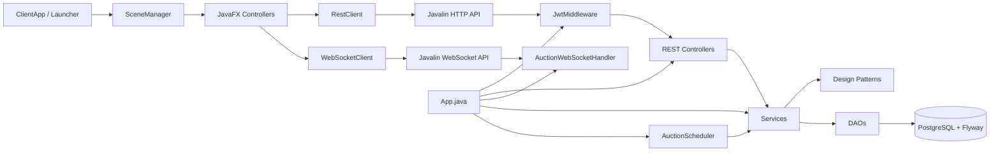
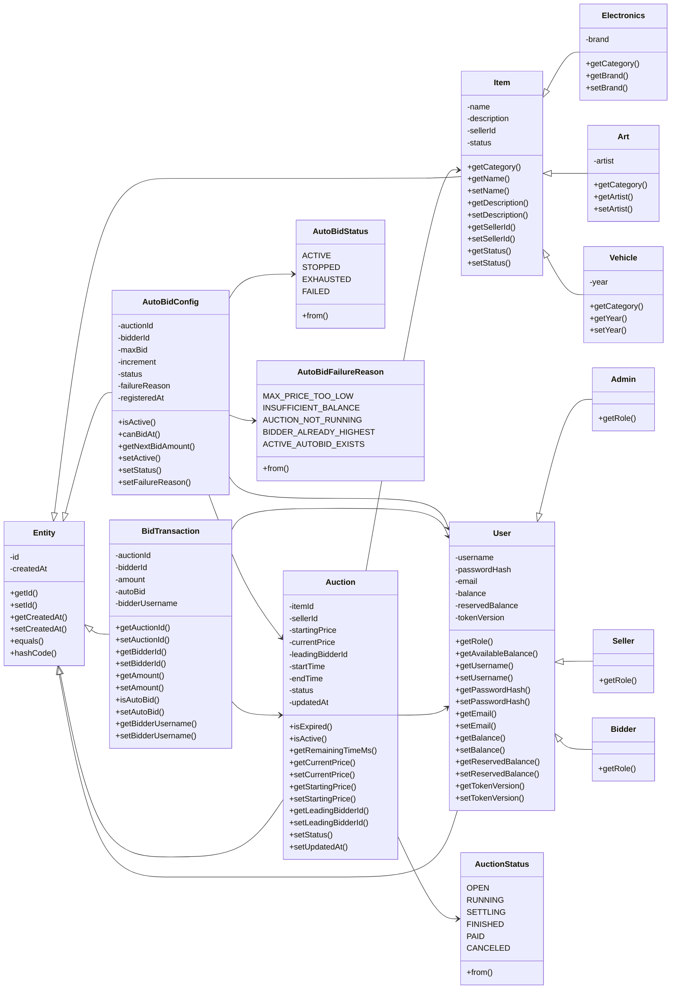
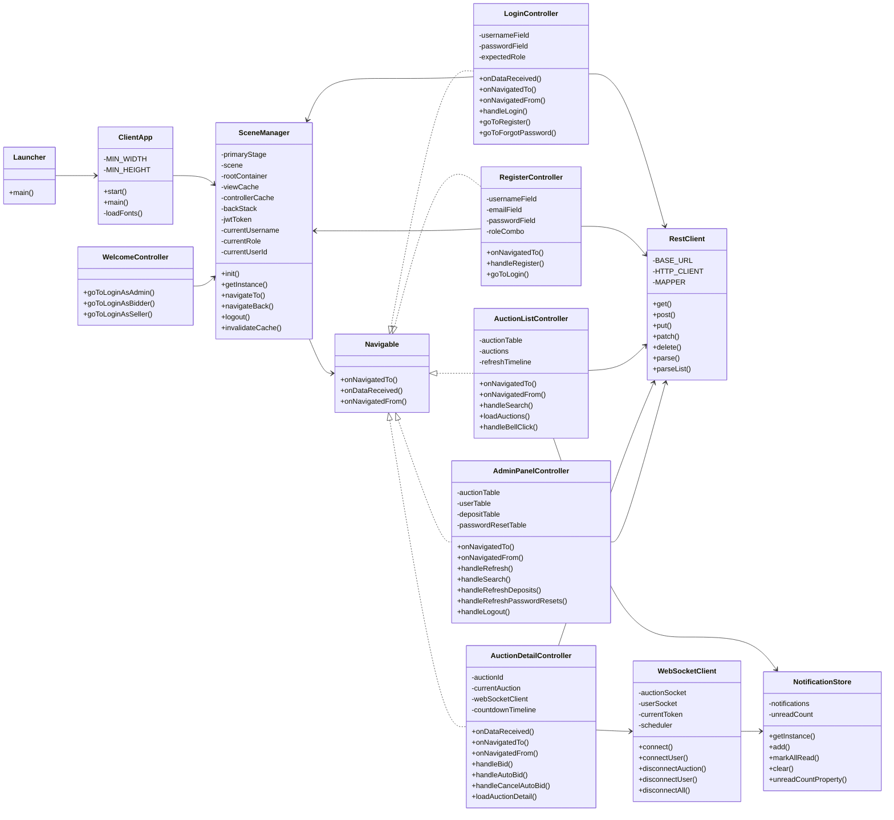

<div align='center'>


# Online Auction System

*A real-time desktop auction platform — JavaFX client · Javalin server · PostgreSQL · WebSocket*

[](https://github.com/kieran-labs/oop-course-project-uet/actions/workflows/ci.yml)
[](https://adoptium.net/)
[](https://javalin.io)
[](https://www.postgresql.org/)
[](https://gradle.org/)
[](LICENSE)

[](https://github.com/kieran-labs/oop-course-project-uet/releases/download/v1.0.0/auction-server-1.0.0.jar)
[](https://github.com/kieran-labs/oop-course-project-uet/releases/download/v1.0.0/auction-client-1.0.0.jar)


**[Release v1.0.0](https://github.com/kieran-labs/oop-course-project-uet/releases/tag/v1.0.0)** · **[Setup](docs/SETUP.md)** · **[Schema](docs/SCHEMA.md)** · **[UML Source Audit](docs/UML_SOURCE_AUDIT.md)** · **[CI](https://github.com/kieran-labs/oop-course-project-uet/actions/workflows/ci.yml)**

</div>

---

## 🚀 Evaluator First: Required Submission Information

> [!IMPORTANT]
> **For grading/evaluation, use the prebuilt JAR method below.** Do **not** build from source unless you are regenerating artifacts as a developer. The server commands below already include the required `JWT_SECRET`, so the evaluator only needs to copy and run them.

| Required item | Value |
|---|---|
| **GitHub repository** | [Project repository](https://github.com/kieran-labs/oop-course-project-uet) |
| **Main branch** | `main` |
| **Recommended run method** | Download the two prebuilt JARs, then run **Server first → Client second** |
| **Release page** | [Release v1.0.0](https://github.com/kieran-labs/oop-course-project-uet/releases/tag/v1.0.0) |
| **Server JAR** | [Download server executable](https://github.com/kieran-labs/oop-course-project-uet/releases/download/v1.0.0/auction-server-1.0.0.jar) |
| **Client JAR** | [Download client executable](https://github.com/kieran-labs/oop-course-project-uet/releases/download/v1.0.0/auction-client-1.0.0.jar) |
| **Report PDF** | `Pending final report link` |
| **Demo video** | `Pending demo video link` |

### ⚡ Quick Download

| Server | Client |
|:---:|:---:|
| [](https://github.com/kieran-labs/oop-course-project-uet/releases/download/v1.0.0/auction-server-1.0.0.jar) | [](https://github.com/kieran-labs/oop-course-project-uet/releases/download/v1.0.0/auction-client-1.0.0.jar) |
| `auction-server-1.0.0.jar` | `auction-client-1.0.0.jar` |

> [!WARNING]
> Before final submission, replace the pending report PDF and demo video entries with the final links.

---

## 1. Problem Description and System Scope

This project implements an **online auction system** where sellers can list items, create auctions, and bidders can join auctions, place bids, configure auto-bidding, and receive real-time updates. The system is built as a desktop client-server application: a JavaFX client communicates with a Javalin backend through REST APIs and WebSocket channels, while the backend persists data in PostgreSQL.

**System scope:**

| Area | Included scope |
|---|---|
| User management | Register, login, role-based access for `ADMIN`, `SELLER`, and `BIDDER` |
| Item management | Sellers create, view, edit, and delete their own items by category |
| Auction management | Sellers create auctions; the system manages lifecycle transitions and settlement |
| Bidding | Manual bidding, auto-bidding, bid history, validation, and wallet reservation |
| Realtime update | WebSocket notifications for bid updates, time extension, auction ending, and balance changes |
| Admin workflow | Deposit approval/rejection, password-reset approval/rejection, user and auction moderation |
| Persistence | PostgreSQL schema migration and persistent auction/user/bid/wallet data |
| Quality | Unit/integration tests, CI, static analysis, coverage, and formatted build pipeline |

---

## 2. Technology, Runtime Environment, and Installation Requirements

| Category | Technology / Requirement |
|---|---|
| Language | Java **21** |
| Client UI | JavaFX + FXML + CSS |
| Backend | Javalin REST API + WebSocket |
| Database | Embedded PostgreSQL for local evaluation; PostgreSQL-compatible schema with Flyway migrations |
| Persistence Access | JDBI |
| Authentication | JWT + BCrypt password hashing |
| Build Tool | Gradle Kotlin DSL |
| Testing / Quality | JUnit 5, Mockito, JaCoCo, Checkstyle, SpotBugs, Spotless, GitHub Actions |
| Operating System | Windows 10+ / macOS / Linux with JDK 21+ |
| Required Port | `8080` must be free before starting the server |

**Required installation:**

1. Install **JDK 21+**.
2. Make sure `java` is available in terminal:

```bash
java -version
```

3. No separate PostgreSQL installation is required for normal evaluation because the server starts embedded PostgreSQL automatically.
4. For grading/evaluation, prefer the **prebuilt release JARs**. They provide the cleanest path because dependencies are already packaged and the run commands below include the required `JWT_SECRET`.

---

## 3. Recommended Run Method — Use Prebuilt JARs

> [!IMPORTANT]
> **Use this method for grading.** Download the two JAR files below, put them in the same folder, then follow Section 4 exactly. Do **not** use the source-build section unless you are a developer regenerating the executable artifacts.

### Step 0 — Download these two files

| File | Direct download |
|---|---|
| **Server JAR** | [Server executable JAR](https://github.com/kieran-labs/oop-course-project-uet/releases/download/v1.0.0/auction-server-1.0.0.jar) |
| **Client JAR** | [Client executable JAR](https://github.com/kieran-labs/oop-course-project-uet/releases/download/v1.0.0/auction-client-1.0.0.jar) |

Release page: [Release v1.0.0](https://github.com/kieran-labs/oop-course-project-uet/releases/tag/v1.0.0)

Put both files in the same folder:

```text
auction-server-1.0.0.jar
auction-client-1.0.0.jar
```

---

## 🔥 4. Run the Application — Server First, Client Second

> [!IMPORTANT]
> Follow this order exactly:
>
> 1. Open **Terminal 1** in the folder containing the two JAR files.
> 2. Run the **Server** command below.
> 3. Keep Terminal 1 open.
> 4. Open **Terminal 2** in the same folder.
> 5. Run the **Client** command below.
>
> The server requires `JWT_SECRET`. The commands below already include it, so do **not** set anything manually.

### Step 1 — Open Terminal 1 and start the Server

#### Windows PowerShell

```powershell
$env:JWT_SECRET='auction-demo-secret-1234567890-abcdef-32bytes'; java -jar .\auction-server-1.0.0.jar
```

#### macOS / Linux

```bash
JWT_SECRET='auction-demo-secret-1234567890-abcdef-32bytes' java -jar ./auction-server-1.0.0.jar
```

Wait until the server finishes startup. The backend listens on:

```text
http://localhost:8080
```

> [!WARNING]
> Do **not** close Terminal 1 while using the application. Closing Terminal 1 stops the server.

### Step 2 — Open Terminal 2 and start the Client

#### Windows PowerShell

```powershell
java -jar .\auction-client-1.0.0.jar
```

#### macOS / Linux

```bash
java -jar ./auction-client-1.0.0.jar
```

To demonstrate multiple clients, open more terminals in the same folder and run the same client command again.

### Step 3 — Login with the seeded admin account

| Role | Username | Password |
|---|---|---|
| Admin | `admin` | `123456` |

### Step 4 — Recommended demo flow

1. Start the server and at least two clients.
2. Login as admin.
3. Register one seller and two bidders.
4. Bidders submit deposit requests.
5. Admin approves deposits.
6. Seller creates an item and an auction.
7. Bidders join the same auction and place bids.
8. Configure auto-bid for one bidder.
9. Observe realtime bid updates, chart updates, notifications, and anti-sniping extension.

---

## 5. Main Project Modules and Directory Structure

```text
src/main/java/com/auction
  ├─ App.java, AdminSeeder.java, ClientApp.java, Launcher.java
  ├─ config/             # DatabaseConfig, JwtUtil
  ├─ middleware/         # JwtMiddleware
  ├─ controller/         # REST controllers + AuctionWebSocketHandler
  ├─ service/            # business services + AuctionScheduler
  ├─ dao/                # JDBI DAOs + row mappers
  ├─ model/              # domain models, records, enums
  ├─ dto/                # request/response/WebSocket/error contracts
  ├─ exception/          # custom domain/API exceptions
  ├─ pattern/            # factory, state, observer, strategy
  ├─ util/               # REST/WS client, validators, notifications, formatting
  └─ ui/                 # JavaFX controllers and navigation utilities

src/main/resources
  ├─ db/migration/       # Flyway database migrations
  ├─ ui/fxml/            # JavaFX screen layouts
  ├─ css/                # JavaFX styling
  ├─ fonts/              # bundled Lexend font files
  └─ icons/              # UI icons

docs/
  ├─ SETUP.md
  ├─ SCHEMA.md
  ├─ BUSINESS_RULES.md
  └─ UML_SOURCE_AUDIT.md
```

---

## 6. Completed Features Mapped to Rubric

> [!IMPORTANT]
> This table intentionally maps each completed feature group directly to the grading rubric. It is written as evidence, not only as a feature list, so the evaluator can verify the implemented scope against the expected assessment items without guessing.

| Rubric area | Completed functionality | Concrete implementation evidence |
|---|---|---|
| User management and authentication | Register, login, JWT authentication, BCrypt password hashing, role-based authorization for `ADMIN`, `SELLER`, and `BIDDER` | `AuthController`, `UserService`, `UserDao`, `JwtUtil`, `JwtMiddleware`, `UserFactory`, `Admin`, `Seller`, `Bidder` |
| Product / item management | Sellers can create, view, edit, and delete their own items by category | `ItemController`, `ItemService`, `ItemDao`, `ItemFactory`, `Item`, `Electronics`, `Art`, `Vehicle` |
| Auction management | Sellers create auctions for their own available items; the system validates ownership and item availability | `AuctionController`, `AuctionService`, `AuctionDao`, `CreateAuctionRequest`, `AuctionResponse` |
| Auction lifecycle | Auctions move through `OPEN → RUNNING → SETTLING → FINISHED / PAID / CANCELED` with scheduler-driven transitions and settlement logic | `AuctionStatus`, `AuctionScheduler`, `AuctionStateFactory`, `AuctionStates`, `OpenState`, `RunningState`, `SettlingState`, `FinishedState`, `PaidState`, `CanceledState` |
| Manual bidding | Bidders can join auctions and place valid manual bids with bid history and highest-price tracking | `BidController`, `BidService`, `BidTransactionDao`, `BidTransaction`, `BidRequest`, `BidUpdateMessage` |
| Concurrent bidding | Bid placement is transaction-protected and uses row-level locking to avoid race conditions | `BidService.placeBid(...)`, `jdbi.inTransaction(...)`, `AuctionDao.findByIdForUpdate(...)`, `UserDao.findByIdForUpdate(...)` |
| Wallet and deposit workflow | Bidders submit deposits; admin approves/rejects; wallet balance and reserved balance are updated consistently | `DepositRequestDao`, `DepositRecord`, `UserService.approveDeposit(...)`, `WalletTransactionDao`, `User.balance`, `User.reservedBalance` |
| Admin functions | Admin can manage users, approve/reject deposits, approve/reject password reset requests, and moderate auctions | `AdminPanelController`, admin routes in `App.java`, `UserService`, `PasswordResetService`, `DepositRequestDao`, `PasswordResetRequestDao` |
| Error handling | Domain errors are represented by a custom exception hierarchy and mapped to HTTP/API errors | `AuctionException`, `InvalidBidException`, `AuctionClosedException`, `UnauthorizedException`, `NotFoundException`, `DuplicateException`, `ErrorResponse` |
| Realtime update | Bid updates, time extension updates, auction-ended events, user notifications, and balance updates are pushed through WebSocket | `AuctionWebSocketHandler`, `AuctionEventManager`, `AuctionEventListener`, `WebSocketObserver`, `WebSocketClient`, `BidUpdateMessage` |
| Advanced feature: auto-bidding | Users can configure auto-bidding with maximum bid, increment, active-status detection, and chained execution | `AutoBidStrategy`, `AutoBidConfig`, `AutoBidConfigDao`, `AutoBidRequest`, `AutoBidStatus`, `AutoBidFailureReason` |
| Advanced feature: anti-sniping | Late bids automatically extend auction end time to reduce last-second unfair wins | `BidService`, `ANTI_SNIPE_THRESHOLD_MS`, `ANTI_SNIPE_EXTENSION_SECONDS`, `BidUpdateMessage.timeExtended(...)` |
| Client-server architecture | JavaFX desktop client communicates with a Javalin backend through REST APIs and WebSocket channels | JavaFX controllers, `RestClient`, `WebSocketClient`, REST controllers, `AuctionWebSocketHandler` |
| MVC / layered architecture | UI, controller, service, DAO, model, DTO, and database migration responsibilities are separated | `ui/controller`, `controller`, `service`, `dao`, `model`, `dto`, `db/migration` |
| OOP principles | Encapsulation, inheritance, polymorphism, abstraction, interfaces, and role/category specialization are used in the domain model and patterns | `Entity`, `User → Admin/Seller/Bidder`, `Item → Electronics/Art/Vehicle`, `AuctionState`, `AuctionEventListener`, factories and strategies |
| Design patterns | Factory, State, Observer, Strategy, and DAO patterns are implemented explicitly | `pattern/factory`, `pattern/state`, `pattern/observer`, `pattern/strategy`, `dao` package |
| JavaFX client functionality | Client includes login/register/profile/admin screens, auction list/detail, bid chart, notifications, wallet/deposit screens, and custom styling | `ClientApp`, `Launcher`, `SceneManager`, JavaFX controllers, FXML files, CSS, screenshots |
| Persistence and migrations | PostgreSQL schema is versioned and data is persisted across users, items, auctions, bids, deposits, notifications, and wallet records | Flyway migrations in `src/main/resources/db/migration`, `DatabaseConfig`, DAOs |
| Build, testing, and quality | Project includes Gradle build, executable fat JARs, unit/integration tests, formatting/static checks, coverage, and CI | `build.gradle.kts`, `build/libs/*.jar`, JUnit tests, Checkstyle, SpotBugs, Spotless, JaCoCo, GitHub Actions |

---

## Screenshots

| Login | Auction List |
|:---:|:---:|
|  |  |

| Auction Detail | Admin Dashboard |
|:---:|:---:|
|  |  |

---

## Architecture

The architecture flowchart below is a **runtime communication/data-flow view**, not a strict Java import graph. It shows how the JavaFX client talks to server routes and WebSocket endpoints, then how server requests move through controllers, services, DAOs, patterns, and PostgreSQL.



---

## Source-Code Coverage Audit for UML

The diagrams below are intentionally split into smaller GitHub-safe Mermaid blocks. Endpoint paths are kept in Markdown tables instead of class bodies because GitHub Mermaid can fail on route strings such as `/api/auctions/{id}/bid`. Mermaid stereotypes such as `record`, `mapper`, or `interface` are described in text instead of angle-bracket syntax to prevent GitHub rendering errors.

| Package | Files represented in UML |
|---|---|
| `com.auction` | `App`, `AdminSeeder`, `ClientApp`, `Launcher` |
| `config` / `middleware` | `DatabaseConfig`, `JwtUtil`, `JwtMiddleware` |
| `controller` | `AuthController`, `ItemController`, `AuctionController`, `BidController`, `NotificationController`, `AuctionWebSocketHandler` |
| `service` | `UserService`, `PasswordResetService`, `ItemService`, `AuctionService`, `BidService`, `NotificationService`, `AuctionScheduler` |
| `dao` | `UserDao`, `ItemDao`, `AuctionDao`, `BidTransactionDao`, `AutoBidConfigDao`, `DepositRequestDao`, `PasswordResetRequestDao`, `NotificationDao`, `WalletTransactionDao` |
| `model` | `Entity`, `User`, `Admin`, `Seller`, `Bidder`, `Item`, `Electronics`, `Art`, `Vehicle`, `Auction`, `AuctionStatus`, `BidTransaction`, `AutoBidConfig`, `AutoBidStatus`, `AutoBidFailureReason`, `DepositRecord`, `PasswordResetRecord` |
| `dto` | request DTOs, response DTOs, `BidUpdateMessage`, `ErrorResponse`, `PageRequest` |
| `exception` | `AuctionException`, `InvalidBidException`, `AuctionClosedException`, `UnauthorizedException`, `NotFoundException`, `DuplicateException` |
| `pattern` | Factory, State, Observer, and Strategy implementations |
| `util` | `MoneyValidator`, `NotificationFormat`, `RestClient`, `WebSocketClient`, notification utilities |
| `ui.controller` / `ui.util` | JavaFX controllers, `SceneManager`, `Navigable` |
| nested source-level helpers | DAO row mappers, `BidHistoryEntry`, scheduler records, `ResizeDirection`, `BalanceDisplay`, date-picker helper classes |

### Inline Routes in `App.java`

| Group | Endpoints |
|---|---|
| Health / shutdown | `GET /api/health`, `POST /internal/shutdown` |
| Current user | `GET /api/users/me`, `PUT /api/users/me/password` |
| Deposit | `GET /api/users/me/deposit-requests`, `POST /api/users/me/deposit` |
| Admin deposit | `GET /api/admin/deposit-requests`, approve/reject by id |
| Admin password reset | `GET /api/admin/password-reset-requests`, approve/reject by id |
| Admin management | `DELETE /api/admin/auctions/{id}`, `GET /api/admin/users`, `DELETE /api/admin/users/{id}` |
| Auto-bid | `GET/POST/DELETE /api/auctions/{id}/auto-bid` |
| WebSocket | `/ws/auction/{id}`, `/ws/user/{id}` |

---

## Class Diagrams

### 1. Runtime Composition, Security, and Route Registration

```mermaid
classDiagram
    direction LR

    class App {
        -SERVER_PORT
        -DATA_DIR
        -SERVER_PID_FILE
        -SERVER_TOKEN_FILE
        -SECURE_RANDOM
        -SHUTTING_DOWN
        +main()
        -buildJavalin()
        -registerShutdownHook()
        -stopServer()
        -isServerAlreadyRunning()
        -loadOrCreateShutdownToken()
        -writeServerPid()
        -deleteServerPid()
        -isLocalRequest()
        -requireAdmin()
        -requireRole()
        -seedAdminIfNeeded()
        -registerExceptionHandlers()
    }

    class AdminSeeder {
        -userDao
        -DEFAULT_ADMIN_USERNAME
        -DEFAULT_ADMIN_EMAIL
        -ENV_PASSWORD_VAR
        -DEMO_FALLBACK_PASSWORD
        +seed()
        +resolveAdminPassword()
    }

    class DatabaseConfig {
        -jdbi
        -dataSource
        -embeddedPostgres
        -EMBEDDED_DATA_DIR
        -POSTGRES_PID_FILE
        -POSTMASTER_PID_FILE
        +create()
        +shutDown()
        -initExternalPostgres()
        -initEmbeddedPostgres()
        -runMigrations()
        -buildHikariConfig()
        -registerShutdownHook()
    }

    class JwtUtil {
        -MIN_SECRET_BYTES
        -SECRET_KEY
        -ALGORITHM
        -VERIFIER
        +validateConfiguration()
        +requireJwtSecret()
        +createToken()
        +verifyToken()
    }

    class JwtMiddleware {
        -userDao
        +configure()
        +handle()
        -attachUserClaims()
        -validateTokenVersion()
        -extractTokenVersion()
    }

    class AuctionWebSocketHandler {
        -jdbi
        -userDao
        -connections
        -userConnections
        -observers
        -sessionExpiresAt
        -expirationTasks
        -expirationScheduler
        -eventManager
        -objectMapper
        +onConnect()
        +onUserConnect()
        +onClose()
        +onUserClose()
        +onError()
        +onUserError()
        +broadcast()
        +pushUserNotification()
        +notifyBalanceUpdate()
        +notifyBalanceChange()
        +notifyUser()
        +getConnectionCount()
        +saveNotificationToDatabase()
    }

    class AuctionEventManager {
        -listeners
        +subscribe()
        +unsubscribe()
        +notifyBidUpdate()
        +notifyTimeExtended()
        +notifyAuctionEnd()
    }

    class WebSocketObserver {
        -handler
        -auctionId
        +onBidUpdate()
        +onTimeExtended()
        +onAuctionEnd()
        +getAuctionId()
    }

    class AuthController {
        +register()
        +registerPasswordReset()
        -handleRegister()
        -handleLogin()
        -handleForgotPassword()
    }

    class ItemController {
        +register()
        -handleGetAll()
        -handleGetById()
        -handleCreate()
        -handleUpdate()
        -handleDelete()
    }

    class AuctionController {
        +register()
        -handleGetAll()
        -handleGetById()
        -handleCreate()
        -handleUpdate()
        -handleDelete()
    }

    class BidController {
        -bidService
        +register()
        +handleManualBid()
    }

    class NotificationController {
        +register()
        -handleGetNotifications()
        -handleMarkRead()
        -handleMarkAllRead()
    }

    App --> DatabaseConfig
    App --> JwtUtil
    App --> JwtMiddleware
    App --> AdminSeeder
    App --> AuthController
    App --> ItemController
    App --> AuctionController
    App --> BidController
    App --> NotificationController
    App --> AuctionWebSocketHandler
    JwtMiddleware --> JwtUtil
    AuctionWebSocketHandler --> JwtUtil
    AuctionWebSocketHandler --> AuctionEventManager
    AuctionWebSocketHandler --> WebSocketObserver
```



### 2. Service Layer and Data Access Layer

```mermaid
classDiagram
    direction LR

    class UserService {
        -userDao
        -depositRequestDao
        -jdbi
        +register()
        +login()
        +getRoleByUsername()
        +findById()
        +changePassword()
        +requestDeposit()
        +getPendingDeposits()
        +approveDeposit()
        +rejectDeposit()
        +getAll()
        +delete()
    }

    class PasswordResetService {
        -userDao
        -resetDao
        -jdbi
        +requestReset()
        +getPendingRequests()
        +approveReset()
        +rejectReset()
        -generateTempPassword()
    }

    class ItemService {
        -itemDao
        +create()
        +getAll()
        +getBySellerId()
        +getById()
        +update()
        +delete()
        -checkOwnership()
    }

    class AuctionService {
        -auctionDao
        -itemDao
        -userDao
        -eventManager
        -jdbi
        -bidTransactionDao
        -wsHandler
        +getAllAuctions()
        +getAll()
        +getById()
        +getAuctionById()
        +create()
        +update()
        +delete()
        +hardDelete()
        +getState()
    }

    class BidService {
        -auctionDao
        -bidTransactionDao
        -autoBidConfigDao
        -eventManager
        -jdbi
        -auctionService
        -userDao
        -autoBidStrategy
        -wsHandler
        +placeBid()
        +getBidHistory()
        +createAutoBid()
    }

    class NotificationService {
        -notificationDao
        +getRecentNotifications()
        +markRead()
        +markAllRead()
    }

    class UserDao {
        -jdbi
        +insert()
        +findById()
        +findByIdForUpdate()
        +findByUsername()
        +findByEmail()
        +findAll()
        +update()
        +delete()
        +updateReservedBalanceInTransaction()
        +releaseReservedBalanceInTransaction()
    }

    class ItemDao {
        -jdbi
        +insert()
        +findAll()
        +findById()
        +findByIdForUpdate()
        +findBySellerId()
        +update()
        +delete()
        +updateStatusInTransaction()
    }

    class AuctionDao {
        -jdbi
        +insert()
        +insertInTransaction()
        +findById()
        +findByIdForUpdate()
        +findAll()
        +findByStatus()
        +update()
        +updateInTransaction()
        +atomicTransition()
        +findDueAuctionIds()
        +findExpiredAuctionIds()
        +hardDelete()
    }

    class BidTransactionDao {
        -jdbi
        +insert()
        +findByAuctionId()
        +findByBidderId()
        +findLastBid()
        +findWithUsernames()
        +countByAuctionId()
        +getHighestPrice()
        +deleteByAuctionId()
    }

    class AutoBidConfigDao {
        -jdbi
        +insert()
        +findById()
        +findByAuctionAndBidder()
        +findActiveByAuctionId()
        +hasActiveConfig()
        +upsertInTransaction()
        +update()
    }

    class DepositRequestDao {
        -jdbi
        +insert()
        +findById()
        +findByIdForUpdate()
        +findByUserId()
        +findByStatus()
        +transitionStatusInTransaction()
    }

    class PasswordResetRequestDao {
        -jdbi
        +insert()
        +findByIdForUpdate()
        +findByStatus()
        +hasPendingRequest()
        +transitionStatusInTransaction()
    }

    class NotificationDao {
        -jdbi
        +findRecentByUserId()
        +markRead()
        +markAllRead()
    }

    class WalletTransactionDao {
        +insert()
    }

    class AutoBidStrategy {
        -autoBidConfigDao
        -userDao
        +executeAll()
        +executeAllInTransaction()
    }

    UserService --> UserDao
    UserService --> DepositRequestDao
    UserService --> WalletTransactionDao
    PasswordResetService --> UserDao
    PasswordResetService --> PasswordResetRequestDao
    ItemService --> ItemDao
    AuctionService --> AuctionDao
    AuctionService --> ItemDao
    AuctionService --> UserDao
    AuctionService --> BidTransactionDao
    AuctionService --> WalletTransactionDao
    BidService --> AuctionDao
    BidService --> BidTransactionDao
    BidService --> AutoBidConfigDao
    BidService --> UserDao
    BidService --> AuctionService
    BidService --> AutoBidStrategy
    NotificationService --> NotificationDao
```



### 3. Domain Model, Records, and Enums



### 4. DTOs, WebSocket Contracts, and Exceptions

```mermaid
classDiagram
    direction LR

    class LoginRequest {
        -username
        -password
        +getUsername()
        +setUsername()
        +getPassword()
        +setPassword()
    }

    class RegisterRequest {
        -username
        -email
        -password
        -role
        +getUsername()
        +setUsername()
        +getEmail()
        +setEmail()
        +getPassword()
        +setPassword()
        +getRole()
        +setRole()
    }

    class CreateItemRequest {
        -name
        -description
        -category
        -categoryDetail
        +getName()
        +setName()
        +getDescription()
        +setDescription()
        +getCategory()
        +setCategory()
        +getCategoryDetail()
        +setCategoryDetail()
    }

    class CreateAuctionRequest {
        -itemId
        -startingPrice
        -startTime
        -endTime
        +getItemId()
        +setItemId()
        +getStartingPrice()
        +setStartingPrice()
        +getStartTime()
        +setStartTime()
        +getEndTime()
        +setEndTime()
    }

    class BidRequest {
        -amount
        +getAmount()
        +setAmount()
    }

    class AutoBidRequest {
        -maxBid
        -increment
        +getMaxBid()
        +setMaxBid()
        +getIncrement()
        +setIncrement()
    }

    class AuctionResponse {
        -id
        -itemId
        -sellerId
        -itemName
        -itemCategory
        -startingPrice
        -currentPrice
        -leadingBidderId
        -leadingBidderUsername
        -startTime
        -endTime
        -status
        -remainingTimeMs
        +fromAuction()
    }

    class UserResponse {
        -id
        -username
        -email
        -role
        -balance
        -availableBalance
        -createdAt
        +from()
    }

    class ErrorResponse {
        -error
        -message
        -timestamp
        +of()
        +toString()
    }

    class BidUpdateMessage {
        -type
        -auctionId
        -currentPrice
        -leadingBidderId
        -leadingBidderUsername
        -endTime
        -timestamp
        -autoBid
        -newBalance
        -balanceDelta
        -approved
        -message
        +bidUpdate()
        +timeExtended()
        +auctionEnded()
        +balanceUpdated()
        +balanceChanged()
        +userNotification()
    }

    class User {
        -username
        -email
        -balance
        -reservedBalance
        +getRole()
        +getAvailableBalance()
    }

    class Auction {
        -itemId
        -sellerId
        -currentPrice
        -leadingBidderId
        -status
        +isActive()
        +getRemainingTimeMs()
    }

    class AuctionException {
        +toString()
    }

    class InvalidBidException {
        +InvalidBidException()
    }

    class AuctionClosedException {
        +AuctionClosedException()
    }

    class UnauthorizedException {
        +UnauthorizedException()
    }

    class NotFoundException {
        +NotFoundException()
    }

    class DuplicateException {
        +DuplicateException()
    }

    UserResponse --> User
    AuctionResponse --> Auction
    BidUpdateMessage --> Auction
    AuctionException <|-- InvalidBidException
    AuctionException <|-- AuctionClosedException
    AuctionException <|-- UnauthorizedException
    AuctionException <|-- NotFoundException
    AuctionException <|-- DuplicateException
```



### 5. Design Patterns and Realtime Collaboration

```mermaid
classDiagram
    direction LR

    class UserFactory {
        +create()
    }

    class Admin {
        +getRole()
    }

    class Seller {
        +getRole()
    }

    class Bidder {
        +getRole()
    }

    class ItemFactory {
        +create()
        -parseYear()
    }

    class Electronics {
        -brand
        +getCategory()
        +getBrand()
        +setBrand()
    }

    class Art {
        -artist
        +getCategory()
        +getArtist()
        +setArtist()
    }

    class Vehicle {
        -year
        +getCategory()
        +getYear()
        +setYear()
    }

    class AuctionStateFactory {
        +create()
    }

    class AuctionState {
        +placeBid()
        +close()
        +edit()
        +extend()
    }

    class AuctionStates {
        +OPEN
        +RUNNING
        +SETTLING
        +FINISHED
        +PAID
        +CANCELED
    }

    class OpenState {
        +placeBid()
        +close()
        +edit()
        +extend()
    }

    class RunningState {
        +placeBid()
        +close()
        +edit()
        +extend()
    }

    class SettlingState {
        +placeBid()
        +close()
        +edit()
        +extend()
    }

    class FinishedState {
        +placeBid()
        +close()
        +edit()
        +extend()
    }

    class PaidState {
        +placeBid()
        +close()
        +edit()
        +extend()
    }

    class CanceledState {
        +placeBid()
        +close()
        +edit()
        +extend()
    }

    class AuctionEventListener {
        +onBidUpdate()
        +onTimeExtended()
        +onAuctionEnd()
    }

    class AuctionEventManager {
        -listeners
        +subscribe()
        +unsubscribe()
        +notifyBidUpdate()
        +notifyTimeExtended()
        +notifyAuctionEnd()
    }

    class WebSocketObserver {
        -handler
        -auctionId
        +onBidUpdate()
        +onTimeExtended()
        +onAuctionEnd()
        +getAuctionId()
    }

    class AuctionWebSocketHandler {
        -connections
        -userConnections
        -observers
        +broadcast()
        +pushUserNotification()
        +notifyBalanceUpdate()
        +notifyBalanceChange()
    }

    class AutoBidStrategy {
        -autoBidConfigDao
        -userDao
        +executeAll()
        +executeAllInTransaction()
    }

    class AutoBidConfigDao {
        -jdbi
        +findActiveByAuctionId()
        +findByAuctionAndBidder()
        +hasActiveConfig()
        +upsertInTransaction()
        +update()
    }

    class UserDao {
        -jdbi
        +findByIdForUpdate()
        +updateReservedBalanceInTransaction()
        +releaseReservedBalanceInTransaction()
    }

    class AutoBidConfig {
        -auctionId
        -bidderId
        -maxBid
        -increment
        -status
        -failureReason
        +isActive()
        +canBidAt()
        +getNextBidAmount()
        +setStatus()
        +setFailureReason()
    }

    class AutoBidExecutor {
        +execute()
    }

    class InTransactionBidExecutor {
        +execute()
    }

    UserFactory --> Admin
    UserFactory --> Seller
    UserFactory --> Bidder
    ItemFactory --> Electronics
    ItemFactory --> Art
    ItemFactory --> Vehicle
    AuctionStateFactory --> AuctionStates
    AuctionStateFactory --> AuctionState
    AuctionStates --> OpenState
    AuctionStates --> RunningState
    AuctionStates --> SettlingState
    AuctionStates --> FinishedState
    AuctionStates --> PaidState
    AuctionStates --> CanceledState
    AuctionState <|.. OpenState
    AuctionState <|.. RunningState
    AuctionState <|.. SettlingState
    AuctionState <|.. FinishedState
    AuctionState <|.. PaidState
    AuctionState <|.. CanceledState
    AuctionEventListener <|.. WebSocketObserver
    AuctionEventManager --> AuctionEventListener
    AuctionWebSocketHandler --> WebSocketObserver
    WebSocketObserver --> AuctionWebSocketHandler
    AutoBidStrategy --> AutoBidConfigDao
    AutoBidStrategy --> UserDao
    AutoBidStrategy --> AutoBidConfig
    AutoBidStrategy --> AutoBidExecutor
    AutoBidStrategy --> InTransactionBidExecutor
```



### 6. JavaFX Client, Navigation, Utilities, and Notifications



### 7. Source-Level Nested Types and Helpers

```mermaid
classDiagram
    direction LR

    class AuctionDao {
        +findById()
        +findByIdForUpdate()
    }

    class AuctionMapper {
        +map()
    }

    class AutoBidConfigDao {
        +findActiveByAuctionId()
        +upsertInTransaction()
    }

    class AutoBidConfigMapper {
        +map()
    }

    class BidTransactionDao {
        +findWithUsernames()
        +findByAuctionId()
    }

    class BidTransactionMapper {
        +map()
    }

    class BidHistoryEntry {
        -transaction
        -username
        +getAuctionId()
        +getBidderId()
        +getAmount()
        +isAutoBid()
        +getCreatedAt()
    }

    class DepositRequestDao {
        +findByIdForUpdate()
    }

    class DepositRecordMapper {
        +map()
    }

    class ItemDao {
        +findById()
    }

    class ItemMapper {
        +map()
    }

    class PasswordResetRequestDao {
        +findByIdForUpdate()
    }

    class PasswordResetMapper {
        +map()
    }

    class UserDao {
        +findById()
        +findByUsername()
    }

    class UserMapper {
        +map()
    }

    class AuctionScheduler {
        -settleAndClose()
    }

    class SchedulerBalanceChange {
        -userId
        -newBalance
        -delta
        -message
        -notificationType
    }

    class SchedulerUserNotification {
        -userId
        -message
        -notificationType
    }

    class SchedulerSettlementResult {
        -auction
        -userNotifications
        -balanceChanges
    }

    class AutoBidStrategy {
        +executeAll()
        +executeAllInTransaction()
    }

    class AutoBidExecutor {
        +execute()
    }

    class InTransactionBidExecutor {
        +execute()
    }

    class SceneManager {
        +init()
        +navigateTo()
    }

    class ResizeDirection {
        NONE
        NORTH
        SOUTH
        EAST
        WEST
        NORTH_EAST
        NORTH_WEST
        SOUTH_EAST
        SOUTH_WEST
    }

    class AuctionListController {
        -loadCurrentBalance()
    }

    class BalanceDisplay {
        -text
        -color
    }

    class CreateAuctionController {
        -configureDatePickerGlassPopup()
    }

    class GlassDateCell {
        -picker
        -state
        -shadow
        +updateItem()
        -refreshAppearance()
    }

    class GlassCalendarState {
        -hoveredCell
        -hoverProgress
        -hoverTimeline
        -refreshAll()
    }

    AuctionDao *-- AuctionMapper
    AutoBidConfigDao *-- AutoBidConfigMapper
    BidTransactionDao *-- BidTransactionMapper
    BidTransactionDao *-- BidHistoryEntry
    DepositRequestDao *-- DepositRecordMapper
    ItemDao *-- ItemMapper
    PasswordResetRequestDao *-- PasswordResetMapper
    UserDao *-- UserMapper
    AuctionScheduler *-- SchedulerBalanceChange
    AuctionScheduler *-- SchedulerUserNotification
    AuctionScheduler *-- SchedulerSettlementResult
    SchedulerSettlementResult --> SchedulerUserNotification
    SchedulerSettlementResult --> SchedulerBalanceChange
    AutoBidStrategy *-- AutoBidExecutor
    AutoBidStrategy *-- InTransactionBidExecutor
    SceneManager *-- ResizeDirection
    AuctionListController *-- BalanceDisplay
    CreateAuctionController *-- GlassDateCell
    CreateAuctionController *-- GlassCalendarState
    GlassDateCell --> GlassCalendarState
```



---

## Main Technical Flow: Manual Bid

```text
AuctionDetailController
  → POST /api/auctions/{id}/bid with JWT
  → JwtMiddleware verifies token and role context
  → BidController requires BIDDER
  → BidService.placeBid(...)
      → jdbi.inTransaction(...)
      → auctionDao.findByIdForUpdate(...)      # SELECT FOR UPDATE
      → RunningState.placeBid(...)             # state validation
      → userDao.findByIdForUpdate(...)         # balance/reservation lock
      → release previous leader reservation
      → freeze current leader reservation
      → insert bid_transactions + wallet_transactions
      → execute auto-bid chain in the same transaction
  → after commit: Observer/WebSocket broadcasts BID_UPDATE / TIME_EXTENDED
  → all connected clients update price, countdown, and chart
```

---

## Developer Only: Build JARs from Source

> [!WARNING]
> This section is for developers only. For grading/evaluation, use the prebuilt JARs in Section 3. Build from source only when you intentionally need to regenerate the executable artifacts.

macOS / Linux:

```bash
./gradlew clean buildJars
```

Windows:

```cmd
gradlew.bat clean buildJars
```

Generated JAR paths:

```text
build/libs/auction-server-1.0.0.jar
build/libs/auction-client-1.0.0.jar
```

---

## Developer Build and Quality Gates

```bash
git clone https://github.com/kieran-labs/oop-course-project-uet.git
cd oop-course-project-uet
```

| Command | Purpose |
|---|---|
| `./gradlew run` | Run the server from source |
| `./gradlew runClient` | Run the JavaFX client from source |
| `./gradlew spotlessCheck` | Verify Google Java formatting |
| `./gradlew test` | Run JUnit 5 / Mockito tests |
| `./gradlew check` | Run tests, Checkstyle, SpotBugs, and JaCoCo verification |
| `./gradlew jacocoTestReport` | Generate HTML coverage report |
| `./gradlew buildJars` | Build server and client fat JARs |

GitHub Actions runs formatting, tests, static analysis, and coverage verification on `main` pushes and pull requests.

---

## Rubric Coverage Cross-Check

The completed-feature table above is the primary rubric map. This cross-check restates the same evidence by assessment dimension so the project can be reviewed from either direction: feature-first or rubric-first.

| Rubric item | Evidence |
|---|---|
| Class design and inheritance | `Entity`, `User → Bidder/Seller/Admin`, `Item → Electronics/Art/Vehicle`, `Auction`, `BidTransaction`, `AutoBidConfig` |
| OOP principles | Encapsulation through private fields/getters/setters, inheritance for users/items, polymorphism through `getRole()` / `getCategory()`, abstraction through state/listener interfaces |
| Design patterns | Factory (`UserFactory`, `ItemFactory`, `AuctionStateFactory`), State (`AuctionState` and concrete states), Observer (`AuctionEventManager`, `WebSocketObserver`), Strategy (`AutoBidStrategy`), DAO layer |
| User and product management | Authentication, role-based access, item CRUD, auction CRUD, deposit/password-reset admin workflows |
| Auction functionality | Manual bidding, bid history, lifecycle transitions, settlement, cancellation, winner/leader tracking |
| Error handling | Custom exception hierarchy and API `ErrorResponse` mapping |
| Concurrent bidding | Transactional bid placement and row-level locking via `findByIdForUpdate` methods |
| Realtime update | WebSocket bid updates, auction end events, time extension events, notification pushes, balance updates |
| Client-server | JavaFX client communicates with Javalin server through REST and WebSocket |
| MVC / layering | FXML + JavaFX controllers; server Controller → Service → DAO → PostgreSQL |
| Build and conventions | Gradle Kotlin DSL, fat JAR tasks, Checkstyle, Spotless, SpotBugs |
| Unit/integration tests | JUnit 5 / Mockito / PostgreSQL integration tests across config, controller, DAO, service, model, pattern, util packages |
| CI/CD | GitHub Actions workflow for formatting, tests, static analysis, coverage, and build verification |
| Advanced features | Auto-bidding, anti-sniping, realtime bid chart, wallet reservation, persistent notifications |

---

## Known Limitations

- Payment is simulated through wallet balance and ledger records; there is no external payment gateway.
- Embedded PostgreSQL is intended for local evaluation and demo. Production should use managed PostgreSQL.
- WebSocket subscriptions are in-memory per server process. Horizontal scaling would require a broker such as Redis Pub/Sub.
- Password reset is admin-reviewed for classroom simplicity; production should use email or another secure out-of-band channel.

---

## Troubleshooting

### `JWT_SECRET is required and must be at least 32 bytes long`

Use the exact one-line server command from Section 4.

Windows PowerShell:

```powershell
$env:JWT_SECRET='auction-demo-secret-1234567890-abcdef-32bytes'; java -jar .\auction-server-1.0.0.jar
```

macOS / Linux:

```bash
JWT_SECRET='auction-demo-secret-1234567890-abcdef-32bytes' java -jar ./auction-server-1.0.0.jar
```

### Port 8080 already in use

Stop the old server process or change the environment. On Windows, the helper scripts may help:

```cmd
server-status.bat
server-stop.bat
```

### Embedded PostgreSQL data directory is stuck

Stop the server and delete generated local state:

```cmd
rmdir /s /q data logs
```

macOS / Linux:

```bash
rm -rf data logs
```

---

## Team

| Member | GitHub | Role | Main Contributions |
|---|---|---|---|
| Bui Ngoc Phu Hung | [@HumaNormal](https://github.com/HumaNormal) | Backend Lead | Javalin server, REST controllers, WebSocket handler, DAOs, Flyway, database config |
| Tran Anh Duc | [@kieran-lucas](https://github.com/kieran-lucas) | Frontend Lead | JavaFX controllers, FXML screens, SceneManager, notifications UI, CSS theme, Lexend integration |
| Nguyen Dinh Viet Duc | [@Black1206-coder](https://github.com/Black1206-coder) | Business Logic | Services, design patterns, exception hierarchy, JWT, BCrypt authentication |
| Bui Quang Huy | [@stillqhuy](https://github.com/stillqhuy) | DevOps & QA | GitHub Actions, JUnit tests, Gradle configuration, Checkstyle, SpotBugs, documentation |

---

## License

Released under the [MIT License](LICENSE).

<div align='center'>
<sub>Built for Advanced Programming (LTNC) — University of Engineering and Technology, VNU Hanoi</sub>
</div>
