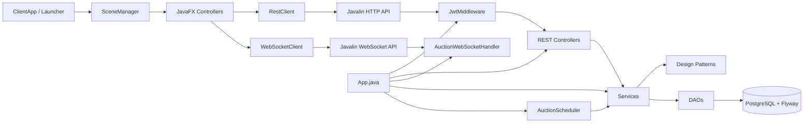
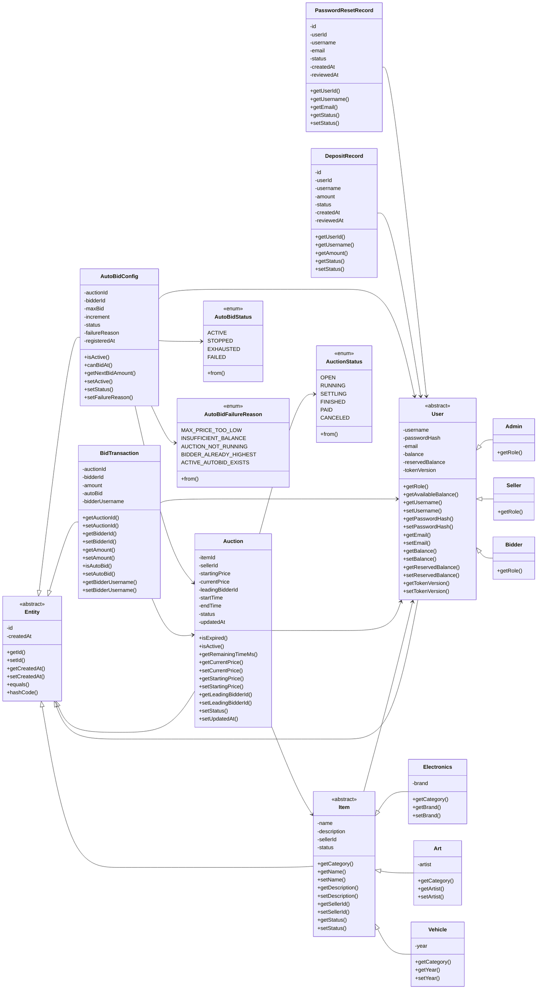

<div align="center">


# Online Auction System

*A real-time desktop auction platform — JavaFX client · Javalin server · PostgreSQL · WebSocket*

[](https://github.com/kieran-labs/oop-course-project-uet/actions/workflows/ci.yml)
[](https://adoptium.net/)
[](https://javalin.io)
[](https://www.postgresql.org/)
[](https://gradle.org/)
[](LICENSE)

**[Download v1.0.0 JARs](https://github.com/kieran-labs/oop-course-project-uet/releases/tag/v1.0.0)** · **[Setup](docs/SETUP.md)** · **[Schema](docs/SCHEMA.md)** · **[UML Source Audit](docs/UML_SOURCE_AUDIT.md)** · **[CI](https://github.com/kieran-labs/oop-course-project-uet/actions/workflows/ci.yml)**

</div>

---

## Submission Links

| Item | Link |
|---|---|
| GitHub repository | https://github.com/kieran-labs/oop-course-project-uet |
| Main branch | `main` |
| Prebuilt JARs | https://github.com/kieran-labs/oop-course-project-uet/releases/tag/v1.0.0 |
| Report PDF | `TODO_ADD_REPORT_PDF_LINK` |
| Demo video | `TODO_ADD_DEMO_VIDEO_LINK` |

---

## Evaluator Quick Start

### Requirements

| Requirement | Version / Note |
|---|---|
| Java | JDK **21+** |
| OS | Windows 10+ / macOS / Linux with desktop display |
| Port | `8080` must be free |
| Database | No local PostgreSQL installation required; the server starts embedded PostgreSQL automatically |

### Run release JARs

Download both release JARs into the same folder:

- `auction-server-1.0.0.jar`
- `auction-client-1.0.0.jar`

Start the server:

```bash
export JWT_SECRET="replace-with-a-random-secret-of-at-least-32-bytes"
java -jar auction-server-1.0.0.jar
```

Windows PowerShell:

```powershell
$env:JWT_SECRET = "replace-with-a-random-secret-of-at-least-32-bytes"
java -jar auction-server-1.0.0.jar
```

Start one or more clients:

```bash
java -jar auction-client-1.0.0.jar
```

Default admin account:

| Role | Username | Password |
|---|---|---|
| Admin | `admin` | `123456` |

---

## Overview

This project implements an online auction system with a JavaFX desktop client and a Javalin REST/WebSocket server. The server owns all database access and persists data in PostgreSQL.

Core capabilities:

- Role-based authentication: `ADMIN`, `SELLER`, `BIDDER`
- Seller item management: create, edit, delete items by category
- Auction lifecycle: `OPEN → RUNNING → SETTLING → FINISHED / PAID / CANCELED`
- Manual bidding with integer VND validation
- Concurrent bidding safety through PostgreSQL row-level locking
- Real-time bid updates through WebSocket + Observer pattern
- Auto-bidding with max bid, increment, and FIFO priority
- Anti-sniping: late bid extends auction time
- Live bid history chart in the JavaFX auction detail screen
- Unit/integration tests, Gradle quality gates, and GitHub Actions CI

---

## Screenshots

| Login | Auction List |
|:---:|:---:|
|  |  |

| Auction Detail | Admin Dashboard |
|:---:|:---:|
|  |  |

---

## Architecture

The architecture flowchart below is a **runtime communication/data-flow view**, not a strict Java import graph. It shows how the JavaFX client talks to server routes and WebSocket endpoints, then how server requests move through controllers, services, DAOs, patterns, and PostgreSQL.



```text
src/main/java/com/auction
  ├─ App.java, AdminSeeder.java, ClientApp.java, Launcher.java
  ├─ config/             # DatabaseConfig, JwtUtil
  ├─ middleware/         # JwtMiddleware
  ├─ controller/         # REST controllers + AuctionWebSocketHandler
  ├─ service/            # business services + AuctionScheduler
  ├─ dao/                # JDBI DAOs + row mappers
  ├─ model/              # domain models, records, enums
  ├─ dto/                # request/response/WebSocket/error contracts
  ├─ exception/          # custom domain/API exceptions
  ├─ pattern/            # factory, state, observer, strategy
  ├─ util/               # REST/WS client, validators, notifications, formatting
  └─ ui/                 # JavaFX controllers and navigation utilities
```

---

## Source-Code Coverage Audit for UML

Endpoint paths are kept in Markdown tables, not inside Mermaid `classDiagram` bodies, because GitHub Mermaid can fail on `/`, spaces, and `{id}` in class members.

| Package | Files represented in UML |
|---|---|
| `com.auction` | `App`, `AdminSeeder`, `ClientApp`, `Launcher` |
| `config` / `middleware` | `DatabaseConfig`, `JwtUtil`, `JwtMiddleware` |
| `controller` | `AuthController`, `ItemController`, `AuctionController`, `BidController`, `NotificationController`, `AuctionWebSocketHandler` |
| `service` | `UserService`, `PasswordResetService`, `ItemService`, `AuctionService`, `BidService`, `NotificationService`, `AuctionScheduler` |
| `dao` | `UserDao`, `ItemDao`, `AuctionDao`, `BidTransactionDao`, `AutoBidConfigDao`, `DepositRequestDao`, `PasswordResetRequestDao`, `NotificationDao`, `WalletTransactionDao` |
| `model` | `Entity`, `User`, `Admin`, `Seller`, `Bidder`, `Item`, `Electronics`, `Art`, `Vehicle`, `Auction`, `AuctionStatus`, `BidTransaction`, `AutoBidConfig`, `AutoBidStatus`, `AutoBidFailureReason`, `DepositRecord`, `PasswordResetRecord` |
| `dto` | request DTOs, response DTOs, `BidUpdateMessage`, `ErrorResponse`, `PageRequest` |
| `exception` | `AuctionException`, `InvalidBidException`, `AuctionClosedException`, `UnauthorizedException`, `NotFoundException`, `DuplicateException` |
| `pattern` | Factory, State, Observer, and Strategy implementations |
| `util` | `MoneyValidator`, `NotificationFormat`, `RestClient`, `WebSocketClient`, notification utilities |
| `ui.controller` / `ui.util` | JavaFX controllers, `SceneManager`, `Navigable` |
| nested source-level helpers | DAO row mappers, `BidHistoryEntry`, scheduler records, `ResizeDirection`, `BalanceDisplay`, date-picker helper classes |

### Inline Routes in `App.java`

| Group | Endpoints |
|---|---|
| Health / shutdown | `GET /api/health`, `POST /internal/shutdown` |
| Current user | `GET /api/users/me`, `PUT /api/users/me/password` |
| Deposit | `GET /api/users/me/deposit-requests`, `POST /api/users/me/deposit` |
| Admin deposit | `GET /api/admin/deposit-requests`, approve/reject by id |
| Admin password reset | `GET /api/admin/password-reset-requests`, approve/reject by id |
| Admin management | `DELETE /api/admin/auctions/{id}`, `GET /api/admin/users`, `DELETE /api/admin/users/{id}` |
| Auto-bid | `GET/POST/DELETE /api/auctions/{id}/auto-bid` |
| WebSocket | `/ws/auction/{id}`, `/ws/user/{id}` |

### Relationship Audit Notes

- Arrows represent **source-code dependency, runtime composition, or stored foreign-key reference** when possible; when a diagram intentionally shows runtime communication, it is labeled as such.
- Mermaid `classDiagram` creates empty boxes for any relation endpoint that is not declared inside the same diagram block. Therefore every class referenced by a relation below has a local declaration with at least one real field or method.
- Foreign-key-like fields are drawn toward `User`, `Item`, or `Auction` when the source stores only IDs such as `userId`, `sellerId`, `bidderId`, `itemId`, or `auctionId`.
- `ErrorResponse` does not import exception classes; exception inheritance is represented through `AuctionException <|-- ...`, while error mapping is handled by `App.java` exception handlers.
- `AuctionWebSocketHandler` creates/stores `WebSocketObserver`, while `WebSocketObserver` calls `AuctionWebSocketHandler.broadcast(...)`, so the Observer/WebSocket link is intentionally bidirectional.
- The README diagrams now include the strict source-level nested helper types that appear as named compiled classes. Anonymous compiler-generated classes such as `$1`, `$2`, or lambda callback classes are intentionally excluded.

---

## Class Diagrams

### 1. Runtime Composition, Security, and Route Registration

```mermaid
classDiagram
    direction LR

    class App {
        -SERVER_PORT
        -DATA_DIR
        -SERVER_PID_FILE
        -SERVER_TOKEN_FILE
        -SECURE_RANDOM
        -SHUTTING_DOWN
        +main()
        -buildJavalin()
        -registerShutdownHook()
        -stopServer()
        -isServerAlreadyRunning()
        -loadOrCreateShutdownToken()
        -writeServerPid()
        -deleteServerPid()
        -isLocalRequest()
        -requireAdmin()
        -requireRole()
        -seedAdminIfNeeded()
        -registerExceptionHandlers()
    }

    class AdminSeeder {
        -userDao
        -DEFAULT_ADMIN_USERNAME
        -DEFAULT_ADMIN_EMAIL
        -ENV_PASSWORD_VAR
        -DEMO_FALLBACK_PASSWORD
        +seed()
        +resolveAdminPassword()
    }

    class DatabaseConfig {
        -jdbi
        -dataSource
        -embeddedPostgres
        -EMBEDDED_DATA_DIR
        -POSTGRES_PID_FILE
        -POSTMASTER_PID_FILE
        +create()
        +shutDown()
        -initExternalPostgres()
        -initEmbeddedPostgres()
        -runMigrations()
        -buildHikariConfig()
        -stopPreviousPostgresIfNeeded()
        -stopPostgresWithPgCtl()
        -killPostgresFromPidFile()
        -registerShutdownHook()
    }

    class JwtUtil {
        -MIN_SECRET_BYTES
        -SECRET_KEY
        -ALGORITHM
        -VERIFIER
        +validateConfiguration()
        +requireJwtSecret()
        +createToken()
        +verifyToken()
    }

    class JwtMiddleware {
        -userDao
        +configure()
        +handle()
        -attachUserClaims()
        -validateTokenVersion()
        -extractTokenVersion()
    }

    class AuthController {
        +register()
        +registerPasswordReset()
        -handleRegister()
        -handleLogin()
        -handleForgotPassword()
    }

    class ItemController {
        +register()
        -handleGetAll()
        -handleGetById()
        -handleCreate()
        -handleUpdate()
        -handleDelete()
    }

    class AuctionController {
        +register()
        -handleGetAll()
        -handleGetById()
        -handleCreate()
        -handleUpdate()
        -handleDelete()
    }

    class BidController {
        -bidService
        +register()
        +handleManualBid()
    }

    class NotificationController {
        +register()
        -handleGetNotifications()
        -handleMarkRead()
        -handleMarkAllRead()
    }

    class AuctionWebSocketHandler {
        -jdbi
        -userDao
        -connections
        -userConnections
        -observers
        -sessionExpiresAt
        -expirationTasks
        -expirationScheduler
        -eventManager
        -objectMapper
        +onConnect()
        +onUserConnect()
        +onClose()
        +onUserClose()
        +onError()
        +onUserError()
        +broadcast()
        +pushUserNotification()
        +notifyBalanceUpdate()
        +notifyBalanceChange()
        +notifyUser()
        +getConnectionCount()
        +saveNotificationToDatabase()
        -removeConnection()
        -removeUserConnection()
        -registerExpiration()
        -verifyTokenVersion()
    }

    class AuctionScheduler {
        -auctionDao
        -userDao
        -itemDao
        -eventManager
        -jdbi
        -wsHandler
        -scheduler
        -scheduledTask
        -running
        +start()
        +stop()
        +scanAndTransition()
        -openToRunning()
        -runningToFinished()
        -settleAndClose()
        -notifyAuctionEnded()
    }

    class UserService {
        -userDao
        -depositRequestDao
        -jdbi
        +register()
        +login()
        +findById()
        +approveDeposit()
    }

    class PasswordResetService {
        -userDao
        -resetDao
        -jdbi
        +requestReset()
        +approveReset()
        +rejectReset()
    }

    class ItemService {
        -itemDao
        +create()
        +getById()
        +update()
        +delete()
    }

    class AuctionService {
        -auctionDao
        -itemDao
        -userDao
        -bidTransactionDao
        -wsHandler
        +create()
        +getState()
        +hardDelete()
    }

    class BidService {
        -auctionDao
        -bidTransactionDao
        -autoBidConfigDao
        -autoBidStrategy
        -wsHandler
        +placeBid()
        +createAutoBid()
        +getBidHistory()
    }

    class NotificationService {
        -notificationDao
        +getRecentNotifications()
        +markRead()
        +markAllRead()
    }

    class UserDao {
        -jdbi
        +findById()
        +findByIdForUpdate()
        +findByUsername()
    }

    class ItemDao {
        -jdbi
        +findByIdForUpdate()
        +updateStatusInTransaction()
    }

    class AuctionDao {
        -jdbi
        +findByIdForUpdate()
        +atomicTransition()
    }

    class BidTransactionDao {
        -jdbi
        +insert()
        +findByAuctionId()
        +findWithUsernames()
    }

    class AutoBidConfigDao {
        -jdbi
        +findByAuctionAndBidder()
        +hasActiveConfig()
        +update()
    }

    class DepositRequestDao {
        -jdbi
        +findByUserId()
        +findByIdForUpdate()
        +transitionStatusInTransaction()
    }

    class PasswordResetRequestDao {
        -jdbi
        +findByStatus()
        +hasPendingRequest()
        +transitionStatusInTransaction()
    }

    class NotificationDao {
        -jdbi
        +findRecentByUserId()
        +markRead()
    }

    class AutoBidStrategy {
        -autoBidConfigDao
        -userDao
        +executeAll()
        +executeAllInTransaction()
    }

    class AuctionEventManager {
        -listeners
        +subscribe()
        +notifyBidUpdate()
        +notifyAuctionEnd()
    }

    class WebSocketObserver {
        -handler
        -auctionId
        +onBidUpdate()
        +onTimeExtended()
        +onAuctionEnd()
        +getAuctionId()
    }

    App --> DatabaseConfig
    App --> JwtUtil
    App --> JwtMiddleware
    App --> AdminSeeder
    App --> UserDao
    App --> ItemDao
    App --> AuctionDao
    App --> BidTransactionDao
    App --> AutoBidConfigDao
    App --> DepositRequestDao
    App --> PasswordResetRequestDao
    App --> NotificationDao
    App --> AuctionEventManager
    App --> AuctionWebSocketHandler
    App --> UserService
    App --> PasswordResetService
    App --> ItemService
    App --> AuctionService
    App --> BidService
    App --> NotificationService
    App --> AutoBidStrategy
    App --> AuctionScheduler
    App --> AuthController
    App --> ItemController
    App --> AuctionController
    App --> BidController
    App --> NotificationController
    AuthController --> UserService
    AuthController --> PasswordResetService
    ItemController --> ItemService
    AuctionController --> AuctionService
    BidController --> BidService
    NotificationController --> NotificationService
    JwtMiddleware --> JwtUtil
    JwtMiddleware --> UserDao
    AuctionWebSocketHandler --> JwtUtil
    AuctionWebSocketHandler --> UserDao
    AuctionWebSocketHandler --> AuctionEventManager
    AuctionWebSocketHandler --> WebSocketObserver
    AuctionScheduler --> AuctionDao
    AuctionScheduler --> UserDao
    AuctionScheduler --> ItemDao
    AuctionScheduler --> AuctionEventManager
    AuctionScheduler --> AuctionWebSocketHandler
```



### 2. Service Layer and Data Access Layer

```mermaid
classDiagram
    direction LR

    class UserService {
        -userDao
        -depositRequestDao
        -jdbi
        +register()
        +login()
        +getRoleByUsername()
        +findById()
        +changePassword()
        +requestDeposit()
        +getPendingDeposits()
        +approveDeposit()
        +rejectDeposit()
        +getAll()
        +delete()
    }

    class PasswordResetService {
        -RESET_PASSWORD_CHARS
        -RESET_PASSWORD_LENGTH
        -SECURE_RANDOM
        -userDao
        -resetDao
        -jdbi
        +requestReset()
        +getPendingRequests()
        +approveReset()
        +rejectReset()
        -generateTempPassword()
    }

    class ItemService {
        -itemDao
        +create()
        +getAll()
        +getBySellerId()
        +getById()
        +update()
        +delete()
        -checkOwnership()
    }

    class AuctionService {
        -LOGGER
        -auctionDao
        -itemDao
        -userDao
        -eventManager
        -jdbi
        -bidTransactionDao
        -wsHandler
        +getAllAuctions()
        +getAll()
        +getById()
        +getAuctionById()
        +create()
        +update()
        +delete()
        +hardDelete()
        +getState()
        -createInTransaction()
        -validateItemCanBeAuctioned()
        -validateItemCanBeAuctionedInTransaction()
        -enrichAuctionResponse()
        -persistCanceledAuction()
        -emitCancellationIfNeeded()
    }

    class BidService {
        -LOGGER
        -ANTI_SNIPE_THRESHOLD_MS
        -ANTI_SNIPE_EXTENSION_SECONDS
        -auctionDao
        -bidTransactionDao
        -autoBidConfigDao
        -eventManager
        -jdbi
        -auctionService
        -userDao
        -autoBidStrategy
        -wsHandler
        +placeBid()
        +getBidHistory()
        +createAutoBid()
        -executeChainBidInHandle()
        -notifyBidUpdate()
        -requirePositiveIntegerVnd()
    }

    class NotificationService {
        -notificationDao
        +getRecentNotifications()
        +markRead()
        +markAllRead()
    }

    class UserDao {
        -jdbi
        -SELECT_COLUMNS
        +insert()
        +findById()
        +findByIdForUpdate()
        +findByUsername()
        +findByEmail()
        +existsByUsername()
        +existsByEmail()
        +findAll()
        +update()
        +delete()
        +hasDeleteBlockingReferences()
        +updateReservedBalanceInTransaction()
        +releaseReservedBalanceInTransaction()
    }

    class ItemDao {
        -jdbi
        +insert()
        +findAll()
        +findById()
        +findByIdForUpdate()
        +findBySellerId()
        +update()
        +delete()
        +updateStatusInTransaction()
    }

    class AuctionDao {
        -jdbi
        -SELECT_COLUMNS
        +insert()
        +insertInTransaction()
        +findById()
        +findByIdForUpdate()
        +findByIdForUpdateOptional()
        +findAll()
        +findByStatus()
        +existsById()
        +existsActiveAuctionForItem()
        +existsPaidAuctionForItem()
        +update()
        +updateInTransaction()
        +atomicTransition()
        +findDueAuctionIds()
        +findExpiredAuctionIds()
        +hardDelete()
        +hardDeleteInTransaction()
    }

    class BidTransactionDao {
        -jdbi
        +insert()
        +insert(handle)
        +findByAuctionId()
        +findByBidderId()
        +findById()
        +findLastBid()
        +findWithUsernames()
        +countByAuctionId()
        +getHighestPrice()
        +deleteByAuctionId()
    }

    class BidHistoryEntry {
        <<record>>
        -transaction
        -username
        +getAuctionId()
        +getBidderId()
        +getAmount()
        +isAutoBid()
        +getCreatedAt()
    }

    class AutoBidConfigDao {
        -jdbi
        +insert()
        +findById()
        +findByAuctionAndBidder()
        +findActiveByAuctionId()
        +hasActiveConfig()
        +upsertInTransaction()
        +update()
    }

    class DepositRequestDao {
        -jdbi
        +insert()
        +findById()
        +findByIdForUpdate()
        +findByUserId()
        +findByStatus()
        +transitionStatusInTransaction()
    }

    class PasswordResetRequestDao {
        -jdbi
        +insert()
        +findByIdForUpdate()
        +findByStatus()
        +hasPendingRequest()
        +transitionStatusInTransaction()
    }

    class NotificationDao {
        -jdbi
        +findRecentByUserId()
        +markRead()
        +markAllRead()
    }

    class WalletTransactionDao {
        -WalletTransactionDao()
        +insert()
    }

    class ItemFactory {
        -ItemFactory()
        +create()
        -parseYear()
    }

    class UserFactory {
        -UserFactory()
        +create()
    }

    class AuctionEventManager {
        -listeners
        +notifyBidUpdate()
        +notifyTimeExtended()
        +notifyAuctionEnd()
    }

    class AuctionWebSocketHandler {
        -connections
        +broadcast()
        +pushUserNotification()
        +notifyBalanceChange()
    }

    class AuctionStates {
        -AuctionStates()
        +OPEN
        +RUNNING
        +SETTLING
        +FINISHED
        +PAID
        +CANCELED
    }

    class MoneyValidator {
        +requirePositiveIntegerVnd()
        +isIntegerVnd()
        +toIntegerVndExact()
    }

    class NotificationFormat {
        +USER_OPEN
        +USER_CLOSE
        +user()
        +auctionName()
    }

    class JwtUtil {
        +createToken()
        +verifyToken()
    }

    class AutoBidStrategy {
        -autoBidConfigDao
        -userDao
        +executeAll()
        +executeAllInTransaction()
    }

    class AuctionResponse {
        +fromAuction()
    }

    class CreateAuctionRequest {
        -itemId
        -startingPrice
        -startTime
        -endTime
    }

    class PageRequest {
        <<record>>
        +offset()
        +of()
    }

    class BidUpdateMessage {
        +bidUpdate()
        +timeExtended()
        +auctionEnded()
    }

    class Art {
        -artist
        +getCategory()
    }

    class Electronics {
        -brand
        +getCategory()
    }

    class Vehicle {
        -year
        +getCategory()
    }

    UserService --> UserDao
    UserService --> DepositRequestDao
    UserService --> JwtUtil
    UserService --> UserFactory
    UserService --> MoneyValidator
    UserService ..> WalletTransactionDao
    PasswordResetService --> UserDao
    PasswordResetService --> PasswordResetRequestDao
    ItemService --> ItemDao
    ItemService --> ItemFactory
    AuctionService --> AuctionDao
    AuctionService --> ItemDao
    AuctionService --> UserDao
    AuctionService --> BidTransactionDao
    AuctionService --> WalletTransactionDao
    AuctionService --> AuctionEventManager
    AuctionService --> AuctionWebSocketHandler
    AuctionService --> AuctionStates
    AuctionService --> MoneyValidator
    AuctionService --> NotificationFormat
    AuctionService --> AuctionResponse
    AuctionService --> CreateAuctionRequest
    AuctionService --> PageRequest
    AuctionService --> BidUpdateMessage
    AuctionService --> Art
    AuctionService --> Electronics
    AuctionService --> Vehicle
    BidService --> AuctionDao
    BidService --> BidTransactionDao
    BidTransactionDao --> BidHistoryEntry
    BidService --> AutoBidConfigDao
    BidService --> UserDao
    BidService --> AuctionService
    BidService --> AutoBidStrategy
    BidService --> AuctionEventManager
    BidService --> AuctionWebSocketHandler
    BidService --> MoneyValidator
    BidService --> NotificationFormat
    BidService --> BidUpdateMessage
    BidService ..> WalletTransactionDao
    NotificationService --> NotificationDao
```



### 3. Domain Model, Records, and Enums



### 4. DTOs, WebSocket Contracts, and Exceptions

```mermaid
classDiagram
    direction LR

    class LoginRequest {
        -username
        -password
        +getUsername()
        +setUsername()
        +getPassword()
        +setPassword()
    }

    class RegisterRequest {
        -username
        -email
        -password
        -role
        +getUsername()
        +setUsername()
        +getEmail()
        +setEmail()
        +getPassword()
        +setPassword()
        +getRole()
        +setRole()
    }

    class ForgotPasswordRequest {
        -email
        +getEmail()
        +setEmail()
    }

    class ChangePasswordRequest {
        -currentPassword
        -newPassword
        +getCurrentPassword()
        +setCurrentPassword()
        +getNewPassword()
        +setNewPassword()
    }

    class DepositRequest {
        -amount
        +getAmount()
        +setAmount()
    }

    class CreateItemRequest {
        -name
        -description
        -category
        -categoryDetail
        +getName()
        +setName()
        +getDescription()
        +setDescription()
        +getCategory()
        +setCategory()
        +getCategoryDetail()
        +setCategoryDetail()
    }

    class CreateAuctionRequest {
        -itemId
        -startingPrice
        -startTime
        -endTime
        +getItemId()
        +setItemId()
        +getStartingPrice()
        +setStartingPrice()
        +getStartTime()
        +setStartTime()
        +getEndTime()
        +setEndTime()
    }

    class BidRequest {
        -amount
        +getAmount()
        +setAmount()
    }

    class AutoBidRequest {
        -maxBid
        -increment
        +getMaxBid()
        +setMaxBid()
        +getIncrement()
        +setIncrement()
    }

    class PageRequest {
        <<record>>
        -page
        -size
        +offset()
        +of()
    }

    class UserResponse {
        -id
        -username
        -email
        -role
        -balance
        -availableBalance
        -createdAt
        +from()
        +getId()
        +getBalance()
        +getAvailableBalance()
    }

    class AuctionResponse {
        -id
        -itemId
        -sellerId
        -itemName
        -itemCategory
        -itemDescription
        -itemBrand
        -itemArtist
        -itemYear
        -startingPrice
        -currentPrice
        -leadingBidderId
        -leadingBidderUsername
        -startTime
        -endTime
        -status
        -remainingTimeMs
        +fromAuction()
    }

    class ErrorResponse {
        -error
        -message
        -timestamp
        +of()
        +toString()
    }

    class BidUpdateMessage {
        +TYPE_BID_UPDATE
        +TYPE_TIME_EXTENDED
        +TYPE_AUCTION_ENDED
        +TYPE_AUTO_BID_TRIGGERED
        +TYPE_BALANCE_UPDATED
        +TYPE_USER_NOTIFICATION
        -type
        -auctionId
        -currentPrice
        -leadingBidderId
        -leadingBidderUsername
        -endTime
        -timestamp
        -autoBid
        -newBalance
        -balanceDelta
        -approved
        -message
        +bidUpdate()
        +timeExtended()
        +auctionEnded()
        +balanceUpdated()
        +balanceChanged()
        +userNotification()
        +getType()
        +setType()
        +getAuctionId()
        +setAuctionId()
    }

    class User {
        -username
        -email
        -balance
        +getRole()
    }

    class Auction {
        -itemId
        -currentPrice
        -status
        +isActive()
    }

    class AuctionException {
        <<abstract>>
        -serialVersionUID
        +toString()
    }

    class InvalidBidException {
        +InvalidBidException(message)
        +InvalidBidException(message,cause)
    }

    class AuctionClosedException {
        +AuctionClosedException(message)
        +AuctionClosedException(message,cause)
    }

    class UnauthorizedException {
        +UnauthorizedException(message)
        +UnauthorizedException(message,cause)
    }

    class NotFoundException {
        +NotFoundException(message)
        +NotFoundException(message,cause)
    }

    class DuplicateException {
        +DuplicateException(message)
        +DuplicateException(message,cause)
    }

    UserResponse --> User
    AuctionResponse --> Auction
    BidUpdateMessage --> Auction
    AuctionException <|-- InvalidBidException
    AuctionException <|-- AuctionClosedException
    AuctionException <|-- UnauthorizedException
    AuctionException <|-- NotFoundException
    AuctionException <|-- DuplicateException
```



### 5. Design Patterns and Realtime Collaboration

```mermaid
classDiagram
    direction LR

    class UserFactory {
        -UserFactory()
        +create()
    }

    class ItemFactory {
        -ItemFactory()
        +create()
        -parseYear()
    }

    class AuctionStateFactory {
        -AuctionStateFactory()
        +create()
    }

    class AuctionState {
        <<interface>>
        +placeBid()
        +close()
        +edit()
        +extend()
    }

    class AuctionStates {
        -AuctionStates()
        +OPEN
        +RUNNING
        +SETTLING
        +FINISHED
        +PAID
        +CANCELED
    }

    class OpenState {
        +placeBid()
        +close()
        +edit()
        +extend()
    }

    class RunningState {
        +placeBid()
        +close()
        +edit()
        +extend()
    }

    class SettlingState {
        +placeBid()
        +close()
        +edit()
        +extend()
    }

    class FinishedState {
        +placeBid()
        +close()
        +edit()
        +extend()
    }

    class PaidState {
        +placeBid()
        +close()
        +edit()
        +extend()
    }

    class CanceledState {
        +placeBid()
        +close()
        +edit()
        +extend()
    }

    class AuctionEventListener {
        <<interface>>
        +onBidUpdate()
        +onTimeExtended()
        +onAuctionEnd()
    }

    class AuctionEventManager {
        -listeners
        +subscribe()
        +unsubscribe()
        +notifyBidUpdate()
        +notifyTimeExtended()
        +notifyAuctionEnd()
        -notifyAll()
    }

    class WebSocketObserver {
        -handler
        -auctionId
        +onBidUpdate()
        +onTimeExtended()
        +onAuctionEnd()
        +getAuctionId()
    }

    class AutoBidStrategy {
        -autoBidConfigDao
        -userDao
        +executeAll()
        +executeAllInTransaction()
    }

    class AutoBidExecutor {
        <<interface>>
        +execute()
    }

    class InTransactionBidExecutor {
        <<interface>>
        +execute()
    }

    class Admin {
        +getRole()
    }

    class Seller {
        +getRole()
    }

    class Bidder {
        +getRole()
    }

    class Electronics {
        -brand
        +getCategory()
    }

    class Art {
        -artist
        +getCategory()
    }

    class Vehicle {
        -year
        +getCategory()
    }

    class BidUpdateMessage {
        -type
        +bidUpdate()
        +auctionEnded()
    }

    class AuctionWebSocketHandler {
        -observers
        +broadcast()
    }

    class AutoBidConfigDao {
        -jdbi
        +findActiveByAuctionId()
        +update()
    }

    class UserDao {
        -jdbi
        +findByIdForUpdate()
    }

    class AutoBidConfig {
        -maxBid
        -increment
        +getNextBidAmount()
    }

    UserFactory --> Admin
    UserFactory --> Seller
    UserFactory --> Bidder
    ItemFactory --> Electronics
    ItemFactory --> Art
    ItemFactory --> Vehicle
    AuctionStateFactory --> AuctionStates
    AuctionStateFactory --> AuctionState
    AuctionStates --> OpenState
    AuctionStates --> RunningState
    AuctionStates --> SettlingState
    AuctionStates --> FinishedState
    AuctionStates --> PaidState
    AuctionStates --> CanceledState
    AuctionState <|.. OpenState
    AuctionState <|.. RunningState
    AuctionState <|.. SettlingState
    AuctionState <|.. FinishedState
    AuctionState <|.. PaidState
    AuctionState <|.. CanceledState
    AuctionEventListener <|.. WebSocketObserver
    AuctionEventManager --> AuctionEventListener
    AuctionEventManager --> BidUpdateMessage
    AuctionWebSocketHandler --> WebSocketObserver
    WebSocketObserver --> AuctionWebSocketHandler
    AutoBidStrategy --> AutoBidConfigDao
    AutoBidStrategy --> UserDao
    AutoBidStrategy --> AutoBidConfig
    AutoBidStrategy --> AutoBidExecutor
    AutoBidStrategy --> InTransactionBidExecutor
```



### 6. JavaFX Client, Navigation, Utilities, and Notifications

```mermaid
classDiagram
    direction LR

    class Launcher {
        +main()
    }

    class ClientApp {
        -MIN_WIDTH
        -MIN_HEIGHT
        +start()
        +main()
        -loadFonts()
    }

    class Navigable {
        <<interface>>
        +onNavigatedTo()
        +onDataReceived()
        +onNavigatedFrom()
    }

    class SceneManager {
        -primaryStage
        -scene
        -rootContainer
        -viewCache
        -controllerCache
        -backStack
        -jwtToken
        -currentUsername
        -currentRole
        -currentUserId
        +init()
        +getInstance()
        +navigateTo()
        +navigateBack()
        +logout()
        +invalidateCache()
    }

    class WelcomeController {
        +goToLoginAsAdmin()
        +goToLoginAsBidder()
        +goToLoginAsSeller()
    }

    class LoginController {
        -usernameField
        -passwordField
        -expectedRole
        +onDataReceived()
        +onNavigatedTo()
        +onNavigatedFrom()
        +handleLogin()
        +goToRegister()
        +goToForgotPassword()
    }

    class RegisterController {
        -usernameField
        -emailField
        -passwordField
        -roleCombo
        +onNavigatedTo()
        +handleRegister()
        +goToLogin()
    }

    class ForgotPasswordController {
        -emailField
        -submitButton
        +onNavigatedTo()
        +handleSubmit()
    }

    class AuctionListController {
        -auctionTable
        -auctions
        -refreshTimeline
        +onNavigatedTo()
        +onNavigatedFrom()
        +handleSearch()
        +loadAuctions()
        +handleBellClick()
    }

    class AuctionDetailController {
        -auctionId
        -currentAuction
        -webSocketClient
        -countdownTimeline
        +onDataReceived()
        +onNavigatedTo()
        +onNavigatedFrom()
        +handleBid()
        +handleAutoBid()
        +handleCancelAutoBid()
        +loadAuctionDetail()
    }

    class CreateItemController {
        -nameField
        -descriptionField
        -categoryCombo
        +onNavigatedTo()
        +handleCategoryChange()
        +handleCreate()
        +goBack()
    }

    class CreateAuctionController {
        -itemCombo
        -startingPriceField
        -startDatePicker
        -endDatePicker
        +onNavigatedTo()
        +handleCreate()
        +goToCreateItem()
        +goBack()
    }

    class ProfileController {
        -usernameLabel
        -roleLabel
        -profileBalanceLabel
        +onNavigatedTo()
        +onNavigatedFrom()
        +goToChangePassword()
        +goToDeposit()
        +handleLogout()
    }

    class DepositController {
        -amountField
        -historyList
        -depositPollTimeline
        +onNavigatedTo()
        +onNavigatedFrom()
        +handleDeposit()
        +loadBalance()
        +loadHistory()
    }

    class ChangePasswordController {
        -currentPasswordField
        -newPasswordField
        -confirmPasswordField
        +onNavigatedTo()
        +handleChangePassword()
    }

    class AdminPanelController {
        -auctionTable
        -userTable
        -depositTable
        -passwordResetTable
        +onNavigatedTo()
        +onNavigatedFrom()
        +handleRefresh()
        +handleSearch()
        +handleRefreshDeposits()
        +handleRefreshPasswordResets()
        +handleLogout()
    }

    class RestClient {
        -BASE_URL
        -HTTP_CLIENT
        -MAPPER
        +get()
        +post()
        +put()
        +patch()
        +delete()
        +parse()
        +parseList()
    }

    class WebSocketClient {
        -auctionSocket
        -userSocket
        -currentToken
        -scheduler
        +connect()
        +connectUser()
        +disconnectAuction()
        +disconnectUser()
        +disconnectAll()
    }

    class BackgroundBidWatcher {
        -watchers
        +getInstance()
        +watch()
        +stopWatching()
        +stopAll()
    }

    class UserBalanceWatcher {
        -wsClient
        -onBalanceUpdate
        +getInstance()
        +connect()
        +disconnect()
        +setOnBalanceUpdate()
    }

    class NotificationStore {
        -notifications
        -unreadCount
        +getInstance()
        +add()
        +markAllRead()
        +clear()
        +unreadCountProperty()
    }

    class NotificationItem {
        -id
        -message
        -type
        -read
        -createdAt
        +clientOnly()
        +getMessage()
        +isRead()
        +setRead()
    }

    class MoneyValidator {
        +requirePositiveIntegerVnd()
        +isIntegerVnd()
        +toIntegerVndExact()
    }

    class NotificationFormat {
        +USER_OPEN
        +USER_CLOSE
        +user()
        +auctionName()
    }

    Launcher --> ClientApp
    ClientApp --> SceneManager
    SceneManager --> Navigable
    SceneManager --> NotificationStore
    SceneManager --> BackgroundBidWatcher
    SceneManager --> UserBalanceWatcher
    WelcomeController --> SceneManager
    LoginController --> RestClient
    LoginController --> SceneManager
    LoginController --> UserBalanceWatcher
    RegisterController --> RestClient
    RegisterController --> SceneManager
    RegisterController --> UserBalanceWatcher
    ForgotPasswordController --> RestClient
    AuctionListController --> RestClient
    AuctionListController --> NotificationStore
    AuctionListController --> NotificationFormat
    AuctionDetailController --> RestClient
    AuctionDetailController --> WebSocketClient
    AuctionDetailController --> BackgroundBidWatcher
    CreateItemController --> RestClient
    CreateAuctionController --> RestClient
    ProfileController --> RestClient
    ProfileController --> UserBalanceWatcher
    ProfileController --> BackgroundBidWatcher
    DepositController --> RestClient
    ChangePasswordController --> RestClient
    AdminPanelController --> RestClient
    BackgroundBidWatcher --> WebSocketClient
    BackgroundBidWatcher --> NotificationStore
    UserBalanceWatcher --> WebSocketClient
    UserBalanceWatcher --> NotificationStore
    NotificationStore --> NotificationItem
    Navigable <|.. LoginController
    Navigable <|.. RegisterController
    Navigable <|.. ForgotPasswordController
    Navigable <|.. AuctionListController
    Navigable <|.. AuctionDetailController
    Navigable <|.. CreateItemController
    Navigable <|.. CreateAuctionController
    Navigable <|.. ProfileController
    Navigable <|.. DepositController
    Navigable <|.. ChangePasswordController
    Navigable <|.. AdminPanelController
```



### 7. Source-Level Nested Types and Helpers

```mermaid
classDiagram
    direction LR

    class AuctionDao {
        +findById()
        +findByIdForUpdate()
    }

    class AuctionMapper {
        <<mapper>>
        +map()
    }

    class AutoBidConfigDao {
        +findActiveByAuctionId()
        +upsertInTransaction()
    }

    class AutoBidConfigMapper {
        <<mapper>>
        +map()
    }

    class BidTransactionDao {
        +findWithUsernames()
        +findByAuctionId()
    }

    class BidTransactionMapper {
        <<mapper>>
        +map()
    }

    class BidHistoryEntry {
        <<record>>
        -transaction
        -username
        +getAuctionId()
        +getBidderId()
        +getAmount()
        +isAutoBid()
        +getCreatedAt()
    }

    class DepositRequestDao {
        +findByIdForUpdate()
    }

    class DepositRecordMapper {
        <<mapper>>
        +map()
    }

    class ItemDao {
        +findById()
    }

    class ItemMapper {
        <<mapper>>
        +map()
    }

    class PasswordResetRequestDao {
        +findByIdForUpdate()
    }

    class PasswordResetMapper {
        <<mapper>>
        +map()
    }

    class UserDao {
        +findById()
        +findByUsername()
    }

    class UserMapper {
        <<mapper>>
        +map()
    }

    class AuctionScheduler {
        -settleAndClose()
    }

    class SchedulerBalanceChange {
        <<record>>
        -userId
        -newBalance
        -delta
        -message
        -notificationType
    }

    class SchedulerUserNotification {
        <<record>>
        -userId
        -message
        -notificationType
    }

    class SchedulerSettlementResult {
        <<record>>
        -auction
        -userNotifications
        -balanceChanges
    }

    class AutoBidStrategy {
        +executeAll()
        +executeAllInTransaction()
    }

    class AutoBidExecutor {
        <<interface>>
        +execute()
    }

    class InTransactionBidExecutor {
        <<interface>>
        +execute()
    }

    class SceneManager {
        +init()
        +navigateTo()
    }

    class ResizeDirection {
        <<enum>>
        NONE
        NORTH
        SOUTH
        EAST
        WEST
        NORTH_EAST
        NORTH_WEST
        SOUTH_EAST
        SOUTH_WEST
    }

    class AuctionListController {
        -loadCurrentBalance()
    }

    class BalanceDisplay {
        <<record>>
        -text
        -color
    }

    class CreateAuctionController {
        -configureDatePickerGlassPopup()
    }

    class GlassDateCell {
        <<nested class>>
        -picker
        -state
        -shadow
        -GlassDateCell()
        +updateItem()
        -refreshAppearance()
    }

    class GlassCalendarState {
        <<nested class>>
        -hoveredCell
        -hoverProgress
        -hoverTimeline
        -refreshAll()
    }

    AuctionDao *-- AuctionMapper
    AutoBidConfigDao *-- AutoBidConfigMapper
    BidTransactionDao *-- BidTransactionMapper
    BidTransactionDao *-- BidHistoryEntry
    DepositRequestDao *-- DepositRecordMapper
    ItemDao *-- ItemMapper
    PasswordResetRequestDao *-- PasswordResetMapper
    UserDao *-- UserMapper
    AuctionScheduler *-- SchedulerBalanceChange
    AuctionScheduler *-- SchedulerUserNotification
    AuctionScheduler *-- SchedulerSettlementResult
    SchedulerSettlementResult --> SchedulerUserNotification
    SchedulerSettlementResult --> SchedulerBalanceChange
    AutoBidStrategy *-- AutoBidExecutor
    AutoBidStrategy *-- InTransactionBidExecutor
    SceneManager *-- ResizeDirection
    AuctionListController *-- BalanceDisplay
    CreateAuctionController *-- GlassDateCell
    CreateAuctionController *-- GlassCalendarState
    GlassDateCell --> GlassCalendarState
```



---

## Main Technical Flow: Manual Bid

```text
AuctionDetailController
  → POST /api/auctions/{id}/bid with JWT
  → JwtMiddleware verifies token and role context
  → BidController requires BIDDER
  → BidService.placeBid(...)
      → jdbi.inTransaction(...)
      → auctionDao.findByIdForUpdate(...)      # SELECT FOR UPDATE
      → RunningState.placeBid(...)             # state validation
      → userDao.findByIdForUpdate(...)         # balance/reservation lock
      → release previous leader reservation
      → freeze current leader reservation
      → insert bid_transactions + wallet_transactions
      → execute auto-bid chain in the same transaction
  → after commit: Observer/WebSocket broadcasts BID_UPDATE / TIME_EXTENDED
  → all connected clients update price, countdown, and chart
```

---

## Features by Role

### Admin

- Login with seeded admin account
- View users
- Delete users when safe
- Approve/reject deposit requests
- Approve/reject password reset requests
- Delete or moderate auctions

### Seller

- Register/login as seller
- Create/edit/delete own items
- Create auctions for own available items
- View bid activity and notifications

### Bidder

- Register/login as bidder
- Submit deposit requests
- Join running auctions
- Place manual bids
- Configure/cancel auto-bid
- Receive real-time price and notification updates

---

## Build From Source

```bash
git clone https://github.com/kieran-labs/oop-course-project-uet.git
cd oop-course-project-uet
```

Set `JWT_SECRET` before starting the server:

```bash
export JWT_SECRET="replace-with-a-random-secret-of-at-least-32-bytes"
```

Windows PowerShell:

```powershell
$env:JWT_SECRET = "replace-with-a-random-secret-of-at-least-32-bytes"
```

### Run from source

```bash
./gradlew run          # server
./gradlew runClient    # client, in another terminal
```

Windows:

```cmd
gradlew.bat run
gradlew.bat runClient
```

### Build fat JARs

```bash
./gradlew clean buildJars
```

Generated files:

- `build/libs/auction-server-1.0.0.jar`
- `build/libs/auction-client-1.0.0.jar`

---

## Quality Gates

| Command | Purpose |
|---|---|
| `./gradlew spotlessCheck` | Verify Google Java formatting |
| `./gradlew test` | Run JUnit 5 / Mockito tests |
| `./gradlew check` | Run tests, Checkstyle, SpotBugs, and JaCoCo verification |
| `./gradlew jacocoTestReport` | Generate HTML coverage report |
| `./gradlew buildJars` | Build server and client fat JARs |

GitHub Actions runs formatting, tests, static analysis, and coverage verification on `main` pushes and pull requests.

---

## Rubric Coverage

| Rubric item | Evidence |
|---|---|
| Class design and inheritance | `Entity`, `User → Bidder/Seller/Admin`, `Item → Electronics/Art/Vehicle`, `Auction`, `BidTransaction` |
| OOP principles | Encapsulation, inheritance, polymorphism through `getRole()` / `getCategory()`, abstraction through abstract base classes and interfaces |
| Design patterns | `pattern/state`, `pattern/factory`, `pattern/observer`, `pattern/strategy`, DAO layer |
| User and product management | Auth, item CRUD, auction CRUD, role-based access |
| Auction functionality | Manual bidding, status lifecycle, settlement, winner determination |
| Error handling | Custom exception hierarchy and HTTP error mapping |
| Concurrent bidding | `BidService` transaction + `AuctionDao.findByIdForUpdate()` |
| Realtime update | `AuctionEventManager`, `WebSocketObserver`, `AuctionWebSocketHandler` |
| Client–Server | JavaFX client communicates with Javalin server through REST and WebSocket |
| MVC / layering | FXML + UI controllers; server Controller → Service → DAO |
| Build and conventions | Gradle Kotlin DSL, Checkstyle, Spotless, SpotBugs |
| Unit tests | JUnit 5 + Mockito + PostgreSQL integration tests |
| CI/CD | GitHub Actions workflow |
| Advanced: Auto-bidding | `AutoBidStrategy`, `AutoBidConfig`, `PriorityQueue` |
| Advanced: Anti-sniping | Final-30-second extension by 60 seconds |
| Advanced: Bid chart | JavaFX `AreaChart` updated from WebSocket events |

---

## Demo Flow

1. Start the server and at least three clients.
2. Log in as `admin / 123456`.
3. Register one seller and two bidders.
4. Bidders submit deposit requests.
5. Admin approves deposits and bidders receive real-time user notifications.
6. Seller creates an item and an auction.
7. Bidders open the same auction detail screen.
8. Place alternating bids and observe real-time price/chart updates.
9. Enable auto-bid for one bidder and trigger the auto-bid chain with another manual bid.
10. Place a bid near the end time to demonstrate anti-sniping extension.
11. Let the scheduler close and settle the auction.

---

## Known Limitations

- Payment is simulated through wallet balance and ledger records; there is no external payment gateway.
- Embedded PostgreSQL is intended for local evaluation and demo. Production should use managed PostgreSQL.
- WebSocket subscriptions are in-memory per server process. Horizontal scaling would require a broker such as Redis Pub/Sub.
- Password reset is admin-reviewed for classroom simplicity; production should use email or another secure out-of-band channel.

---

## Troubleshooting

### `JWT_SECRET is required and must be at least 32 bytes long`

Set the variable in the same terminal that starts the server. `.env` is not auto-loaded by the app.

### Port 8080 already in use

Stop the old server process or change the environment. On Windows, the helper scripts may help:

```cmd
server-status.bat
server-stop.bat
```

### Embedded PostgreSQL data directory is stuck

Stop the server and delete generated local state:

```cmd
rmdir /s /q data logs
```

macOS / Linux:

```bash
rm -rf data logs
```

---

## Team

| Member | GitHub | Role | Main Contributions |
|---|---|---|---|
| Bui Ngoc Phu Hung | [@HumaNormal](https://github.com/HumaNormal) | Backend Lead | Javalin server, REST controllers, WebSocket handler, DAOs, Flyway, database config |
| Tran Anh Duc | [@kieran-lucas](https://github.com/kieran-lucas) | Frontend Lead | JavaFX controllers, FXML screens, SceneManager, notifications UI, CSS theme, Lexend integration |
| Nguyen Dinh Viet Duc | [@Black1206-coder](https://github.com/Black1206-coder) | Business Logic | Services, design patterns, exception hierarchy, JWT, BCrypt authentication |
| Bui Quang Huy | [@stillqhuy](https://github.com/stillqhuy) | DevOps & QA | GitHub Actions, JUnit tests, Gradle configuration, Checkstyle, SpotBugs, documentation |

---

## License

Released under the [MIT License](LICENSE).

<div align="center">
<sub>Built for Advanced Programming (LTNC) — University of Engineering and Technology, VNU Hanoi</sub>
</div>
