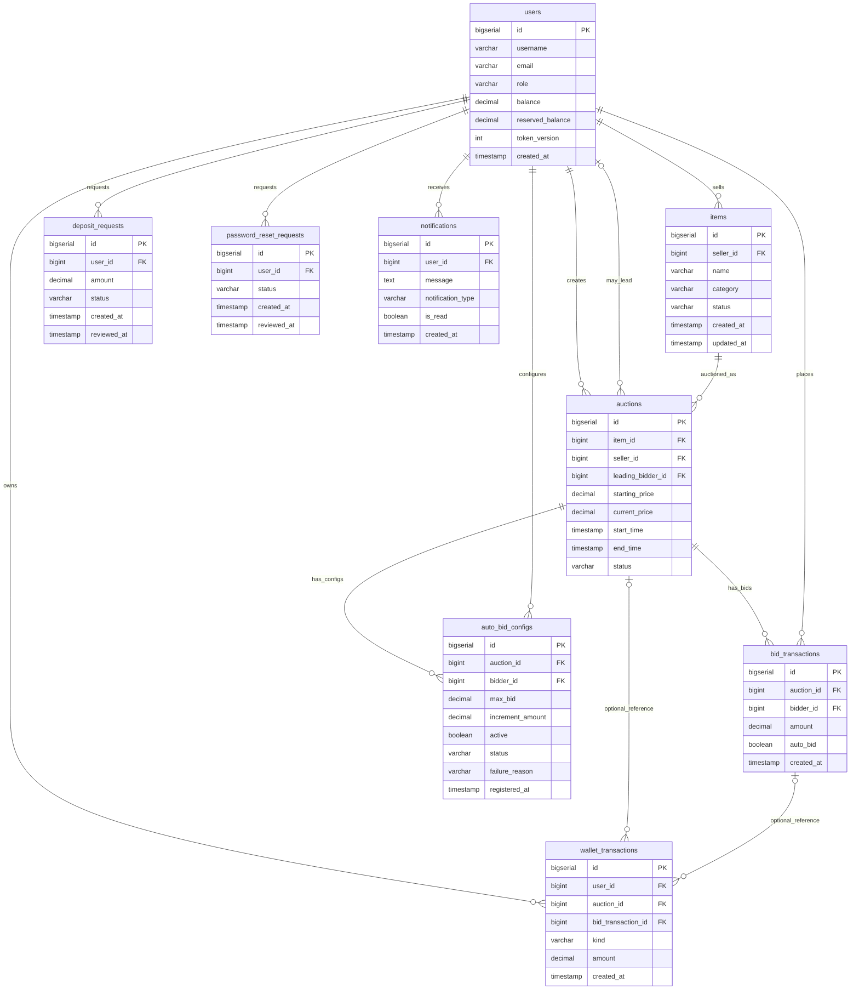

# Database Schema

This document describes the database schema after applying Flyway migrations under `src/main/resources/db/migration` from `V1` through `V17`.

Runtime database stack:

```text
Embedded PostgreSQL / external PostgreSQL
  -> PostgreSQL JDBC driver
  -> HikariCP connection pool
  -> Flyway migrations
  -> JDBI DAOs
  -> service layer
```

Default local evaluation uses Embedded PostgreSQL. Advanced users can provide an external PostgreSQL database through `DB_URL`, `DB_USER`, and `DB_PASSWORD`. In both modes, `DatabaseConfig` creates a `HikariDataSource`, runs Flyway migrations, and exposes a JDBI instance.

---

## 1. Runtime Database Infrastructure

| Component | Source-aligned role |
|---|---|
| Embedded PostgreSQL | Default local database runtime for demo/evaluation. |
| PostgreSQL JDBC | JDBC driver used by HikariCP/JDBI to talk to PostgreSQL. |
| HikariCP | Connection pool configured in `DatabaseConfig.buildHikariConfig(...)`. |
| Flyway | Applies versioned SQL migrations from `src/main/resources/db/migration`. |
| JDBI | DAO access layer used by services and transactions. |

Source-configured HikariCP settings:

| Setting | Value / meaning |
|---|---|
| Pool class | `HikariDataSource` |
| Pool name | `Auction-Jdbi-Pool` |
| Maximum pool size | `10` |
| Minimum idle connections | `5` |
| Connection timeout | `30000` ms |
| Schema data source property | `currentSchema = public` |

Other HikariCP behavior uses library defaults unless the source sets it explicitly.

---

## 2. Tables Overview

| Table | Purpose |
|---|---|
| `users` | Accounts for `BIDDER`, `SELLER`, and `ADMIN`. |
| `items` | Products owned by sellers. |
| `auctions` | Auction sessions and lifecycle state. |
| `bid_transactions` | Immutable bid history for manual and auto bids. |
| `auto_bid_configs` | One auto-bid configuration per bidder per auction. |
| `wallet_transactions` | Ledger for deposit, reservation, release, winner payment, and seller payout. |
| `deposit_requests` | Admin-reviewed deposit workflow. |
| `password_reset_requests` | Admin-reviewed password reset workflow. |
| `notifications` | Persistent per-user notification feed. |

---

## 3. Table Definitions

### `users`

| Column | Type | Constraints / meaning |
|---|---|---|
| `id` | BIGSERIAL | Primary key. |
| `username` | VARCHAR(50) | Unique, not null. |
| `password_hash` | VARCHAR(255) | Not null; BCrypt hash. |
| `email` | VARCHAR(100) | Unique, not null. |
| `role` | VARCHAR(20) | Not null; check in `BIDDER`, `SELLER`, `ADMIN`. |
| `balance` | DECIMAL(15,2) | Not null, default `0`. |
| `reserved_balance` | DECIMAL(15,2) | Not null, default `0`. |
| `token_version` | INTEGER | Not null, default `0`; used to invalidate stale tokens. |
| `created_at` | TIMESTAMP | Not null, default `NOW()`. |

### `items`

| Column | Type | Constraints / meaning |
|---|---|---|
| `id` | BIGSERIAL | Primary key. |
| `seller_id` | BIGINT | Not null; foreign key to `users.id`. |
| `name` | VARCHAR(200) | Not null. |
| `description` | TEXT | Nullable. |
| `category` | VARCHAR(20) | Not null; check in `ELECTRONICS`, `ART`, `VEHICLE`. |
| `brand` | VARCHAR(100) | Nullable; used for electronics/vehicle. |
| `artist` | VARCHAR(100) | Nullable; used for art. |
| `year` | INTEGER | Nullable. |
| `status` | VARCHAR(20) | Not null, default `AVAILABLE`; check in `AVAILABLE`, `IN_AUCTION`, `SOLD`, `REMOVED`. |
| `created_at` | TIMESTAMP | Not null, default `NOW()`. |
| `updated_at` | TIMESTAMP | Not null, default `NOW()`. |

Indexes: `idx_items_seller`, `idx_items_status`.

### `auctions`

| Column | Type | Constraints / meaning |
|---|---|---|
| `id` | BIGSERIAL | Primary key. |
| `item_id` | BIGINT | Not null; foreign key to `items.id`. |
| `seller_id` | BIGINT | Not null; foreign key to `users.id`; denormalized for authorization. |
| `starting_price` | DECIMAL(15,2) | Not null. |
| `current_price` | DECIMAL(15,2) | Not null; current leading price. |
| `leading_bidder_id` | BIGINT | Nullable; foreign key to `users.id`. |
| `start_time` | TIMESTAMP | Not null. |
| `end_time` | TIMESTAMP | Not null; can be extended by anti-sniping. |
| `status` | VARCHAR(20) | Not null, default `OPEN`; check in `OPEN`, `RUNNING`, `SETTLING`, `FINISHED`, `PAID`, `CANCELED`. |
| `created_at` | TIMESTAMP | Not null, default `NOW()`. |
| `updated_at` | TIMESTAMP | Not null, default `NOW()`. |

Indexes: `idx_auctions_status`, `idx_auctions_seller`.

### `bid_transactions`

| Column | Type | Constraints / meaning |
|---|---|---|
| `id` | BIGSERIAL | Primary key. |
| `auction_id` | BIGINT | Not null; foreign key to `auctions.id`. |
| `bidder_id` | BIGINT | Not null; foreign key to `users.id`. |
| `amount` | DECIMAL(15,2) | Not null. |
| `auto_bid` | BOOLEAN | Not null, default `FALSE`; true when system placed it. |
| `created_at` | TIMESTAMP | Not null, default `NOW()`. |

Index: `idx_bid_transactions_auction`.

### `auto_bid_configs`

| Column | Type | Constraints / meaning |
|---|---|---|
| `id` | BIGSERIAL | Primary key. |
| `auction_id` | BIGINT | Not null; foreign key to `auctions.id`. |
| `bidder_id` | BIGINT | Not null; foreign key to `users.id`. |
| `max_bid` | DECIMAL(15,2) | Not null. |
| `increment_amount` | DECIMAL(15,2) | Not null. |
| `active` | BOOLEAN | Not null, default `TRUE`; legacy compatibility flag. |
| `status` | VARCHAR(20) | Not null, default `ACTIVE`; check in `ACTIVE`, `STOPPED`, `EXHAUSTED`, `FAILED`. |
| `failure_reason` | VARCHAR(50) | Nullable; checked when present. |
| `registered_at` | TIMESTAMP | Not null, default `NOW()`; FIFO chain order. |

Constraints and notes:

- Unique pair: `(auction_id, bidder_id)`.
- `registered_at` is the canonical creation/ordering timestamp for this table.
- Index: `idx_auto_bid_configs_status`.

### `wallet_transactions`

| Column | Type | Constraints / meaning |
|---|---|---|
| `id` | BIGSERIAL | Primary key. |
| `user_id` | BIGINT | Not null; foreign key to `users.id`. |
| `auction_id` | BIGINT | Nullable; foreign key to `auctions.id`. |
| `bid_transaction_id` | BIGINT | Nullable; foreign key to `bid_transactions.id`. |
| `kind` | VARCHAR(32) | Not null; check in `DEPOSIT`, `FREEZE`, `RELEASE`, `WIN_CONSUME`, `SELLER_PAYOUT`, `CANCEL_RELEASE`. |
| `amount` | DECIMAL(15,2) | Not null; check greater than zero. |
| `reference_info` | TEXT | Nullable. |
| `created_at` | TIMESTAMP | Not null, default `NOW()`. |

Indexes: `idx_wallet_transactions_user_created`, `idx_wallet_transactions_auction`, `idx_wallet_transactions_bid`.

### `deposit_requests`

| Column | Type | Constraints / meaning |
|---|---|---|
| `id` | BIGSERIAL | Primary key. |
| `user_id` | BIGINT | Not null; foreign key to `users.id` with cascade delete. |
| `amount` | DECIMAL(15,2) | Not null. |
| `status` | VARCHAR(20) | Not null, default `PENDING`; check in `PENDING`, `APPROVED`, `REJECTED`. |
| `created_at` | TIMESTAMP | Not null, default `NOW()`. |
| `reviewed_at` | TIMESTAMP | Nullable; set when admin acts. |

Index: `idx_deposit_requests_status`.

### `password_reset_requests`

| Column | Type | Constraints / meaning |
|---|---|---|
| `id` | BIGSERIAL | Primary key. |
| `user_id` | BIGINT | Not null; foreign key to `users.id` with cascade delete. |
| `status` | VARCHAR(20) | Not null, default `PENDING`; check in `PENDING`, `APPROVED`, `REJECTED`. |
| `created_at` | TIMESTAMP | Not null, default `NOW()`. |
| `reviewed_at` | TIMESTAMP | Nullable; set when admin acts. |

Indexes: `idx_password_reset_requests_status`, `idx_password_reset_requests_user`, and partial unique index `ux_password_reset_one_pending_per_user` on `user_id` where `status = 'PENDING'`.

### `notifications`

| Column | Type | Constraints / meaning |
|---|---|---|
| `id` | BIGSERIAL | Primary key. |
| `user_id` | BIGINT | Not null; foreign key to `users.id` with cascade delete. |
| `message` | TEXT | Not null. |
| `notification_type` | VARCHAR(50) | Not null. |
| `is_read` | BOOLEAN | Default `FALSE`. |
| `created_at` | TIMESTAMP | Default `CURRENT_TIMESTAMP`. |

Indexes: `idx_notifications_user_id`, `idx_notifications_is_read`.

---

## 4. Entity-Relationship Diagram



---

## 5. Migration Timeline

| Migration | Main change |
|---|---|
| `V1__initial_schema.sql` | Core users, items, auctions, bid transactions, and auto-bid configs. |
| `V2__seed_admin.sql` | Initial admin seed support. |
| `V3__add_balance.sql` | Adds user balance. |
| `V4__deposit_requests.sql` | Adds deposit request workflow. |
| `V5__password_reset_requests.sql` | Adds password reset workflow. |
| `V6__notifications.sql` | Adds persistent notifications. |
| `V7__add_increment_amount.sql` | Adds/repairs auto-bid increment amount. |
| `V8__add_seller_id_to_auctions.sql` | Adds auction seller id for authorization/performance. |
| `V9__add_settling_status.sql` | Adds `SETTLING` lifecycle status. |
| `V10__repair_auto_bid_config_columns.sql` | Repairs auto-bid config columns. |
| `V11__relax_legacy_auto_bid_increment.sql` | Relaxes legacy auto-bid increment compatibility. |
| `V12__add_reserved_balance.sql` | Adds `users.reserved_balance`. |
| `V13__unique_pending_password_reset.sql` | Adds one-pending-reset-per-user rule. |
| `V14__add_item_status.sql` | Adds item status. |
| `V15__add_auto_bid_status.sql` | Adds auto-bid status and failure reason. |
| `V16__add_user_token_version.sql` | Adds token version for JWT invalidation. |
| `V17__wallet_transactions.sql` | Adds wallet ledger. |
